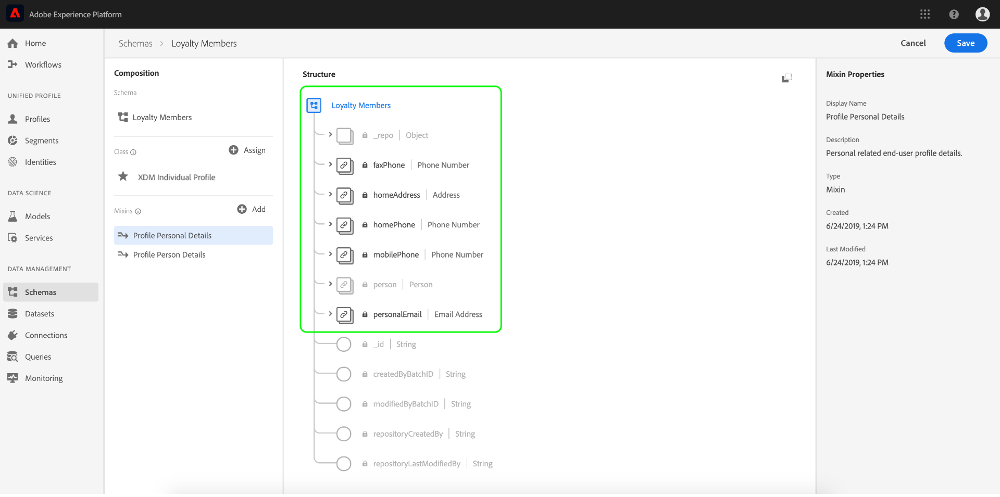
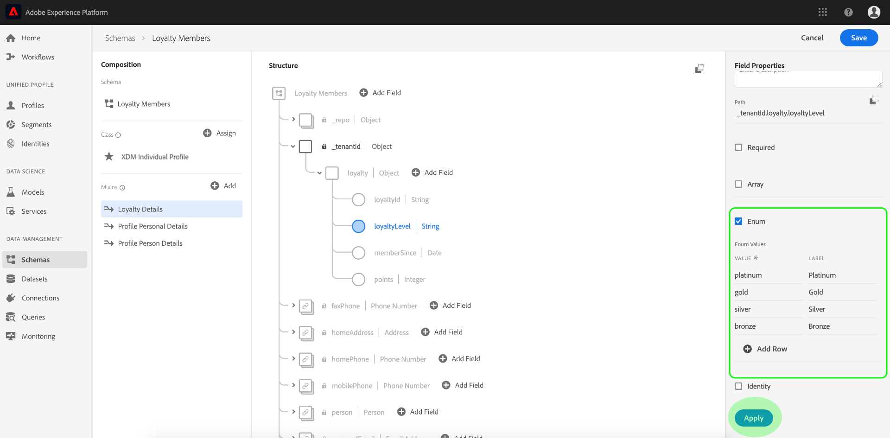
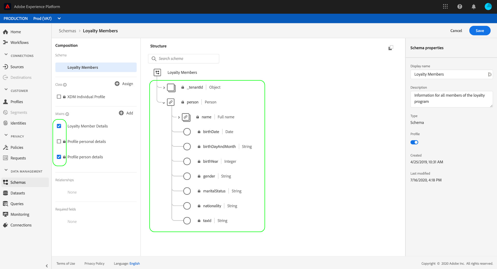
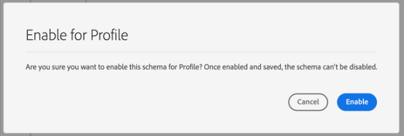

# Crie um esquema usando o [!DNL Schema Editor]

A interface do usuário do Adobe Experience Platform permite criar e gerenciar esquemas [!DNL Experience Data Model] (XDM) em uma tela visual interativa chamada de [!DNL Schema Editor]. Este tutorial aborda como criar um schema usando o [!DNL Schema Editor].

>[!NOTE]
>
>Para fins de demonstração, as etapas neste tutorial envolvem a criação de um schema de exemplo que descreve membros de um programa de fidelidade do cliente. Embora você possa usar essas etapas para criar um schema diferente para seus próprios propósitos, é recomendável seguir primeiro juntamente com a criação do schema de exemplo para aprender os recursos do [!DNL Schema Editor].

Se preferir compor um schema usando a API [!DNL Schema Registry], comece lendo o [[!DNL Schema Registry] guia do desenvolvedor](../api/getting-started.md) antes de tentar o tutorial em [criar um schema usando a API](create-schema-api.md).

## Introdução

Este tutorial requer uma compreensão funcional dos vários aspectos do Adobe Experience Platform envolvidos na criação do schema. Antes de iniciar este tutorial, reveja a documentação dos seguintes conceitos:

* [[!DNL Experience Data Model (XDM)]](../home.md): A estrutura padronizada pela qual  [!DNL Platform] organiza os dados de experiência do cliente.
   * [Noções básicas da composição](../schema/composition.md) do schema: Uma visão geral dos esquemas XDM e seus blocos fundamentais, incluindo classes, mixins, tipos de dados e campos.
* [[!DNL Real-time Customer Profile]](../../profile/home.md): Fornece um perfil de consumidor unificado e em tempo real com base em dados agregados de várias fontes.

## Abra o [!UICONTROL Schemas] espaço de trabalho {#browse}

O espaço de trabalho [!UICONTROL Schemas] na interface do usuário [!DNL Platform] fornece uma visualização do [!DNL Schema Library], permitindo visualizar o gerenciamento dos esquemas disponíveis para sua organização. O espaço de trabalho também inclui a [!DNL Schema Editor], a tela na qual você pode compor um schema neste tutorial.

Depois de fazer logon em [!DNL Experience Platform], selecione **[!UICONTROL Schemas]** na navegação à esquerda para abrir o espaço de trabalho **[!UICONTROL Schemas]**. A guia **[!UICONTROL Browse]** exibe uma lista de schemas (uma representação do [!DNL Schema Library]) que você pode visualizar e personalizar. A lista inclui o nome, o tipo, a classe e o comportamento (registro ou série de tempo) em que o schema se baseia, bem como a data e a hora em que o schema foi modificado pela última vez.

Consulte o guia sobre [exploração de recursos XDM existentes na interface do usuário](../ui/explore.md) para obter mais informações.

## Criar e nomear um esquema {#create}

Para começar a compor um schema, selecione **[!UICONTROL Create schema]** no canto superior direito do espaço de trabalho **[!UICONTROL Schemas]**. Um menu suspenso é exibido, dando a você a opção de escolher entre as classes principais [!UICONTROL XDM Individual Profile] e [!UICONTROL XDM ExperienceEvent]. Se essas classes não atenderem aos seus propósitos, você também poderá selecionar **[!UICONTROL Browse]** para escolher entre outras classes disponíveis ou [criar uma nova classe](#create-new-class).

Para os fins deste tutorial, selecione **[!UICONTROL XDM Individual Profile]**.

Como você escolheu uma classe XDM padrão para basear o esquema, a caixa de diálogo **[!UICONTROL Add mixin]** é exibida, permitindo que você comece imediatamente a adicionar campos ao esquema. Por enquanto, selecione **[!UICONTROL Cancel]** para sair da caixa de diálogo.

O [!DNL Schema Editor] é exibido. Essa é a tela sobre a qual você irá compor o esquema. Um schema sem título é criado automaticamente na seção **[!UICONTROL Structure]** da tela ao chegar ao editor, juntamente com os campos padrão incluídos em todos os schemas com base nessa classe. A classe atribuída ao schema também é listada em **[!UICONTROL Class]** na seção **[!UICONTROL Composition]**.

>[!NOTE]
>
>Você pode [alterar a classe de um schema](#change-class) em qualquer ponto durante o processo de composição inicial antes que o schema tenha sido salvo, mas isso deve ser feito com extremo cuidado. Mixins são compatíveis apenas com determinadas classes e, portanto, alterar a classe redefinirá a tela e quaisquer campos adicionados.

Use os campos no lado direito do editor para fornecer um nome de exibição e uma descrição opcional para o esquema. Depois que um nome é inserido, a tela é atualizada para refletir o novo nome do schema.

Há várias considerações importantes a serem feitas ao decidir um nome para o esquema:

* Os nomes de esquema devem ser curtos e descritivos para que o esquema possa ser facilmente encontrado posteriormente.
* Os nomes de esquema devem ser exclusivos, o que significa que também devem ser específicos o suficiente para que não sejam reutilizados no futuro. Por exemplo, se sua organização tivesse programas de fidelidade separados para diferentes marcas, seria recomendável nomear seu esquema como &quot;Membros da Fidelidade da Marca A&quot; para facilitar a distinção entre outros esquemas relacionados à fidelidade que você poderá definir posteriormente.
* Você também pode usar a descrição do schema para fornecer quaisquer informações contextuais adicionais relacionadas ao schema.

Este tutorial compõe um schema para assimilar dados relacionados aos membros de um programa de fidelidade e, portanto, o schema é chamado de &quot;Membros de fidelidade&quot;.

## Adicionar uma mistura {#mixin}

Agora é possível começar a adicionar campos ao esquema adicionando mixins. Uma mistura é um grupo de um ou mais campos que são frequentemente usados em conjunto para descrever um conceito específico. Este tutorial usa mixins para descrever os membros do programa de fidelidade e capturar informações importantes como nome, aniversário, número de telefone, endereço e muito mais.

Para adicionar um mixin, selecione **[!UICONTROL Add]** na subseção **[!UICONTROL Mixins]**.

Uma nova caixa de diálogo é exibida, exibindo uma lista de mixins disponíveis. Cada mixin só deve ser usada com uma classe específica, portanto, a caixa de diálogo lista apenas mixins compatíveis com a classe selecionada (neste caso, a classe [!DNL XDM Individual Profile] ). Se você estiver usando uma classe XDM padrão, a lista de mixins será classificada de forma inteligente com base na popularidade do uso.

Selecionar um mixin na lista faz com que ele apareça no painel direito. Você pode selecionar várias combinações, se desejar, adicionar uma à lista no painel direito antes de confirmar. Além disso, um ícone é exibido no lado direito do mixin selecionado no momento, permitindo que você visualize a estrutura dos campos fornecidos.

Ao visualizar um mixin, uma descrição detalhada do schema do mixin é fornecida no painel direito. Também é possível navegar pelos campos do mixin na tela fornecida. À medida que você seleciona campos diferentes, o painel direito é atualizado para mostrar detalhes sobre o campo em questão. Selecione **[!UICONTROL Back]** quando terminar de visualizar para retornar à caixa de diálogo de seleção mixin.

Para este tutorial, selecione a combinação **[!UICONTROL Demographic Details]** e selecione **[!UICONTROL Add mixin]**.

A tela do esquema é exibida novamente. A seção **[!UICONTROL Mixins]** agora lista &quot;[!UICONTROL Demographic Details]&quot; e a seção **[!UICONTROL Structure]** inclui os campos contribuídos pelo mixin. Você pode selecionar o nome do mixin na seção **[!UICONTROL Mixins]** para realçar os campos específicos fornecidos na tela.

Esse mixin contribui com vários campos sob o nome de nível superior `person` com o tipo de dados &quot;[!UICONTROL Person]&quot;. Este grupo de campos descreve informações sobre um indivíduo, incluindo nome, data de nascimento e gênero.

>[!NOTE]
>
>Lembre-se de que os campos podem usar tipos escalares (como string, integer, matriz ou data), bem como qualquer tipo de dados (um grupo de campos que representa um conceito comum) definido dentro do [!DNL Schema Registry].

Observe que o campo `name` tem um tipo de dados de &quot;[!UICONTROL Person name]&quot;, o que significa que ele também descreve um conceito comum e contém subcampos relacionados ao nome, como nome, sobrenome, título de cortesia e sufixo.

Selecione os diferentes campos na tela para revelar quaisquer campos adicionais que contribuem para a estrutura do schema.

## Adicionar outro mixin {#mixin-2}

Agora você pode repetir as mesmas etapas para adicionar outra mixin. Ao visualizar a caixa de diálogo **[!UICONTROL Add mixin]** desta vez, observe que a mistura &quot;[!UICONTROL Demographic Details]&quot; foi esmaecida e a caixa de seleção ao lado dela não pode ser selecionada. Isso evita que você duplique acidentalmente mixins que já foram incluídos no esquema atual.

Para este tutorial, selecione o mixin &quot;[!DNL Personal Contact Details]&quot; na caixa de diálogo e selecione **[!UICONTROL Add mixin]** para adicioná-lo ao schema.

Depois de adicionada, a tela reaparece. &quot;[!UICONTROL Personal Contact Details]&quot; agora está listado em **[!UICONTROL Mixins]** na seção **[!UICONTROL Composition]**, e os campos para endereço residencial, telefone celular e muito mais foram adicionados em **[!UICONTROL Structure]**.

Semelhante ao campo `name`, os campos que você acabou de adicionar representam os conceitos de vários campos. Por exemplo, `homeAddress` tem um tipo de dados de &quot;[!UICONTROL Postal address]&quot; e `mobilePhone` tem um tipo de dados de &quot;[!UICONTROL Phone number]&quot;. Você pode selecionar cada um desses campos para expandi-los e ver os campos adicionais incluídos no tipo de dados.

## Definir um mixin personalizado {#define-mixin}

O schema &quot;[!UICONTROL Loyalty Members]&quot; destina-se a capturar dados relacionados aos membros de um programa de fidelidade, de modo que exigirá alguns campos específicos relacionados a fidelidade.

Há um mixin padrão [!UICONTROL Loyalty Details] que pode ser adicionado ao schema para capturar campos comuns relacionados a um programa de fidelidade. Embora seja altamente recomendável usar mixins padrão para representar conceitos capturados por seus esquemas, a estrutura do mixin de fidelidade padrão pode não ser capaz de capturar todos os dados relevantes para seu programa de fidelidade específico. Nesse cenário, você pode optar por definir um novo mixin personalizado para capturar esses campos.

Abra a caixa de diálogo **[!UICONTROL Add Mixin]** novamente, mas desta vez selecione **[!UICONTROL Create New Mixin]** próximo à parte superior. Em seguida, você será solicitado a fornecer um nome de exibição e uma descrição para a mixin.

Assim como com nomes de classe, o nome da mixin deve ser curto e simples, descrevendo o que a mixin contribuirá para o schema. Eles também são exclusivos, portanto, você não poderá reutilizar o nome e, portanto, deve garantir que seja específico o suficiente.

Para este tutorial, nomeie o novo mixin como &quot;Detalhes de fidelidade&quot;.

Selecione **[!UICONTROL Add mixin]** para retornar ao [!DNL Schema Editor]. &quot;[!UICONTROL Loyalty Details]&quot; agora deve aparecer em **[!UICONTROL Mixins]** no lado esquerdo da tela, mas ainda não há campos associados a ela e, portanto, nenhum novo campo aparece em **[!UICONTROL Structure]**.

## Adicionar campos ao mixin {#mixin-fields}

Agora que você criou a combinação &quot;Detalhes de fidelidade&quot;, é hora de definir os campos que o mixin contribuirá para o schema.

Para começar, selecione o nome do mixin na seção **[!UICONTROL Mixins]** . Depois disso, as propriedades do mixin são exibidas no lado direito do editor e um ícone de **mais (+)** aparece ao lado do nome do schema em **[!UICONTROL Structure]**.

Selecione o ícone de **mais (+)** ao lado de &quot;[!DNL Loyalty Members]&quot; para criar um novo nó na estrutura. Esse nó (chamado `_tenantId` neste exemplo) representa a ID do locatário da Organização IMS, precedida por um sublinhado. A presença da ID do locatário indica que os campos que você está adicionando estão contidos no namespace da sua organização.

Em outras palavras, os campos que você está adicionando são exclusivos de sua organização e serão salvos em [!DNL Schema Registry] em uma área específica acessível somente à sua organização. Os campos que você definir devem sempre ser adicionados ao namespace do locatário para evitar colisões com nomes de outras classes padrão, mixins, tipos de dados e campos.

Dentro desse nó namespaced está um &quot;[!UICONTROL New Field]&quot;. Este é o início da mistura &quot;[!UICONTROL Loyalty Details]&quot;.

Usando os controles no lado direito do editor, comece criando um campo `loyalty` com o tipo &quot;[!UICONTROL Object]&quot; que será usado para manter seus campos relacionados à fidelidade. Quando terminar, selecione **[!UICONTROL Apply]**.

As alterações são aplicadas e o objeto `loyalty` recém-criado é exibido. Selecione o ícone de **mais (+)** ao lado do objeto para adicionar mais campos relacionados à fidelidade. Um &quot;[!UICONTROL New Field]&quot; é exibido e a seção **[!UICONTROL Field properties]** é visível no lado direito da tela.

Cada campo requer as seguintes informações:

* **[!UICONTROL Field Name]:** o nome do campo, escrito em camel case. Exemplo: loyaltyLevel
* **[!UICONTROL Display Name]:** o nome do campo, escrito no caso de título. Exemplo: Nível de Fidelidade
* **[!UICONTROL Type]:** O tipo de dados do campo. Isso inclui tipos escalares básicos e quaisquer tipos de dados definidos no [!DNL Schema Registry]. Exemplos: [!UICONTROL String], [!UICONTROL Integer], [!UICONTROL Boolean], [!UICONTROL Person], [!UICONTROL Address], [!UICONTROL Phone number], etc.
* **[!UICONTROL Description]:** uma descrição opcional do campo deve ser incluída, escrita em caso de frase, com no máximo 200 caracteres.

O primeiro campo para o objeto `Loyalty` será uma string chamada `loyaltyId`. Ao definir o tipo do novo campo como &quot;[!UICONTROL String]&quot;, a seção **[!UICONTROL Field properties]** é preenchida com várias opções para aplicar restrições, incluindo valor padrão, formato e comprimento máximo.

Diferentes opções de restrição estão disponíveis dependendo do tipo de dados selecionado. Como `loyaltyId` será um endereço de email, selecione &quot;[!UICONTROL email]&quot; no menu suspenso **[!UICONTROL Format]**. Selecione **[!UICONTROL Apply]** para aplicar as alterações.

## Adicionar mais campos ao mixin {#mixin-fields-2}

Agora que você adicionou o campo `loyaltyId`, é possível adicionar campos adicionais para capturar informações relacionadas à fidelidade, como:

* Pontos (número inteiro)
* Membro desde (data)

Para adicionar cada campo ao schema, selecione o ícone de adição (+)**ao lado do objeto `loyalty` e preencha as informações necessárias.**

Quando concluído, o objeto de Fidelidade conterá campos para ID de fidelidade, pontos e desde-o-membro.

## Adicione um campo enum ao mixin {#enum}

Ao definir campos no [!DNL Schema Editor], há algumas opções adicionais que podem ser aplicadas aos tipos básicos de campos para fornecer restrições adicionais sobre os dados que o campo pode conter. Os casos de uso dessas restrições são explicados na tabela a seguir:

| Restrição | Descrição |
| --- | --- |
| [!UICONTROL Required] | Indica que o campo é obrigatório para a assimilação de dados. Qualquer dado carregado em um conjunto de dados com base nesse esquema que não contenha esse campo falhará ao ser assimilado. |
| [!UICONTROL Array] | Indica que o campo contém uma matriz de valores, cada um com o tipo de dados especificado. Por exemplo, usar essa restrição em um campo com um tipo de dados &quot;[!UICONTROL String]&quot; especifica que o campo conterá uma matriz de sequências de caracteres. |
| [!UICONTROL Enum] | Indica que este campo deve conter um dos valores de uma lista enumerada de valores possíveis. |
| [!UICONTROL Identity] | Indica que este campo é um campo de identidade. Mais informações sobre campos de identidade são fornecidas [posteriormente neste tutorial](#identity-field). |
| [!UICONTROL Relationship] | Embora os relacionamentos de esquema possam ser inferidos por meio do uso do schema de união e [!DNL Real-time Customer Profile], isso se aplica somente a esquemas que compartilham a mesma classe. A restrição [!UICONTROL Relationship] indica que esse campo faz referência à identidade primária de um schema com base em uma classe diferente, o que implica uma relação entre os dois schemas. Consulte o tutorial em [definindo um relacionamento](./relationship-ui.md) para obter mais informações. |

>[!NOTE]
>
>Todos os campos obrigatórios, de identidade ou de relacionamento são mostrados no painel esquerdo, permitindo localizar esses campos facilmente, independentemente da complexidade do esquema.
>
>

Para este tutorial, o objeto [!DNL "loyalty"] no schema requer um novo campo enum que descreve o &quot;nível de fidelidade&quot; de um cliente, onde o valor pode ser apenas uma das quatro opções possíveis. Para adicionar esse campo ao schema, selecione o ícone de **mais (+)** ao lado do objeto `loyalty` e preencha os campos necessários para **[!UICONTROL Field name]** e **[!UICONTROL Display name]**. Para **[!UICONTROL Type]**, selecione &quot;[!UICONTROL String]&quot;.

Caixas de seleção adicionais aparecem para o campo depois que seu tipo é selecionado, incluindo caixas de seleção para **[!UICONTROL Array]**, **[!UICONTROL Enum]** e **[!UICONTROL Identity]**.

Marque a caixa de seleção **[!UICONTROL Enum]** para abrir a seção **[!UICONTROL Enum values]** abaixo. Aqui, você pode inserir o **[!UICONTROL Value]** (em camelCase) e o **[!UICONTROL Label]** (um nome opcional e amigável para leitores no caso de Título) para cada nível de fidelidade aceitável.

Após concluir todas as propriedades do campo, selecione **[!UICONTROL Apply]** para adicionar o campo &quot;[!DNL loyaltyLevel]&quot; ao objeto `loyalty`.

## Converter um objeto de vários campos em um tipo de dados {#datatype}

O objeto `loyalty` agora contém vários campos específicos de fidelidade e representa uma estrutura de dados comum que pode ser útil em outros schemas. O [!DNL Schema Editor] permite aplicar prontamente objetos de vários campos reutilizáveis, convertendo a estrutura desses objetos em tipos de dados.

Os tipos de dados permitem o uso consistente de estruturas de vários campos e fornecem mais flexibilidade do que uma combinação, pois podem ser usados em qualquer lugar dentro de um esquema. Isso é feito definindo o valor **[!UICONTROL Type]** do campo como o de qualquer tipo de dados definido no [!DNL Schema Registry].

Para converter o objeto `loyalty` em um tipo de dados, selecione o campo `loyalty` em **[!UICONTROL Structure]** e selecione **[!UICONTROL Convert to new data type]** no lado direito do editor em **[!UICONTROL Field properties]**. Uma tampa verde é exibida, confirmando que o objeto foi convertido com êxito.

Agora, ao olhar em **[!UICONTROL Structure]**, você pode ver que o campo `loyalty` tem um tipo de dados de &quot;[!DNL Loyalty]&quot; e que os campos têm pequenos ícones de bloqueio ao seu lado, indicando que não são mais campos individuais, mas sim parte de um tipo de dados de vários campos.

Em um schema futuro, agora é possível atribuir um campo como um tipo &quot;[!DNL Loyalty]&quot; e ele incluirá automaticamente campos para ID, nível de fidelidade, membro desde e pontos.

>[!NOTE]
>
>Você também pode criar e editar tipos de dados personalizados independentemente dos esquemas de edição. Consulte o guia sobre [criação e edição de tipos de dados](../ui/resources/data-types.md) para obter mais informações.

## Pesquisar e filtrar campos de esquema

O esquema agora contém várias combinações além dos campos fornecidos pela classe base. Ao trabalhar com esquemas maiores, você pode marcar as caixas de seleção ao lado de nomes mixin no painel à esquerda para filtrar os campos exibidos somente para aqueles fornecidos pelas mixins em que está interessado.

Se você estiver procurando um campo específico em seu esquema, também poderá usar a barra de pesquisa para filtrar os campos exibidos por nome, independentemente do mixin em que são fornecidos.

>[!IMPORTANT]
>
>A função de pesquisa considera todos os filtros mixin selecionados ao exibir campos correspondentes. Se uma consulta de pesquisa não estiver exibindo os resultados esperados, talvez seja necessário verificar novamente se você não está filtrando nenhuma mistura relevante.

## Definir um campo de esquema como um campo de identidade {#identity-field}

A estrutura de dados padrão fornecida pelos esquemas pode ser aproveitada para identificar dados pertencentes ao mesmo indivíduo em várias fontes, permitindo vários casos de uso downstream, como segmentação, relatórios, análise da ciência de dados e muito mais. Para compilar dados com base em identidades individuais, os campos principais devem ser marcados como campos [!UICONTROL Identity] nos esquemas aplicáveis.

[!DNL Experience Platform] facilita a identificação de um campo de identidade por meio do uso de uma  **[!UICONTROL Identity]** caixa de seleção no  [!DNL Schema Editor]. No entanto, você deve determinar qual campo é o melhor candidato a usar como identidade, com base na natureza de seus dados.

Por exemplo, pode haver milhares de membros do programa de fidelidade pertencentes ao mesmo &quot;nível de fidelidade&quot;, mas cada membro do programa de fidelidade tem um `loyaltyId` exclusivo (que neste caso é o endereço de email de cada membro). O fato de `loyaltyId` ser um identificador exclusivo para cada membro faz dele um bom candidato para um campo de identidade, enquanto `loyaltyLevel` não é.

>[!IMPORTANT]
>
>As etapas descritas abaixo abordam como adicionar um descritor de identidade a um campo de esquema existente. Como alternativa à definição de campos de identidade na estrutura do próprio schema, também é possível usar um campo `identityMap` para conter informações de identidade.
>
>Se você planeja usar `identityMap`, lembre-se de que isso substituirá qualquer identidade primária adicionada ao schema diretamente. Consulte a seção `identityMap` no [básico do guia de composição de schema](../schema/composition.md#identityMap) para obter mais informações.

Na seção **[!UICONTROL Structure]** do editor, selecione o campo `loyaltyId` e a caixa de seleção **[!UICONTROL Identity]** aparece em **[!UICONTROL Field properties]**. Marque a caixa e a opção para definir isso quando **[!UICONTROL Primary identity]** for exibido. Selecione essa caixa também.

>[!NOTE]
>
>Cada schema pode conter apenas um campo de identidade primário. Depois que um campo de esquema tiver sido definido como a identidade primária, você receberá uma mensagem de erro se, posteriormente, tentar definir outro campo de identidade no esquema como primário.

Em seguida, você deve fornecer um **[!UICONTROL Identity namespace]** da lista de namespaces predefinidos na lista suspensa. Como `loyaltyId` é o endereço de email do cliente, selecione &quot;[!UICONTROL Email]&quot; na lista suspensa. Selecione **[!UICONTROL Apply]** para confirmar as atualizações no campo `loyaltyId`.

>[!NOTE]
>
>Para obter uma lista de namespaces padrão e suas definições, consulte a [[!DNL Identity Service] documentação](../../identity-service/troubleshooting-guide.md#standard-namespaces).

Depois de aplicar a alteração, o ícone para `loyaltyId` mostra um símbolo de impressão digital, indicando que agora é um campo de identidade.

Agora, todos os dados assimilados no campo `loyaltyId` serão usados para ajudar a identificar esse indivíduo e unir uma única visualização desse cliente. Para saber mais sobre como trabalhar com identidades em [!DNL Experience Platform], consulte a documentação [[!DNL Identity Service]](../../identity-service/home.md).

## Ative o esquema para usar em [!DNL Real-time Customer Profile] {#profile}

[[!DNL Real-time Customer Profile]](../../profile/home.md) O usa os dados de identidade do  [!DNL Experience Platform] para fornecer uma visualização holística de cada cliente individual. O serviço cria perfis robustos e de 360° de atributos do cliente, bem como contas com carimbos de data e hora de cada interação que os clientes tiveram em qualquer sistema integrado com [!DNL Experience Platform].

Para que um schema seja ativado para uso com [!DNL Real-time Customer Profile], ele deve ter uma identidade primária definida. Você receberá uma mensagem de erro ao tentar ativar um esquema sem primeiro definir uma identidade primária.

 

Para ativar o schema &quot;Membros de Fidelidade&quot; para uso em [!DNL Profile], comece selecionando &quot;[!DNL Loyalty Members]&quot; na seção **[!UICONTROL Structure]** do editor.

No lado direito do editor, são mostradas informações sobre o schema, incluindo o nome de exibição, a descrição e o tipo. Além dessas informações, há um botão de alternância **[!UICONTROL Profile]**.

Selecione **[!UICONTROL Profile]** e uma pop-up será exibida, solicitando que você confirme que deseja habilitar o schema para [!DNL Profile].

 

>[!WARNING]
>
>Depois que um schema é ativado para [!DNL Real-time Customer Profile] e salvo, ele não pode ser desativado.

Selecione **[!UICONTROL Enable]** para confirmar sua escolha. Você pode selecionar a opção **[!UICONTROL Profile]** novamente para desativar o schema, se desejar, mas uma vez que o schema foi salvo enquanto [!DNL Profile] está ativado, ele não poderá mais ser desativado.

## Próximas etapas e recursos adicionais

Agora que você terminou de compor o schema, é possível ver o schema completo na tela. Selecione **[!UICONTROL Save]** e o schema será salvo no [!DNL Schema Library], tornando-o acessível pelo [!DNL Schema Registry].

O novo schema agora pode ser usado para assimilar dados em [!DNL Platform]. Lembre-se de que, uma vez que o schema tenha sido usado para assimilar dados, somente alterações aditivas poderão ser feitas. Consulte as [noções básicas da composição do schema](../schema/composition.md) para obter mais informações sobre o controle de versão do schema.

Agora você pode seguir o tutorial em [definindo uma relação de schema na interface do usuário](./relationship-ui.md) para adicionar um novo campo de relacionamento ao schema &quot;Membros de fidelidade&quot;.

O schema &quot;Membros de fidelidade&quot; também está disponível para ser visualizado e gerenciado usando a API [!DNL Schema Registry]. Para começar a trabalhar com a API, comece lendo o [[!DNL Schema Registry API] guia do desenvolvedor](../api/getting-started.md).

### Recursos de vídeo

>[!WARNING]
>
>A interface [!DNL Platform] mostrada nos vídeos a seguir está desatualizada. Consulte a documentação acima para obter as capturas de tela e a funcionalidade mais recentes da interface do usuário.

O vídeo a seguir mostra como criar um esquema simples na interface do usuário [!DNL Platform].

>[!VIDEO](https://video.tv.adobe.com/v/27012?quality=12&learn=on)

O vídeo a seguir destina-se a reforçar sua compreensão sobre como trabalhar com mixins e classes.

>[!VIDEO](https://video.tv.adobe.com/v/27013?quality=12&learn=on)

## Apêndice

As seções a seguir fornecem informações adicionais sobre o uso do [!DNL Schema Editor].

### Criar uma nova classe {#create-new-class}

[!DNL Experience Platform] O oferece a flexibilidade para definir um schema com base em uma classe exclusiva para sua organização. Para saber como criar uma nova classe, consulte o guia em [criar e editar classes na interface do usuário](../ui/resources/classes.md#create).

### Alterar a classe de um schema {#change-class}

Você pode alterar a classe de um schema em qualquer ponto durante o processo de composição inicial antes que o schema tenha sido salvo.

>[!WARNING]
>
>A reatribuição da classe para um schema deve ser feita com extremo cuidado. Mixins são compatíveis apenas com determinadas classes e, portanto, alterar a classe redefinirá a tela e quaisquer campos adicionados.

Para saber como alterar a classe de um schema, consulte o guia em [gerenciar schemas na interface do usuário](../ui/resources/schemas.md).
