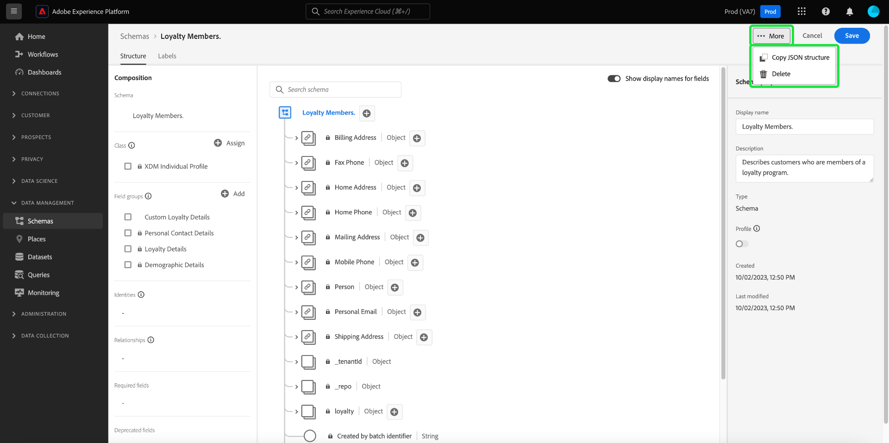

# Criar um esquema usando o [!DNL Schema Editor]

A interface de usuário do Adobe Experience Platform permite criar e gerenciar esquemas do [!DNL Experience Data Model] (XDM) em uma tela visual interativa chamada de [!DNL Schema Editor]. Este tutorial aborda como criar um esquema usando o [!DNL Schema Editor].

Para fins de demonstração, as etapas deste tutorial envolvem a criação de um schema de exemplo que descreve os membros de um programa de fidelidade do cliente. Embora você possa usar essas etapas para criar um esquema diferente para suas próprias finalidades, é recomendável que você siga primeiro juntamente com a criação do esquema de exemplo para conhecer os recursos do [!DNL Schema Editor].

>[!NOTE]
>
>Se você estiver assimilando dados CSV na Experience Platform, poderá [mapear esses dados para um esquema XDM criado por recomendações geradas por IA](../../ingestion/tutorials/map-csv/recommendations.md) (atualmente na versão beta) sem precisar criar manualmente o esquema.
>
>Se preferir compor um esquema usando a API [!DNL Schema Registry], comece lendo o [[!DNL Schema Registry] guia do desenvolvedor](../api/getting-started.md) antes de tentar o tutorial sobre [criação de um esquema usando a API](create-schema-api.md).

## Introdução

Este tutorial requer uma compreensão funcional dos vários aspectos do Adobe Experience Platform envolvidos na criação do esquema. Antes de iniciar este tutorial, revise a documentação dos seguintes conceitos:

* [[!DNL Experience Data Model (XDM)]](../home.md): a estrutura padronizada pela qual o [!DNL Experience Platform] organiza os dados de experiência do cliente.
   * [Noções básicas sobre a composição de esquema](../schema/composition.md): uma visão geral dos esquemas XDM e seus blocos de construção, incluindo classes, grupos de campos de esquema, tipos de dados e campos individuais.
* [[!DNL Real-Time Customer Profile]](../../profile/home.md): Fornece um perfil de consumidor unificado em tempo real com base em dados agregados de várias fontes.

## Abrir o espaço de trabalho [!UICONTROL Schemas] {#browse}

O espaço de trabalho [!UICONTROL Schemas] na interface do usuário do [!DNL Experience Platform] fornece uma visualização do [!DNL Schema Library], permitindo que você visualize e gerencie os esquemas disponíveis para sua organização. O espaço de trabalho também inclui o [!DNL Schema Editor], a tela na qual você pode compor um esquema através deste tutorial.

Depois de fazer logon em [!DNL Experience Platform], selecione **[!UICONTROL Schemas]** na navegação à esquerda para abrir o espaço de trabalho **[!UICONTROL Schemas]**. A guia **[!UICONTROL Browse]** exibe uma lista de esquemas (uma representação do [!DNL Schema Library]) para você visualizar e personalizar. A lista inclui o nome, o tipo, a classe e o comportamento (registro ou série temporal) em que o esquema se baseia, bem como a data e a hora em que o esquema foi modificado pela última vez.

Consulte o manual sobre [exploração de recursos XDM existentes na interface](../ui/explore.md) para obter mais informações.

## Criar e nomear um esquema {#create}

Para começar a compor um esquema, selecione **[!UICONTROL Create schema]** no canto superior direito do espaço de trabalho **[!UICONTROL Schemas]**.

![A guia [!UICONTROL Schemas] do espaço de trabalho [!UICONTROL Browse] com [!UICONTROL Create schema] realçada.](../images/tutorials/create-schema/create-schema-button.png)

A caixa de diálogo [!UICONTROL Create a schema] é exibida. Nesta caixa de diálogo, você pode optar por criar manualmente um esquema adicionando campos e grupos de campos ou pode fazer upload de um arquivo CSV e usar algoritmos de ML para gerar um esquema. Selecione um workflow de criação de esquema na caixa de diálogo.

### Beta [!BADGE Criação manual ou com ML]{type=Informative} do esquema {#manual-or-assisted}

Para saber como usar um algoritmo de ML para recomendar uma estrutura de esquema com base em um arquivo carregado, consulte o [guia de criação de esquema assistido por aprendizado de máquina](../ui/ml-assisted-schema-creation.md). Este guia de interface do usuário se concentra no fluxo de trabalho de criação manual.

### Escolha uma classe base {#choose-a-class}

O fluxo de trabalho [!UICONTROL Create schema] é exibido. Em seguida, escolha uma classe base para o esquema. Você pode escolher entre as classes principais de [!UICONTROL XDM Individual Profile] e [!UICONTROL XDM ExperienceEvent], ou [!UICONTROL Other] se essas classes não se adequarem aos seus objetivos. A opção de classes [!UICONTROL Other] permite [criar uma nova classe](#create-new-class) ou escolher entre outras classes pré-existentes.

Consulte a documentação de [[!UICONTROL XDM individual profile]](../classes/individual-profile.md) e [[!UICONTROL XDM ExperienceEvent]](../classes/experienceevent.md) para obter mais informações sobre essas classes. Para os fins deste tutorial, selecione **[!UICONTROL XDM Individual Profile]** seguido de **[!UICONTROL Next]**.

![O fluxo de trabalho [!UICONTROL Create schema] com as opções [!UICONTROL XDM individual profile] e [!UICONTROL Next] realçadas.](../images/tutorials/create-schema/individual-profile-base-class.png)

### Nomear e revisar {#name-and-review}

Após selecionar uma classe, a seção [!UICONTROL Name and review] é exibida. Nesta seção, você fornece um nome e uma descrição para identificar o esquema. Há várias considerações importantes a serem feitas ao decidir sobre um nome para o esquema:

* Os nomes do esquema devem ser curtos e descritivos para que o esquema possa ser facilmente encontrado posteriormente.
* Os nomes do esquema devem ser exclusivos, o que significa que também devem ser específicos o suficiente para não serem reutilizados no futuro. Por exemplo, se sua organização tivesse programas de fidelidade separados para marcas diferentes, seria interessante nomear seu esquema como &quot;Membros da fidelidade da marca A&quot; para facilitar a distinção de outros esquemas relacionados à fidelidade que você poderia definir posteriormente.
* Também é possível usar a descrição do schema para fornecer informações contextuais adicionais sobre o schema.

Este tutorial compõe um esquema para assimilar dados relacionados aos membros de um programa de fidelidade e, portanto, o esquema é nomeado como &quot;[!DNL Loyalty Members]&quot;.

&#x200B;A estrutura base do esquema (fornecida pela classe) é mostrada na tela para que você revise e verifique a classe selecionada e a estrutura do esquema.

Insira um [!UICONTROL Schema display name] amigável no campo de texto. Em seguida, insira uma descrição adequada para ajudar a identificar seu esquema. Quando tiver revisado sua estrutura de esquema e estiver satisfeito com suas configurações, selecione **[!UICONTROL Finish]** para criar seu esquema.

![A seção [!UICONTROL Name and review] do fluxo de trabalho [!UICONTROL Create schema] com [!UICONTROL Schema display name], [!UICONTROL Description] e [!UICONTROL Finish] realçados.](../images/ui/resources/schemas/name-and-review.png)

### Compor seu esquema {#compose-your-schema}

O [!DNL Schema Editor] aparece. Esta é a tela sobre a qual você irá compor seu esquema. O esquema autointitulado é criado automaticamente na seção **[!UICONTROL Structure]** da tela quando você chega ao editor, juntamente com os campos padrão incluídos na classe base selecionada. A classe atribuída para o esquema também está listada em **[!UICONTROL Class]** na seção **[!UICONTROL Composition]**.

>[!NOTE]
>
>Você pode atualizar o nome para exibição e a descrição opcional do esquema na barra lateral **[!UICONTROL Schema properties]**. Depois que um novo nome é inserido, a tela é atualizada automaticamente para refletir o novo nome do esquema.

>[!NOTE]
>
>Você pode [alterar a classe de um esquema](#change-class) em qualquer momento durante o processo de composição inicial, antes que o esquema tenha sido salvo, mas isso deve ser feito com muito cuidado. Os grupos de campos são compatíveis apenas com determinadas classes e, portanto, alterar a classe redefinirá a tela e quaisquer campos adicionados.

## Adicionar um grupo de campos {#field-group}

Agora é possível começar a adicionar campos ao esquema adicionando grupos de campos. Um grupo de campos é um grupo de um ou mais campos que geralmente são usados juntos para descrever um conceito específico. Este tutorial usa grupos de campos para descrever os membros do programa de fidelidade e capturar informações importantes, como nome, aniversário, número de telefone, endereço e muito mais.

Para adicionar um grupo de campos, selecione **[!UICONTROL Add]** na subseção **[!UICONTROL Field groups]**.

Uma nova caixa de diálogo é exibida, exibindo uma lista de grupos de campos disponíveis. Cada grupo de campos destina-se apenas ao uso com uma classe específica, portanto, a caixa de diálogo lista apenas grupos de campos compatíveis com a classe selecionada (nesse caso, a classe [!DNL XDM Individual Profile]). Se você estiver usando uma classe XDM padrão, a lista de grupos de campos será classificada de forma inteligente com base na popularidade do uso.

![A caixa de diálogo [!UICONTROL Add field groups].](../images/tutorials/create-schema/field-group-popularity.png)

Você pode selecionar um dos filtros no painel esquerdo para restringir a lista de grupos de campos padrão a [setores](../schema/industries/overview.md) específicos, como varejo, serviços financeiros e área de saúde.

![A caixa de diálogo [!UICONTROL Add field groups] com os grupos de campos do setor realçados.](../images/tutorials/create-schema/industry-field-groups.png)

Selecionar um grupo de campos na lista faz com que ele apareça no painel direito. Você pode selecionar vários grupos de campos, se desejar, adicionando cada um à lista no painel direito antes de confirmar. Além disso, um ícone é exibido no lado direito do grupo de campos selecionado no momento, o que permite visualizar a estrutura dos campos fornecidos.

![A caixa de diálogo [!UICONTROL Add field groups] com o ícone de visualização do grupo de campos selecionado está realçada.](../images/tutorials/create-schema/preview-field-group-button.png)

Ao visualizar um grupo de campos, uma descrição detalhada do esquema do grupo de campos é fornecida no painel direito. Você também pode navegar pelos campos do grupo de campos na tela fornecida. À medida que você seleciona campos diferentes, o painel direito é atualizado para mostrar detalhes sobre o campo em questão. Selecione **[!UICONTROL Back]** quando terminar de visualizar para retornar à caixa de diálogo de seleção do grupo de campos.

![A caixa de diálogo [!UICONTROL Preview field group] com o grupo de campos Detalhes Demográficos foi visualizada.](../images/tutorials/create-schema/preview-field-group.png)

Para este tutorial, selecione o grupo de campos **[!UICONTROL Demographic Details]** e selecione **[!UICONTROL Add field group]**.

![A caixa de diálogo [!UICONTROL Add field groups] com o grupo de campos Detalhes Demográficos selecionado e [!UICONTROL Add field groups] realçado.](../images/tutorials/create-schema/demographic-details.png)

A tela do esquema será exibida novamente. A seção **[!UICONTROL Field groups]** agora lista &quot;[!UICONTROL Demographic Details]&quot; e a seção **[!UICONTROL Structure]** inclui os campos contribuídos pelo grupo de campos. Você pode selecionar o nome do grupo de campos na seção **[!UICONTROL Field groups]** para realçar os campos específicos que ele fornece dentro da tela.

>[!NOTE]
>
>No Editor de esquemas, classes e grupos de campos padrão (gerados pela Adobe) são indicados com o ícone de cadeado (. O cadeado é exibido no painel à esquerda, ao lado do nome da classe ou do grupo de campos, e também ao lado de qualquer campo no diagrama de esquema que faça parte de um recurso gerado pelo sistema.
>
>

Este grupo de campos contribui com vários campos sob o nome de nível superior `person` com o tipo de dados &quot;[!UICONTROL Person]&quot;. Esse grupo de campos descreve informações sobre um indivíduo, incluindo nome, data de nascimento e sexo.

>[!NOTE]
>
>Lembre-se de que os campos podem usar tipos escalares (como sequência, inteiro, matriz ou data), bem como qualquer tipo de dados (um grupo de campos que representa um conceito comum) definido em [!DNL Schema Registry].

Observe que o campo `name` tem um tipo de dados de &quot;[!UICONTROL Full name]&quot;, o que significa que ele também descreve um conceito comum e contém subcampos relacionados ao nome, como nome, sobrenome, título de cortesia e sufixo.

Selecione os diferentes campos na tela para revelar quaisquer campos adicionais com que eles contribuam para a estrutura do esquema.

## Adicionar mais grupos de campos {#field-group-2}

Agora é possível repetir as mesmas etapas para adicionar outro grupo de campos. Ao exibir a caixa de diálogo **[!UICONTROL Add field group]** desta vez, observe que o grupo de campos &quot;[!UICONTROL Demographic Details]&quot; foi esmaecido e a caixa de seleção ao lado dele não pode ser selecionada. Isso impede a duplicação acidental de grupos de campos que você já incluiu no esquema atual.

Para este tutorial, selecione os grupos de campos padrão **[!UICONTROL Personal Contact Details]** e **[!UICONTROL Loyalty Details]** na lista, em seguida, selecione **[!UICONTROL Add field groups]** para adicioná-los ao esquema.

![A caixa de diálogo [!UICONTROL Add field groups] com dois novos grupos de campos selecionados e [!UICONTROL Add field groups] realçados.](../images/tutorials/create-schema/more-field-groups.png)

A tela será exibida novamente com os grupos de campos adicionados listados em **[!UICONTROL Field groups]** na seção **[!UICONTROL Composition]** e seus campos compostos adicionados à estrutura do esquema.

## Definir um grupo de campos personalizado {#define-field-group}

O esquema [!UICONTROL Loyalty Members] deve capturar dados relacionados aos membros de um programa de fidelidade, e o grupo de campos [!UICONTROL Loyalty Details] padrão adicionado ao esquema fornece a maioria deles, incluindo o tipo de programa, pontos, data de adesão e muito mais.

No entanto, pode haver um cenário em que você deseje incluir campos personalizados adicionais não cobertos por grupos de campos padrão para atingir seus casos de uso. No caso de adicionar campos de fidelidade personalizados, você tem duas opções:

1. Crie um novo grupo de campos personalizado para capturar esses campos. Este é o método que será abordado neste tutorial.
1. Estender o grupo de campos padrão [!UICONTROL Loyalty Details] com campos personalizados. Isso faz com que [!UICONTROL Loyalty Details] seja convertido em um grupo de campos personalizados, e o grupo de campos padrão original não estará mais disponível. Consulte o guia da interface do usuário do [!UICONTROL Schemas] para obter mais informações sobre [adição de campos personalizados à estrutura de grupos de campos padrão](../ui/resources/schemas.md#custom-fields-for-standard-groups).

Para criar um novo grupo de campos, selecione **[!UICONTROL Add]** na subseção **[!UICONTROL Field groups]** como antes, mas dessa vez selecione **[!UICONTROL Create New Field group]** próximo à parte superior da caixa de diálogo exibida. Em seguida, você será solicitado a fornecer um nome de exibição e uma descrição para o novo grupo de campos. Para este tutorial, nomeie o novo grupo de campos &quot;[!DNL Custom Loyalty Details]&quot; e selecione **[!UICONTROL Add field groups]**.

![A caixa de diálogo [!UICONTROL Add field groups] com [!UICONTROL Create new field group], [!UICONTROL Display name] e [!UICONTROL Description] foi realçada.](../images/tutorials/create-schema/create-new-field-group.png)

>[!NOTE]
>
>Assim como com os nomes de classe, o nome do grupo de campos deve ser curto e simples, descrevendo o que o grupo de campos contribuirá para o esquema. Eles também são exclusivos, portanto, você não poderá reutilizar o nome e deve garantir que ele seja específico o suficiente.

&quot;[!DNL Custom Loyalty Details]&quot; agora deve aparecer em **[!UICONTROL Field groups]** no lado esquerdo da tela, mas ainda não há campos associados a ela e, portanto, nenhum campo novo aparecerá em **[!UICONTROL Structure]**.

## Adicionar campos ao grupo de campos {#field-group-fields}

Agora que você criou o grupo de campos &quot;[!DNL Custom Loyalty Details]&quot;, é hora de definir os campos nos quais o grupo de campos contribuirá para o esquema.

Para começar, selecione o ícone de **adição (+)** ao lado do nome do esquema na tela.

Um espaço reservado &quot;[!UICONTROL Untitled Field]&quot; é exibido na tela e o painel direito é atualizado para revelar as opções de configuração do campo.

![O Editor de Esquemas com um [!UICONTROL Untitled Field] e o esquema [!UICONTROL Field properties] realçado.](../images/tutorials/create-schema/untitled-field.png)

Nesse cenário, o esquema precisa ter um campo do tipo objeto que descreva detalhadamente o nível de fidelidade atual da pessoa. Usando os controles no painel direito, comece criando um campo `loyaltyTier` com o tipo &quot;[!UICONTROL Object]&quot;, que será usado para manter seus campos relacionados.

Em **[!UICONTROL Assign to]**, você deve selecionar um grupo de campos ao qual atribuir o campo. Lembre-se de que todos os campos de esquema pertencem a uma classe ou a um grupo de campos e, como esse esquema usa uma classe padrão, sua única opção é selecionar um grupo de campos. Comece a digitar o nome &quot;[!DNL Custom Loyalty Details]&quot; e selecione o grupo de campos na lista.

Quando terminar, selecione **[!UICONTROL Apply]**.

![O Editor de Esquemas com o objeto de Camada de Fidelidade adicionado ao esquema [!UICONTROL Field properties] foi realçado.](../images/tutorials/create-schema/loyalty-tier-object.png)

As alterações são aplicadas e o objeto `loyaltyTier` recém-criado é exibido. Como esse é um campo personalizado, ele é aninhado automaticamente em um objeto com namespace à ID de locatário da sua organização, precedido por um sublinhado (`_tenantId` neste exemplo).

>[!NOTE]
>
>A presença do objeto de ID do locatário indica que os campos que você está adicionando estão contidos no namespace da sua organização.
>
>Em outras palavras, os campos que você está adicionando são exclusivos de sua organização e serão salvos no [!DNL Schema Registry] em uma área específica acessível somente para sua organização. Os campos definidos devem sempre ser adicionados ao namespace do locatário para evitar colisões com nomes de outras classes padrão, grupos de campos, tipos de dados e campos.

Selecione o ícone de **mais (+)** ao lado do objeto `loyaltyTier` para começar a adicionar subcampos. Um novo espaço reservado de campo é exibido e a seção **[!UICONTROL Field properties]** está visível no lado direito da tela.

Cada campo requer as seguintes informações:

* **[!UICONTROL Field Name]:** O nome do campo, de preferência escrito em camelCase. Não são permitidos caracteres de espaço. Esse é o nome usado para fazer referência ao campo no código e em outros aplicativos downstream.
   * Exemplo: fidelizlevel
* **[!UICONTROL Display Name]:** O nome do campo, escrito em letra maiúscula. Esse é o nome que será exibido na tela ao visualizar ou editar o esquema.
   * Exemplo: Nível de fidelidade
* **[!UICONTROL Type]:** O tipo de dados do campo. Isso inclui tipos escalares básicos e quaisquer tipos de dados definidos em [!DNL Schema Registry]. Exemplos: [!UICONTROL String], [!UICONTROL Integer], [!UICONTROL Boolean], [!UICONTROL Person], [!UICONTROL Address], [!UICONTROL Phone number], etc.
* **[!UICONTROL Description]:** Uma descrição opcional do campo deve ser incluída com no máximo 200 caracteres.

O primeiro campo para o objeto `loyaltyTier` será uma cadeia de caracteres chamada `id`, representando a ID da camada atual do membro de fidelidade. A ID da camada será exclusiva para cada membro do programa de fidelidade, já que essa empresa define diferentes limites de ponto da camada de fidelidade para cada cliente com base em diferentes fatores. Defina o novo tipo de campo como &quot;[!UICONTROL String]&quot; e a seção **[!UICONTROL Field properties]** será preenchida com várias opções para aplicar restrições, incluindo valor padrão, formato e comprimento máximo. Consulte a documentação sobre [práticas recomendadas para campos de validação de dados](../schema/best-practices.md#data-validation-fields) para saber mais.

Como `id` será uma cadeia de caracteres de forma livre gerada aleatoriamente, nenhuma outra restrição será necessária. Selecione **[!UICONTROL Apply]** para aplicar as alterações.

## Adicionar mais campos ao grupo de campos {#field-group-fields-2}

Agora que você adicionou o campo `id`, é possível adicionar outros campos para capturar informações do nível de fidelidade, como:

* Limite de ponto atual (número inteiro): o número mínimo de pontos de fidelidade que o membro deve manter para permanecer na camada atual.
* Limite de próximo ponto de camada (número inteiro): o número de pontos de fidelidade que o membro deve acumular para se formar no próximo nível.
* Data de efetivação (data-hora): a data em que o membro do programa de fidelidade ingressou nessa camada.

Para adicionar cada campo ao esquema, selecione o ícone **de adição (+)** ao lado do objeto `loyalty` e preencha as informações necessárias.

Quando concluído, o objeto `loyaltyTier` conterá campos para `id`, `currentThreshold`, `nextThreshold` e `effectiveDate`.

## Adicionar um campo de enumeração ao grupo de campos {#enum}

Ao definir campos no [!DNL Schema Editor], há algumas opções adicionais que você pode aplicar aos tipos de campos básicos para fornecer restrições adicionais sobre os dados que o campo pode conter. Os casos de uso para essas restrições são explicados na tabela a seguir:

| Restrição | Descrição |
| --- | --- |
| [!UICONTROL Required] | Indica que o campo é obrigatório para assimilação de dados. Quaisquer dados carregados em um conjunto de dados com base nesse esquema que não contenha esse campo falharão na assimilação. |
| [!UICONTROL Array] | Indica que o campo contém uma matriz de valores, cada um com o tipo de dados especificado. Por exemplo, o uso dessa restrição em um campo com um tipo de dados de &quot;[!UICONTROL String]&quot; especifica que o campo conterá uma matriz de cadeias de caracteres. |
| [!UICONTROL Enum & Suggested Values] | Um enum indica que este campo deve conter um dos valores de uma lista enumerada de valores possíveis. Como alternativa, você também pode usar essa opção para fornecer apenas uma lista de valores sugeridos para um campo de string sem restringir o campo a esses valores. |
| [!UICONTROL Identity] | Indica que este campo é um campo de identidade. Mais informações sobre campos de identidade são fornecidas [mais tarde neste tutorial](#identity-field). |
| [!UICONTROL Relationship] | Embora as relações de esquema possam ser inferidas por meio do uso do esquema de união e [!DNL Real-Time Customer Profile], isso se aplica somente a esquemas que compartilham a mesma classe. A restrição [!UICONTROL Relationship] indica que este campo faz referência à identidade primária de um esquema com base em uma classe diferente, implicando uma relação entre os dois esquemas. Consulte o tutorial em [definindo uma relação](./relationship-ui.md) para obter mais informações. |

{style="table-layout:auto"}

>[!NOTE]
>
>Todos os campos obrigatórios, de identidade ou de relação são listados nas respectivas seções no painel à esquerda, permitindo que você localize esses campos facilmente, independentemente da complexidade do esquema.

Para este tutorial, o objeto `loyaltyTier` no esquema requer um novo campo enum que descreve a classe de camada, onde o valor só pode ser uma das quatro opções possíveis. Para adicionar este campo ao esquema, selecione o ícone **de adição (+)** ao lado do objeto `loyaltyTier` e preencha os campos obrigatórios para **[!UICONTROL Field name]** e **[!UICONTROL Display name]**. Para **[!UICONTROL Type]**, selecione &quot;[!UICONTROL String]&quot;.

![O Editor de Esquemas com o objeto de Classe de Camada adicionado e realçado em [!UICONTROL Field properties].](../images/tutorials/create-schema/tier-class-type.png)

Caixas de seleção adicionais aparecem para o campo após o tipo ter sido selecionado, incluindo caixas de seleção para **[!UICONTROL Array]**, **[!UICONTROL Enum & Suggested Values]**, **[!UICONTROL Identity]** e **[!UICONTROL Relationship]**.

Marque a caixa de seleção **[!UICONTROL Enum & Suggested Values]** e selecione **[!UICONTROL Enum]**. Aqui você pode inserir o **[!UICONTROL Value]** (em camelCase) e **[!UICONTROL Display Name]** (um nome opcional e amigável ao leitor em Title Case) para cada classe de camada de fidelidade aceitável.

Quando tiver concluído todas as propriedades de campo, selecione **[!UICONTROL Apply]** para adicionar o campo `tierClass` ao objeto `loyaltyTier`.

![As propriedades de campo de valores de enumeração e sugestão foram concluídas com [!UICONTROL Apply] realçados.](../images/tutorials/create-schema/tier-class-enum.png)

## Converter um objeto de vários campos em um tipo de dados {#datatype}

O objeto `loyaltyTier` agora contém vários campos e representa uma estrutura de dados comum que pode ser útil em outros esquemas. O [!DNL Schema Editor] permite aplicar prontamente objetos de vários campos reutilizáveis convertendo a estrutura desses objetos em tipos de dados.

Os tipos de dados permitem o uso consistente de estruturas de vários campos e fornecem mais flexibilidade do que um grupo de campos, pois podem ser usados em qualquer lugar em um esquema. Isso é feito definindo o valor **[!UICONTROL Type]** do campo como aquele de qualquer tipo de dados definido em [!DNL Schema Registry].

Para converter o objeto `loyaltyTier` em um tipo de dados, selecione o campo `loyaltyTier` na tela e selecione **[!UICONTROL Convert to new data type]** no lado direito do editor em **[!UICONTROL Field properties]**.

![O Editor de Esquemas com o objeto fidelisytier e [!UICONTROL Convert to new data type] realçado.](../images/tutorials/create-schema/convert-data-type.png)

Uma notificação é exibida, confirmando que o objeto foi convertido com êxito. Na tela você pode ver que o campo `loyaltyTier` agora tem um ícone de link, e o painel direito indica que ele tem um tipo de dados de &quot;[!DNL Loyalty Tier]&quot;.

Em um esquema futuro, agora você pode atribuir um campo como um tipo &quot;[!DNL Loyalty Tier]&quot; e ele incluirá automaticamente campos para ID, classe de camada, limites de ponto e data de efetivação.

>[!NOTE]
>
>Você também pode criar e editar tipos de dados personalizados independentemente de editar esquemas. Consulte o manual sobre [criação e edição de tipos de dados](../ui/resources/data-types.md) para obter mais informações.

## Pesquisar e filtrar campos de esquema

Seu esquema agora contém vários grupos de campos além dos campos fornecidos por sua classe base. Ao trabalhar com esquemas maiores, você pode marcar as caixas de seleção ao lado dos nomes dos grupos de campos no painel esquerdo para filtrar os campos exibidos somente para aqueles fornecidos pelos grupos de campos em que você está interessado.

Se estiver procurando um campo específico no esquema, também poderá usar a barra de pesquisa para filtrar os campos exibidos por nome, independentemente do grupo de campos em que são fornecidos.

>[!IMPORTANT]
>
>A função de pesquisa considera todos os filtros de grupo de campos selecionados ao exibir campos correspondentes. Se uma consulta de pesquisa não estiver exibindo os resultados esperados, talvez seja necessário verificar novamente se você não está filtrando nenhum grupo de campos relevante.

## Definir um campo de esquema como um campo de identidade {#identity-field}

A estrutura de dados padrão fornecida pelos esquemas pode ser aproveitada para identificar dados pertencentes ao mesmo indivíduo em várias fontes, permitindo vários casos de uso downstream, como segmentação, relatórios, análise de ciência de dados e muito mais. Para compilar dados com base em identidades individuais, os campos de chave devem ser marcados como [!UICONTROL Identity] campos dentro de esquemas aplicáveis.

O [!DNL Experience Platform] facilita a identificação de um campo de identidade através do uso de uma caixa de seleção **[!UICONTROL Identity]** no [!DNL Schema Editor]. No entanto, você deve determinar qual campo é o melhor candidato a ser usado como identidade, com base na natureza dos dados.

Por exemplo, pode haver milhares de membros do programa de fidelidade pertencentes ao mesmo nível de fidelidade e vários que podem compartilhar o mesmo endereço físico. Nesse cenário, no entanto, no momento da inscrição, cada membro do programa de fidelidade fornece seu endereço de email pessoal. Como os endereços de email pessoais geralmente são gerenciados por uma pessoa, o campo `personalEmail.address` (fornecido pelo grupo de campos [!UICONTROL Personal Contact Details]) é um bom candidato para um campo de identidade.

>[!IMPORTANT]
>
>As etapas descritas abaixo abordam como adicionar um descritor de identidade a um campo de esquema existente. Como alternativa para definir campos de identidade dentro da estrutura do próprio esquema, você também pode usar um campo `identityMap` para conter informações de identidade.
>
>Se você planeja usar `identityMap`, lembre-se de que ele substituirá qualquer identidade principal adicionada diretamente ao esquema. Consulte a seção sobre `identityMap` no [guia de composição de esquema](../schema/composition.md#identityMap) para obter mais informações.

Selecione o campo `personalEmail.address` na tela e a caixa de seleção **[!UICONTROL Identity]** aparecerá em **[!UICONTROL Field properties]**. Marque a caixa e a opção para definir isso como **[!UICONTROL Primary identity]** será exibida. Selecione esta caixa também.

>[!NOTE]
>
>Cada esquema pode conter apenas um campo de identidade principal. Depois que um campo de esquema é definido como a identidade primária, você receberá uma mensagem de erro se tentar posteriormente definir outro campo de identidade no esquema como a principal.

Em seguida, você deve fornecer um **[!UICONTROL Identity namespace]** da lista de namespaces predefinidos na lista suspensa. Como este campo é o endereço de email do cliente, selecione &quot;[!UICONTROL Email]&quot; na lista suspensa. Selecione **[!UICONTROL Apply]** para confirmar as atualizações do campo `personalEmail.address`.

>[!NOTE]
>
>Para obter uma lista de namespaces padrão e suas definições, consulte a [[!DNL Identity Service] documentação](../../identity-service/troubleshooting-guide.md#standard-namespaces).

Depois de aplicar a alteração, o ícone de `personalEmail.address` mostra um símbolo de impressão digital, indicando que agora ele é um campo de identidade. O campo também está listado no painel esquerdo em **[!UICONTROL Identities]**.

Agora, todos os dados assimilados no campo `personalEmail.address` serão usados para ajudar a identificar esse indivíduo e unir uma única visualização desse cliente. Para saber mais sobre como trabalhar com identidades em [!DNL Experience Platform], reveja a documentação de [[!DNL Identity Service]](../../identity-service/home.md).

## Habilitar o esquema para uso em [!DNL Real-Time Customer Profile] {#profile}

O [[!DNL Real-Time Customer Profile]](../../profile/home.md) aproveita os dados de identidade em [!DNL Experience Platform] para fornecer uma visão holística de cada cliente individual. O serviço cria perfis robustos de 360° dos atributos do cliente, bem como contas com carimbo de data e hora de cada interação que os clientes tiveram em qualquer sistema integrado ao [!DNL Experience Platform].

Para que um esquema seja habilitado para uso com [!DNL Real-Time Customer Profile], ele deve ter uma identidade primária definida. Você receberá uma mensagem de erro se tentar ativar um esquema sem definir primeiro uma identidade primária.

Para habilitar o esquema &quot;Membros de Fidelidade&quot; para uso em [!DNL Profile], comece selecionando o título do esquema na tela.

No lado direito do editor, são mostradas informações sobre o esquema, incluindo o nome para exibição, a descrição e o tipo. Além dessas informações, há um botão de alternância **[!UICONTROL Profile]**.

Selecione **[!UICONTROL Profile]** e um popover será exibido, pedindo sua confirmação de que você deseja habilitar o esquema para [!DNL Profile].

>[!WARNING]
>
>Depois que um esquema é habilitado para [!DNL Real-Time Customer Profile] e salvo, ele não pode ser desabilitado.

Selecione **[!UICONTROL Enable]** para confirmar sua escolha. Você pode selecionar a opção **[!UICONTROL Profile]** novamente para desabilitar o esquema, se desejar, mas uma vez que o esquema tenha sido salvo enquanto [!DNL Profile] estiver habilitado, ele não poderá mais ser desabilitado.

## Mais ações {#more}

No Editor de esquemas, você também pode realizar ações rápidas para copiar a estrutura JSON do esquema ou excluir o esquema. Selecione [!UICONTROL More] na parte superior da exibição para exibir um menu suspenso com ações rápidas.

### Excluir um esquema {#delete-a-schema}

>[!CONTEXTUALHELP]
>id="platform_schemas_delete_profileenabledwithdatasets"
>title="Não é possível excluir esquemas"
>abstract="O esquema não pode ser excluído porque foi habilitado para Perfil e tem conjuntos de dados associados."

>[!CONTEXTUALHELP]
>id="platform_schemas_delete_profileenablednodatasets"
>title="Não é possível excluir esquemas"
>abstract="O esquema não pode ser excluído porque foi habilitado para Perfil."

>[!CONTEXTUALHELP]
>id="platform_schemas_delete_withdatasetsnotprofileenabled"
>title="Não é possível excluir esquemas"
>abstract="O esquema não pode ser excluído porque tem conjuntos de dados associados."

Um esquema pode ser excluído na interface do usuário no Editor de Esquemas usando as ações [!UICONTROL More] e também nos detalhes do esquema na guia [!UICONTROL Browse]. Há determinadas condições que impedem a exclusão de um esquema. Um esquema não pode ser excluído se:

* O esquema é ativado para o Perfil.
* O esquema é ativado para o Perfil e tem conjuntos de dados associados.
* O esquema tem conjuntos de dados associados, mas não está habilitado para o Perfil.

### Copiar estrutura JSON {#copy-json-structure}

Selecione **[!UICONTROL Copy JSON structure]** para gerar uma carga de exportação para qualquer esquema na Biblioteca de Esquemas. Essa ação copia a estrutura JSON para a área de transferência. Seu JSON exportado pode ser usado para importar o esquema e quaisquer recursos relacionados para uma sandbox ou organização diferente. Isso torna simples e eficiente o compartilhamento e a reutilização de esquemas entre diferentes ambientes.

## Próximas etapas e recursos adicionais

Agora que terminou de compor o esquema, você pode ver o esquema completo na tela. Selecione **[!UICONTROL Save]** e o esquema será salvo em [!DNL Schema Library], tornando-o acessível por [!DNL Schema Registry].

Seu novo esquema agora pode ser usado para assimilar dados no [!DNL Experience Platform]. Lembre-se de que, uma vez que o esquema tenha sido usado para assimilar dados, somente alterações aditivas poderão ser feitas. Consulte as [noções básicas da composição de esquema](../schema/composition.md) para obter mais informações sobre o controle de versão de esquema.

Agora você pode seguir o tutorial em [definição de uma relação de esquema na interface](./relationship-ui.md) para adicionar um novo campo de relação ao esquema &quot;Membros de Fidelidade&quot;.

O esquema &quot;Membros de fidelidade&quot; também está disponível para ser visualizado e gerenciado usando a API [!DNL Schema Registry]. Para começar a trabalhar com a API, comece lendo o [[!DNL Schema Registry API] guia do desenvolvedor](../api/getting-started.md).

### Recursos de vídeo

>[!WARNING]
>
>A interface do usuário [!DNL Experience Platform] mostrada nos vídeos a seguir está desatualizada. Consulte a documentação acima para obter as capturas de tela e a funcionalidade mais recentes da interface.

O vídeo a seguir mostra como criar um esquema simples na interface do usuário do [!DNL Experience Platform].

>[!VIDEO](https://video.tv.adobe.com/v/3430218?captions=por_br&quality=12&learn=on)

O vídeo a seguir tem como objetivo reforçar sua compreensão de trabalhar com grupos de campo e classes.

>[!VIDEO](https://video.tv.adobe.com/v/3413605?captions=por_br&quality=12&learn=on)

## Apêndice

As seções a seguir fornecem informações adicionais sobre o uso do [!DNL Schema Editor].

### Criar uma nova classe {#create-new-class}

O [!DNL Experience Platform] fornece a flexibilidade para definir um esquema com base em uma classe que é exclusiva de sua organização. Para saber como criar uma nova classe, consulte o manual sobre [criação e edição de classes na interface](../ui/resources/classes.md#create).

### Alterar a classe de um esquema {#change-class}

Você pode alterar a classe de um esquema em qualquer momento durante o processo de composição inicial, antes que o esquema tenha sido salvo.

>[!WARNING]
>
>A reatribuição da classe para um schema deve ser feita com extremo cuidado. Os grupos de campos são compatíveis apenas com determinadas classes e, portanto, alterar a classe redefinirá a tela e quaisquer campos adicionados.

Para saber como alterar a classe de um esquema, consulte o manual sobre [gerenciamento de esquemas na interface](../ui/resources/schemas.md#change-class).
