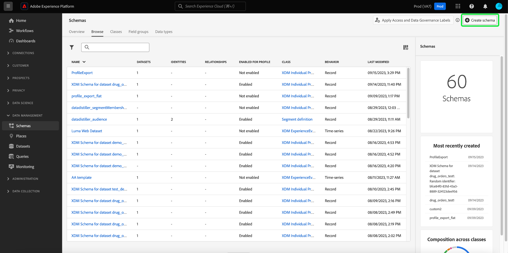
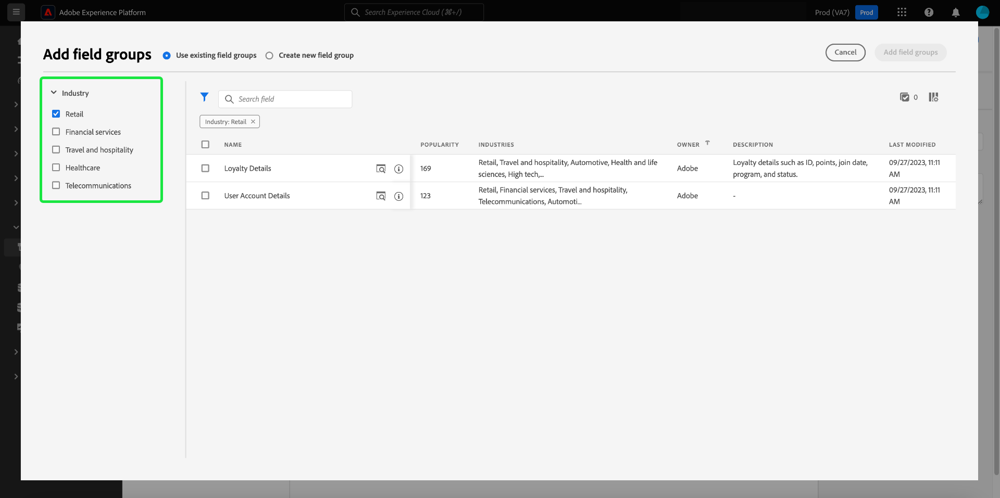

# Crie um schema usando o [!DNL Schema Editor]

A interface do usuário do Adobe Experience Platform permite criar e gerenciar [!DNL Experience Data Model] Esquemas (XDM) em uma tela visual interativa chamada de [!DNL Schema Editor]. Este tutorial aborda como criar um schema usando o [!DNL Schema Editor].

Para fins de demonstração, as etapas neste tutorial envolvem a criação de um schema de exemplo que descreve membros de um programa de fidelidade do cliente. Embora você possa usar essas etapas para criar um schema diferente para seus próprios propósitos, é recomendável primeiro acompanhar a criação do schema de exemplo para saber mais sobre os recursos da variável [!DNL Schema Editor].

>[!NOTE]
>
>Se você estiver assimilando dados CSV na Platform, é possível [mapear esses dados para um esquema XDM criado por recomendações geradas por AI](../../ingestion/tutorials/map-csv/recommendations.md) (no momento em beta) sem precisar criar manualmente o schema por conta própria.
>
>Se preferir compor um schema usando o [!DNL Schema Registry] Comece lendo a API [[!DNL Schema Registry] guia do desenvolvedor](../api/getting-started.md) antes de tentar o tutorial em [criação de um schema usando a API](create-schema-api.md).

## Introdução

Este tutorial requer uma compreensão funcional dos vários aspectos do Adobe Experience Platform envolvidos na criação do schema. Antes de iniciar este tutorial, reveja a documentação dos seguintes conceitos:

* [[!DNL Experience Data Model (XDM)]](../home.md): O quadro normalizado pelo qual [!DNL Platform] organiza os dados de experiência do cliente.
   * [Noções básicas da composição do schema](../schema/composition.md): Uma visão geral dos esquemas XDM e seus blocos de construção, incluindo classes, grupos de campos de esquema, tipos de dados e campos individuais.
* [[!DNL Real-Time Customer Profile]](../../profile/home.md): Fornece um perfil de consumidor unificado e em tempo real com base em dados agregados de várias fontes.

## Abra o [!UICONTROL Esquemas] espaço de trabalho {#browse}

O [!UICONTROL Esquemas] na área de trabalho do [!DNL Platform] A interface do usuário do fornece uma visualização do [!DNL Schema Library], permitindo que você visualize o gerenciamento dos esquemas disponíveis para sua organização. A área de trabalho também inclui a variável [!DNL Schema Editor], a tela na qual você pode compor um esquema em todo este tutorial.

Depois de fazer logon em [!DNL Experience Platform], selecione **[!UICONTROL Esquemas]** na navegação à esquerda para abrir o **[!UICONTROL Esquemas]** espaço de trabalho. O **[!UICONTROL Procurar]** exibe uma lista de schemas (uma representação da variável [!DNL Schema Library]) que você pode visualizar e personalizar. A lista inclui o nome, o tipo, a classe e o comportamento (registro ou série de tempo) em que o schema se baseia, bem como a data e a hora em que o schema foi modificado pela última vez.

Consulte o guia sobre [exploração de recursos XDM existentes na interface do usuário](../ui/explore.md) para obter mais informações.

## Criar e nomear um esquema {#create}

Para começar a compor um schema, selecione **[!UICONTROL Criar esquema]** no canto superior direito do **[!UICONTROL Esquemas]** espaço de trabalho. Um menu suspenso é exibido, dando a você a opção de escolher entre as classes principais [!UICONTROL Perfil individual XDM] e [!UICONTROL ExperiênciaEvento XDM]. Se essas classes não atenderem aos seus propósitos, você também poderá selecionar **[!UICONTROL Procurar]** escolher entre outras classes disponíveis ou [criar uma nova classe](#create-new-class).

Para fins deste tutorial, selecione **[!UICONTROL Perfil individual XDM]**.

O [!DNL Schema Editor] é exibido. Essa é a tela sobre a qual você irá compor o esquema. Um schema sem título é criado automaticamente no **[!UICONTROL Estrutura]** da tela ao chegar ao editor, juntamente com os campos padrão incluídos em todos os schemas com base nessa classe. A classe atribuída para o schema também é listada em **[!UICONTROL Classe]** em **[!UICONTROL Composição]** seção.

>[!NOTE]
>
>Você pode [alterar a classe de um schema](#change-class) em qualquer ponto durante o processo de composição inicial antes que o schema seja salvo, mas isso deve ser feito com extremo cuidado. Os grupos de campos são compatíveis apenas com determinadas classes e, portanto, alterar a classe redefinirá a tela e quaisquer campos adicionados.

Em **[!UICONTROL Propriedades do schema]**, forneça um nome de exibição e uma descrição opcional para o esquema. Depois que um nome é inserido, a tela é atualizada para refletir o novo nome do schema.

Há várias considerações importantes a serem feitas ao decidir um nome para o esquema:

* Os nomes de esquema devem ser curtos e descritivos para que o esquema possa ser facilmente encontrado posteriormente.
* Os nomes de esquema devem ser exclusivos, o que significa que também devem ser específicos o suficiente para que não sejam reutilizados no futuro. Por exemplo, se sua organização tivesse programas de fidelidade separados para diferentes marcas, seria recomendável nomear seu esquema como &quot;Membros da Fidelidade da Marca A&quot; para facilitar a distinção entre outros esquemas relacionados à fidelidade que você poderá definir posteriormente.
* Você também pode usar a descrição do schema para fornecer quaisquer informações contextuais adicionais relacionadas ao schema.

Este tutorial compõe um schema para assimilar dados relacionados aos membros de um programa de fidelidade e, portanto, o schema é nomeado como &quot;[!DNL Loyalty Members]&quot;.

## Adicionar um grupo de campos {#field-group}

Agora é possível começar a adicionar campos ao esquema adicionando grupos de campos. Um grupo de campos é um grupo de um ou mais campos que são frequentemente usados em conjunto para descrever um conceito específico. Este tutorial usa grupos de campos para descrever os membros do programa de fidelidade e capturar informações-chave como nome, aniversário, número de telefone, endereço e muito mais.

Para adicionar um grupo de campos, selecione **[!UICONTROL Adicionar]** no **[!UICONTROL Grupos de campos]** subseção.

Uma nova caixa de diálogo é exibida, exibindo uma lista de grupos de campos disponíveis. Cada grupo de campos deve ser usado somente com uma classe específica, portanto, a caixa de diálogo lista somente grupos de campos compatíveis com a classe selecionada (nesse caso, a variável [!DNL XDM Individual Profile] classe ). Se você estiver usando uma classe XDM padrão, a lista de grupos de campo será classificada de forma inteligente com base na popularidade do uso.

Você pode selecionar um dos filtros no painel esquerdo para restringir a lista de grupos de campos padrão a [indústrias](../schema/industries/overview.md) como varejo, serviços financeiros e saúde.

Selecionar um grupo de campos na lista faz com que ele apareça no painel direito. É possível selecionar vários grupos de campos, se desejar, adicionando cada um à lista no painel direito antes de confirmar. Além disso, um ícone é exibido no lado direito do grupo de campos atualmente selecionado, permitindo que você visualize a estrutura dos campos que ele fornece.

Ao visualizar um grupo de campos, uma descrição detalhada do esquema do grupo de campos é fornecida no painel direito. Também é possível navegar pelos campos do grupo de campos na tela fornecida. À medida que você seleciona campos diferentes, o painel direito é atualizado para mostrar detalhes sobre o campo em questão. Selecionar **[!UICONTROL Voltar]** quando você terminar de visualizar para retornar à caixa de diálogo de seleção do grupo de campos.

Para este tutorial, selecione o **[!UICONTROL Detalhes demográficos]** grupo de campos e selecione **[!UICONTROL Adicionar grupo de campos]**.

A tela do esquema é exibida novamente. O **[!UICONTROL Grupos de campos]** seção agora lista &quot;[!UICONTROL Detalhes demográficos]&quot; e o **[!UICONTROL Estrutura]** inclui os campos contribuídos pelo grupo de campos. Você pode selecionar o nome do grupo de campos sob a variável **[!UICONTROL Grupos de campos]** para realçar os campos específicos fornecidos na tela.

Esse grupo de campos contribui com vários campos sob o nome de nível superior `person` com o tipo de dados &quot;[!UICONTROL Pessoa]&quot;. Este grupo de campos descreve informações sobre um indivíduo, incluindo nome, data de nascimento e gênero.

>[!NOTE]
>
>Lembre-se de que os campos podem usar tipos escalares (como string, integer, array ou data), bem como qualquer tipo de dados (um grupo de campos que representa um conceito comum) definido na variável [!DNL Schema Registry].

Observe que a variável `name` tem um tipo de dados de &quot;[!UICONTROL Nome completo]&quot;, o que significa que também descreve um conceito comum e contém subcampos relacionados ao nome, como nome, sobrenome, título de cortesia e sufixo.

Selecione os diferentes campos na tela para revelar quaisquer campos adicionais que contribuem para a estrutura do schema.

## Adicionar mais grupos de campos {#field-group-2}

Agora é possível repetir as mesmas etapas para adicionar outro grupo de campos. Ao exibir a variável **[!UICONTROL Adicionar grupo de campos]** dessa vez, observe que &quot;[!UICONTROL Detalhes demográficos]&quot; o grupo de campos foi esmaecido e a caixa de seleção ao lado dele não pode ser selecionada. Isso evita a duplicação acidental de grupos de campos que já foram incluídos no esquema atual.

Para este tutorial, selecione os grupos de campos padrão **[!UICONTROL Detalhes de contato pessoal]** e **[!UICONTROL Detalhes da Fidelidade]** na lista, em seguida, selecione **[!UICONTROL Adicionar grupos de campos]** para adicioná-los ao schema.

A tela é exibida novamente com os grupos de campos adicionados listados em **[!UICONTROL Grupos de campos]** no **[!UICONTROL Composição]** e seus campos compostos adicionados à estrutura do schema.

## Definir um grupo de campos personalizado {#define-field-group}

O [!UICONTROL Membros de Fidelidade] O schema deve capturar dados relacionados aos membros de um programa de fidelidade e ao [!UICONTROL Detalhes da Fidelidade] o grupo de campos que você adicionou ao schema fornece a maioria desses itens, incluindo o tipo de programa, pontos, data de associação e muito mais.

No entanto, pode haver um cenário em que você queira incluir campos personalizados adicionais não cobertos por grupos de campos padrão para obter os casos de uso. No caso de adicionar campos de fidelidade personalizados, há duas opções:

1. Crie um novo grupo de campos personalizado para capturar esses campos. Este é o método que será abordado neste tutorial.
1. Estender o padrão [!UICONTROL Detalhes da Fidelidade] grupo de campos com campos personalizados. Isso causa [!UICONTROL Detalhes da Fidelidade] para ser convertido em um grupo de campos personalizado e o grupo de campos padrão original não estará mais disponível. Consulte a [!UICONTROL Esquemas] Guia da interface do usuário para obter mais informações sobre [adição de campos personalizados à estrutura de grupos de campos padrão](../ui/resources/schemas.md#custom-fields-for-standard-groups).

Para criar um novo grupo de campos, selecione **[!UICONTROL Adicionar]** no **[!UICONTROL Grupos de campos]** subseção como antes, mas desta vez selecione **[!UICONTROL Criar novo grupo de campos]** próximo à parte superior da caixa de diálogo exibida. Em seguida, é necessário fornecer um nome de exibição e uma descrição para o novo grupo de campos. Para este tutorial, nomeie o novo grupo de campos &quot;[!DNL Custom Loyalty Details]&quot; e, em seguida, selecione **[!UICONTROL Adicionar grupos de campos]**.

>[!NOTE]
>
>Assim como com os nomes de classe, o nome do grupo de campos deve ser curto e simples, descrevendo o que o grupo de campos contribuirá para o schema. Eles também são exclusivos, portanto, você não poderá reutilizar o nome e deve garantir que seja específico o suficiente.

&quot;[!DNL Custom Loyalty Details]&quot; agora deve aparecer em **[!UICONTROL Grupos de campos]** no lado esquerdo da tela, mas ainda não há campos associados a ela e, portanto, nenhum novo campo é exibido em **[!UICONTROL Estrutura]**.

## Adicionar campos ao grupo de campos {#field-group-fields}

Agora que você criou o &quot;[!DNL Custom Loyalty Details]&quot;, é hora de definir os campos que o grupo de campos contribuirá para o schema.

Para começar, selecione o **mais (+)** ícone ao lado do nome do schema na tela.

Um &quot;[!UICONTROL Campo sem título]&quot; espaço reservado aparece na tela e o painel direito é atualizado para revelar as opções de configuração do campo.

Nesse cenário, o schema precisa ter um campo do tipo objeto que descreva detalhadamente o nível de fidelidade atual da pessoa. Usando os controles no painel direito, comece a criar um `loyaltyTier` campo com tipo &quot;[!UICONTROL Objeto]&quot; que será usado para manter seus campos relacionados.

Em **[!UICONTROL Atribuir a]**, é necessário selecionar um grupo de campos para atribuir o campo. Lembre-se de que todos os campos de esquema pertencem a uma classe ou a um grupo de campos e, como esse esquema usa uma classe padrão, sua única opção é selecionar um grupo de campos. Comece a digitar o nome &quot;[!DNL Custom Loyalty Details]&quot;, em seguida, selecione o grupo de campos na lista.

Quando terminar, selecione **[!UICONTROL Aplicar]**.

As alterações são aplicadas e as `loyaltyTier` é exibido. Como esse é um campo personalizado, ele é automaticamente aninhado em um objeto com o nome do ID do locatário de sua organização, precedido por um sublinhado (`_tenantId` neste exemplo).

>[!NOTE]
>
>A presença do objeto de ID de locatário indica que os campos que você está adicionando estão contidos no namespace da sua organização.
>
>Em outras palavras, os campos que você está adicionando são exclusivos de sua organização e serão salvos na variável [!DNL Schema Registry] em uma área específica acessível somente à sua organização. Os campos definidos devem sempre ser adicionados ao namespace do locatário para evitar colisões com nomes de outras classes padrão, grupos de campos, tipos de dados e campos.

Selecione o **mais (+)** ícone ao lado do `loyaltyTier` objeto para começar a adicionar subcampos. Um novo espaço reservado para campo é exibido e a variável **[!UICONTROL Propriedades do campo]** é visível no lado direito da tela.

Cada campo requer as seguintes informações:

* **[!UICONTROL Nome do campo]:** O nome do campo, escrito em camel case. Exemplo: loyaltyLevel
* **[!UICONTROL Nome de exibição]:** O nome do campo, escrito no caso de título. Exemplo: Nível de Fidelidade
* **[!UICONTROL Tipo]:** O tipo de dados do campo. Isso inclui tipos escalares básicos e quaisquer tipos de dados definidos na variável [!DNL Schema Registry]. Exemplos: [!UICONTROL String], [!UICONTROL Número inteiro], [!UICONTROL Booleano], [!UICONTROL Pessoa], [!UICONTROL Endereço], [!UICONTROL Número de telefone], etc.
* **[!UICONTROL Descrição]:** Uma descrição opcional do campo deve ser incluída com no máximo 200 caracteres.

O primeiro campo para a variável `loyaltyTier` será uma string chamada `id`, representando a ID do nível atual do membro de fidelidade. A ID de camada será exclusiva para cada membro de fidelidade, já que essa empresa define limites de ponto de nível de fidelidade diferentes para cada cliente com base em fatores diferentes. Defina o tipo do novo campo como &quot;[!UICONTROL String]&quot;, e o **[!UICONTROL Propriedades do campo]** torna-se preenchida com várias opções para aplicar restrições, incluindo valor padrão, formato e comprimento máximo.

Since `id` será uma sequência de forma livre gerada aleatoriamente; nenhuma restrição adicional será necessária. Selecionar **[!UICONTROL Aplicar]** para aplicar as alterações.

## Adicionar mais campos ao grupo de campos {#field-group-fields-2}

Agora que você adicionou o `id` , é possível adicionar campos adicionais para capturar informações do nível de fidelidade, como:

* Limite de ponto atual (número inteiro): O número mínimo de pontos de fidelidade que o membro deve manter para permanecer no nível atual.
* Limite do próximo ponto de camada (número inteiro): O número de pontos de fidelidade que o membro deve acumular para se graduar no próximo nível.
* Data efetiva (data-hora): A data em que o membro de fidelidade ingressou nesse nível.

Para adicionar cada campo ao schema, selecione o **mais (+)** ícone ao lado do `loyalty` e preencha as informações necessárias.

Quando concluído, a variável `loyaltyTier` conterá campos para `id`, `currentThreshold`, `nextThreshold`e `effectiveDate`.

## Adicionar um campo enum ao grupo de campos {#enum}

Ao definir campos na variável [!DNL Schema Editor], há algumas opções adicionais que podem ser aplicadas aos tipos básicos de campos para fornecer restrições adicionais sobre os dados que o campo pode conter. Os casos de uso dessas restrições são explicados na tabela a seguir:

| Restrição | Descrição |
| --- | --- |
| [!UICONTROL Obrigatório] | Indica que o campo é obrigatório para a assimilação de dados. Qualquer dado carregado em um conjunto de dados com base nesse esquema que não contenha esse campo falhará ao ser assimilado. |
| [!UICONTROL Matriz] | Indica que o campo contém uma matriz de valores, cada um com o tipo de dados especificado. Por exemplo, o uso dessa restrição em um campo com um tipo de dados &quot;[!UICONTROL String]&quot; especifica que o campo conterá uma matriz de sequências de caracteres. |
| [!UICONTROL Enum e valores sugeridos] | Um enum indica que esse campo deve conter um dos valores de uma lista enumerada de valores possíveis. Como alternativa, você também pode usar essa opção para fornecer uma lista de valores sugeridos para um campo de string sem restringir o campo a esses valores. Consulte o guia sobre [definição de enumerações e valores sugeridos](../ui/fields/enum.md) para obter mais informações sobre como gerenciar esses tipos de campos na interface do usuário do . |
| [!UICONTROL Identidade] | Indica que este campo é um campo de identidade. Mais informações sobre campos de identidade são fornecidas [mais tarde neste tutorial](#identity-field). |
| [!UICONTROL Relação] | Embora os relacionamentos de schema possam ser inferidos por meio do uso do schema de união e [!DNL Real-Time Customer Profile], isso se aplica somente a esquemas que compartilham a mesma classe. O [!UICONTROL Relação] constraint indica que esse campo faz referência à identidade primária de um schema com base em uma classe diferente, implicando uma relação entre os dois schemas. Veja o tutorial em [definição de uma relação](./relationship-ui.md) para obter mais informações. |

{style=&quot;table-layout:auto&quot;}

>[!NOTE]
>
>Todos os campos obrigatórios, de identidade ou de relacionamento são listados em suas respectivas seções no painel esquerdo, permitindo localizar esses campos facilmente, independentemente da complexidade do esquema.

Para este tutorial, a variável `loyaltyTier` no esquema requer um novo campo enum que descreve a classe de camada, onde o valor pode ser apenas uma das quatro opções possíveis. Para adicionar esse campo ao schema, selecione o **mais (+)** ícone ao lado do `loyaltyTier` e preencha os campos obrigatórios para **[!UICONTROL Nome do campo]** e **[!UICONTROL Nome de exibição]**. Para **[!UICONTROL Tipo]**, selecione &quot;[!UICONTROL String]&quot;.

Caixas de seleção adicionais aparecem para o campo depois que seu tipo é selecionado, incluindo caixas de seleção para **[!UICONTROL Matriz]**, **[!UICONTROL Enum e valores sugeridos]**, **[!UICONTROL Identidade]** e **[!UICONTROL Relação]**.

Selecione o **[!UICONTROL Enum e valores sugeridos]** caixa de seleção, em seguida, selecione **[!UICONTROL Enum]**. Aqui você pode inserir o **[!UICONTROL Valor]** (em camelCase) e **[!UICONTROL Nome de exibição]** (um nome opcional e amigável para o leitor no caso de título) para cada classe de nível de fidelidade aceitável.

Após concluir todas as propriedades do campo, selecione **[!UICONTROL Aplicar]** para adicionar o `tierClass` para `loyaltyTier` objeto.

## Converter um objeto de vários campos em um tipo de dados {#datatype}

O `loyaltyTier` agora contém vários campos e representa uma estrutura de dados comum que pode ser útil em outros schemas. O [!DNL Schema Editor] O permite aplicar prontamente objetos de vários campos reutilizáveis, convertendo a estrutura desses objetos em tipos de dados.

Os tipos de dados permitem o uso consistente de estruturas de vários campos e fornecem mais flexibilidade do que um grupo de campos, pois podem ser usados em qualquer lugar dentro de um esquema. Isso é feito definindo as **[!UICONTROL Tipo]** para o de qualquer tipo de dados definido na variável [!DNL Schema Registry].

Para converter o `loyaltyTier` para um tipo de dados, selecione a variável `loyaltyTier` na tela, em seguida selecione **[!UICONTROL Converter em novo tipo de dados]** no lado direito do editor, abaixo **[!UICONTROL Propriedades do campo]**.

Uma notificação é exibida, confirmando que o objeto foi convertido com êxito. Na tela, agora você pode ver que a variável `loyaltyTier` O campo agora tem um ícone de link e o painel direito indica que ele tem um tipo de dados de &quot;[!DNL Loyalty Tier]&quot;.

Em um schema futuro, agora é possível atribuir um campo como um &quot;[!DNL Loyalty Tier]&quot; e ele incluiria automaticamente campos para ID, classe de camada, limites de ponto e data de efetivação.

>[!NOTE]
>
>Você também pode criar e editar tipos de dados personalizados independentemente dos esquemas de edição. Consulte o guia sobre [criação e edição de tipos de dados](../ui/resources/data-types.md) para obter mais informações.

## Pesquisar e filtrar campos de esquema

O esquema agora contém vários grupos de campos além dos campos fornecidos pela classe base. Ao trabalhar com esquemas maiores, você pode marcar as caixas de seleção ao lado dos nomes dos grupos de campos no painel à esquerda para filtrar os campos exibidos somente para aqueles fornecidos pelos grupos de campos em que está interessado.

Se você estiver procurando um campo específico no esquema, também poderá usar a barra de pesquisa para filtrar os campos exibidos por nome, independentemente do grupo de campos em que foram fornecidos.

>[!IMPORTANT]
>
>A função de pesquisa considera todos os filtros de grupo de campos selecionados ao exibir campos correspondentes. Se uma consulta de pesquisa não estiver exibindo os resultados esperados, talvez seja necessário verificar novamente se você não está filtrando nenhum grupo de campo relevante.

## Definir um campo de esquema como um campo de identidade {#identity-field}

A estrutura de dados padrão fornecida pelos esquemas pode ser aproveitada para identificar dados pertencentes ao mesmo indivíduo em várias fontes, permitindo vários casos de uso downstream, como segmentação, relatórios, análise da ciência de dados e muito mais. Para compilar dados com base em identidades individuais, os campos principais devem ser marcados como [!UICONTROL Identidade] campos dentro de schemas aplicáveis.

[!DNL Experience Platform] facilita a identificação de um campo de identidade por meio do uso de um **[!UICONTROL Identidade]** na caixa de seleção [!DNL Schema Editor]. No entanto, você deve determinar qual campo é o melhor candidato a usar como identidade, com base na natureza de seus dados.

Por exemplo, pode haver milhares de membros do programa de fidelidade pertencentes ao mesmo nível de fidelidade e vários que podem compartilhar o mesmo endereço físico. Neste cenário, no entanto, ao se inscrever, cada membro do programa de fidelidade fornece seu endereço de email pessoal. Como os endereços de email pessoais geralmente são gerenciados por uma pessoa, o campo `personalEmail.address` (fornecido pelo [!UICONTROL Detalhes de contato pessoal] grupo de campos) é um bom candidato para um campo de identidade.

>[!IMPORTANT]
>
>As etapas descritas abaixo abordam como adicionar um descritor de identidade a um campo de esquema existente. Como alternativa à definição de campos de identidade dentro da estrutura do próprio schema, também é possível usar um `identityMap` para conter informações de identidade.
>
>Se você planeja usar `identityMap`, lembre-se de que isso substituirá qualquer identidade primária adicionada ao schema diretamente. Consulte a seção sobre `identityMap` no [noções básicas do guia de composição do schema](../schema/composition.md#identityMap) para obter mais informações.

Selecione o `personalEmail.address` na tela e na **[!UICONTROL Identidade]** a caixa de seleção aparece em **[!UICONTROL Propriedades do campo]**. Marque a caixa e a opção para definir isso como a **[!UICONTROL Identidade primária]** é exibido. Selecione essa caixa também.

>[!NOTE]
>
>Cada schema pode conter apenas um campo de identidade primário. Depois que um campo de esquema tiver sido definido como a identidade primária, você receberá uma mensagem de erro se, posteriormente, tentar definir outro campo de identidade no esquema como primário.

Em seguida, você deve fornecer um **[!UICONTROL Namespace de identidade]** na lista de namespaces predefinidos na lista suspensa. Como esse campo é o endereço de email do cliente, selecione &quot;[!UICONTROL Email]&quot; na lista suspensa. Selecionar **[!UICONTROL Aplicar]** para confirmar as atualizações no `personalEmail.address` campo.

>[!NOTE]
>
>Para obter uma lista de namespaces padrão e suas definições, consulte o [[!DNL Identity Service] documentação](../../identity-service/troubleshooting-guide.md#standard-namespaces).

Depois de aplicar a alteração, o ícone para `personalEmail.address` mostra um símbolo de impressão digital, indicando que agora é um campo de identidade. O campo também está listado no painel esquerdo em **[!UICONTROL Identidades]**.

Agora todos os dados assimilados no `personalEmail.address` será usado para ajudar a identificar esse indivíduo e unir uma única visualização desse cliente. Para saber mais sobre como trabalhar com identidades no [!DNL Experience Platform], reveja o [[!DNL Identity Service]](../../identity-service/home.md) documentação.

## Ative o esquema para usar em [!DNL Real-Time Customer Profile] {#profile}

[[!DNL Real-Time Customer Profile]](../../profile/home.md) usa dados de identidade em [!DNL Experience Platform] para fornecer uma visão holística de cada cliente individual. O serviço cria perfis robustos e de 360° dos atributos do cliente, bem como contas com carimbos de data e hora de cada interação que os clientes tiveram em qualquer sistema integrado com o [!DNL Experience Platform].

Para que um schema seja ativado para uso com o [!DNL Real-Time Customer Profile], deve ter uma identidade primária definida. Você receberá uma mensagem de erro ao tentar ativar um esquema sem primeiro definir uma identidade primária.

Para ativar o schema &quot;Membros de Fidelidade&quot; para uso em [!DNL Profile], comece selecionando o título do esquema na tela.

No lado direito do editor, são mostradas informações sobre o schema, incluindo seu nome de exibição, descrição e tipo. Além dessas informações, há um **[!UICONTROL Perfil]** botão de alternância.

Selecionar **[!UICONTROL Perfil]** e uma instância será exibida, solicitando que você confirme que deseja habilitar o schema de [!DNL Profile].

>[!WARNING]
>
>Depois que um schema é ativado para [!DNL Real-Time Customer Profile] e salvo, não poderá ser desativado.

Selecionar **[!UICONTROL Habilitar]** para confirmar sua escolha. Você pode selecionar a variável **[!UICONTROL Perfil]** alterne novamente para desativar o schema, se desejar, mas uma vez que o schema tenha sido salvo enquanto [!DNL Profile] estiver ativado, não poderá mais ser desativado.

## Próximas etapas e recursos adicionais

Agora que você terminou de compor o schema, é possível ver o schema completo na tela. Selecionar **[!UICONTROL Salvar]** e o esquema será salvo no [!DNL Schema Library], tornando-a acessível ao [!DNL Schema Registry].

O novo schema agora pode ser usado para assimilar dados no [!DNL Platform]. Lembre-se de que, uma vez que o schema tenha sido usado para assimilar dados, somente alterações aditivas poderão ser feitas. Consulte a [noções básicas da composição do schema](../schema/composition.md) para obter mais informações sobre o controle de versão do schema.

Agora você pode seguir o tutorial em [definição de uma relação de schema na interface do usuário](./relationship-ui.md) para adicionar um novo campo de relacionamento ao schema &quot;Membros de fidelidade&quot;.

O schema &quot;Membros de Fidelidade&quot; também está disponível para exibição e gerenciamento usando o [!DNL Schema Registry] API. Para começar a trabalhar com a API, comece lendo o [[!DNL Schema Registry API] guia do desenvolvedor](../api/getting-started.md).

### Recursos de vídeo

>[!WARNING]
>
>O [!DNL Platform] A interface do usuário exibida nos vídeos a seguir está desatualizada. Consulte a documentação acima para obter as capturas de tela e a funcionalidade mais recentes da interface do usuário.

O vídeo a seguir mostra como criar um schema simples no [!DNL Platform] IU.

>[!VIDEO](https://video.tv.adobe.com/v/27012?quality=12&learn=on)

O vídeo a seguir destina-se a reforçar sua compreensão sobre como trabalhar com grupos e classes de campo.

>[!VIDEO](https://video.tv.adobe.com/v/27013?quality=12&learn=on)

## Apêndice

As seções a seguir fornecem informações adicionais sobre o uso da variável [!DNL Schema Editor].

### Criar uma nova classe {#create-new-class}

[!DNL Experience Platform] O oferece a flexibilidade para definir um schema com base em uma classe exclusiva para sua organização. Para saber como criar uma nova classe, consulte o guia em [criação e edição de classes na interface do usuário](../ui/resources/classes.md#create).

### Alterar a classe de um schema {#change-class}

Você pode alterar a classe de um schema em qualquer ponto durante o processo de composição inicial antes que o schema tenha sido salvo.

>[!WARNING]
>
>A reatribuição da classe para um schema deve ser feita com extremo cuidado. Os grupos de campos são compatíveis apenas com determinadas classes e, portanto, alterar a classe redefinirá a tela e quaisquer campos adicionados.

Para saber como alterar a classe de um schema, consulte o guia em [gerenciamento de schemas na interface do usuário](../ui/resources/schemas.md#change-class).
