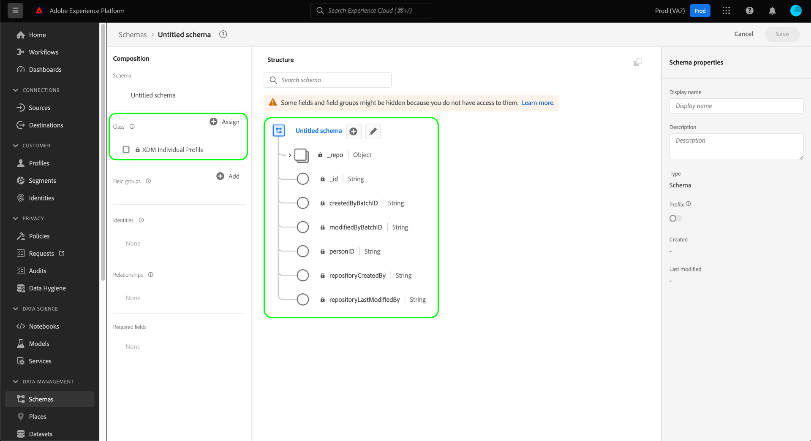
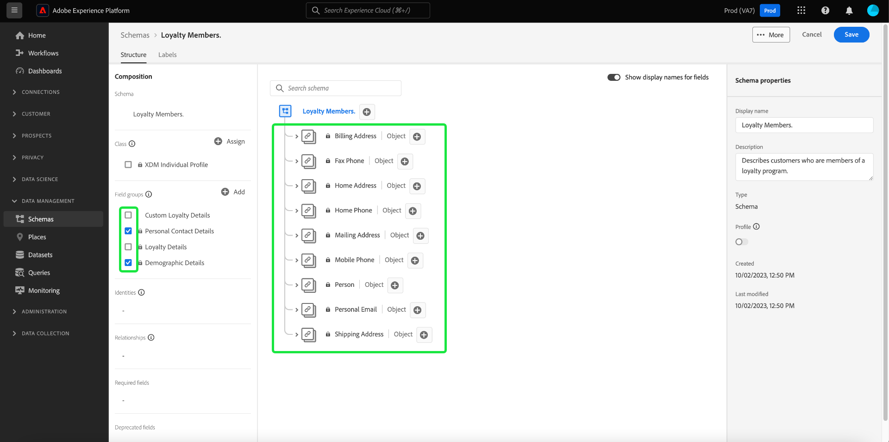

# Criar um esquema usando o [!DNL Schema Editor]

A interface do usuário do Adobe Experience Platform permite criar e gerenciar [!DNL Experience Data Model] (XDM) em uma tela visual interativa chamada de [!DNL Schema Editor]. Este tutorial aborda como criar um esquema usando o [!DNL Schema Editor].

Para fins de demonstração, as etapas deste tutorial envolvem a criação de um schema de exemplo que descreve os membros de um programa de fidelidade do cliente. Embora você possa usar essas etapas para criar um esquema diferente para suas próprias finalidades, recomenda-se seguir primeiro juntamente com a criação do esquema de exemplo para conhecer os recursos do [!DNL Schema Editor].

>[!NOTE]
>
>Se estiver assimilando dados CSV na Platform, você poderá [mapear esses dados para um esquema XDM criado por recomendações geradas por IA](../../ingestion/tutorials/map-csv/recommendations.md) (atualmente na versão beta) sem precisar criar manualmente o esquema.
>
>Se preferir compor um esquema usando a variável [!DNL Schema Registry] API, comece lendo o [[!DNL Schema Registry] guia do desenvolvedor](../api/getting-started.md) antes de tentar acessar o tutorial em [criação de um schema usando a API](create-schema-api.md).

## Introdução

Este tutorial requer uma compreensão funcional dos vários aspectos do Adobe Experience Platform envolvidos na criação do esquema. Antes de iniciar este tutorial, revise a documentação dos seguintes conceitos:

* [[!DNL Experience Data Model (XDM)]](../home.md): o quadro normalizado pelo qual [!DNL Platform] organiza os dados de experiência do cliente.
   * [Noções básicas da composição do esquema](../schema/composition.md): uma visão geral dos esquemas XDM e seus blocos de construção, incluindo classes, grupos de campos de esquema, tipos de dados e campos individuais.
* [[!DNL Real-Time Customer Profile]](../../profile/home.md): fornece um perfil de consumidor unificado em tempo real com base em dados agregados de várias fontes.

## Abra o [!UICONTROL Esquemas] espaço de trabalho {#browse}

A variável [!UICONTROL Esquemas] espaço de trabalho no [!DNL Platform] A interface do usuário fornece uma visualização do [!DNL Schema Library], permitindo exibir e gerenciar os esquemas disponíveis para sua organização. O espaço de trabalho também inclui o [!DNL Schema Editor], a tela na qual você pode compor um esquema neste tutorial.

Depois de fazer logon no [!DNL Experience Platform], selecione **[!UICONTROL Esquemas]** na navegação à esquerda, para abrir a **[!UICONTROL Esquemas]** espaço de trabalho. A variável **[!UICONTROL Procurar]** exibe uma lista de schemas (uma representação da variável [!DNL Schema Library]), que pode ser visualizada e personalizada. A lista inclui o nome, o tipo, a classe e o comportamento (registro ou série temporal) em que o esquema se baseia, bem como a data e a hora em que o esquema foi modificado pela última vez.

Consulte o guia sobre [exploração de recursos XDM existentes na interface do](../ui/explore.md) para obter mais informações.

## Criar e nomear um esquema {#create}

Para começar a compor um esquema, selecione **[!UICONTROL Criar esquema]** no canto superior direito da **[!UICONTROL Esquemas]** espaço de trabalho. Um menu suspenso é exibido, oferecendo a opção de escolher entre as classes principais [!UICONTROL Perfil individual XDM] e [!UICONTROL XDM ExperienceEvent]. Se essas classes não se adequarem aos seus objetivos, você também poderá selecionar **[!UICONTROL Procurar]** para escolher entre outras classes disponíveis ou [criar uma nova classe](#create-new-class).

Para os fins deste tutorial, selecione **[!UICONTROL Perfil individual XDM]**.

A variável [!DNL Schema Editor] é exibida. Esta é a tela sobre a qual você irá compor seu esquema. Um esquema sem título é criado automaticamente na variável **[!UICONTROL Estrutura]** da tela quando você chegar no editor, junto com os campos padrão incluídos em todos os schemas com base nessa classe. A classe atribuída para o esquema também é listada em **[!UICONTROL Classe]** in **[!UICONTROL Composição]** seção.

>[!NOTE]
>
>Você pode [alterar a classe de um schema](#change-class) em qualquer momento durante o processo de composição inicial, antes do esquema ter sido salvo, mas isso deve ser feito com muito cuidado. Os grupos de campos são compatíveis apenas com determinadas classes e, portanto, alterar a classe redefinirá a tela e quaisquer campos adicionados.

Em **[!UICONTROL Propriedades do esquema]**, forneça um nome de exibição e uma descrição opcional para o esquema. Depois que um nome é inserido, a tela é atualizada para refletir o novo nome do esquema.

Há várias considerações importantes a serem feitas ao decidir sobre um nome para o esquema:

* Os nomes do esquema devem ser curtos e descritivos para que o esquema possa ser facilmente encontrado posteriormente.
* Os nomes do esquema devem ser exclusivos, o que significa que também devem ser específicos o suficiente para não serem reutilizados no futuro. Por exemplo, se sua organização tivesse programas de fidelidade separados para marcas diferentes, seria interessante nomear seu esquema como &quot;Membros da fidelidade da marca A&quot; para facilitar a distinção de outros esquemas relacionados à fidelidade que você poderia definir posteriormente.
* Também é possível usar a descrição do schema para fornecer informações contextuais adicionais sobre o schema.

Este tutorial compõe um esquema para assimilar dados relacionados aos membros de um programa de fidelidade e, portanto, o esquema é nomeado como &quot;[!DNL Loyalty Members]&quot;.

## Adicionar um grupo de campos {#field-group}

Agora é possível começar a adicionar campos ao esquema adicionando grupos de campos. Um grupo de campos é um grupo de um ou mais campos que geralmente são usados juntos para descrever um conceito específico. Este tutorial usa grupos de campos para descrever os membros do programa de fidelidade e capturar informações importantes, como nome, aniversário, número de telefone, endereço e muito mais.

Para adicionar um grupo de campos, selecione **[!UICONTROL Adicionar]** no **[!UICONTROL Grupos de campos]** subseção.

Uma nova caixa de diálogo é exibida, exibindo uma lista de grupos de campos disponíveis. Cada grupo de campos deve ser usado apenas com uma classe específica, portanto, a caixa de diálogo lista apenas grupos de campos compatíveis com a classe selecionada (nesse caso, o [!DNL XDM Individual Profile] classe). Se você estiver usando uma classe XDM padrão, a lista de grupos de campos será classificada de forma inteligente com base na popularidade do uso.

É possível selecionar um dos filtros no painel à esquerda para restringir a lista de grupos de campos padrão a campos específicos [indústrias](../schema/industries/overview.md) como varejo, serviços financeiros e assistência médica.

Selecionar um grupo de campos na lista faz com que ele apareça no painel direito. Você pode selecionar vários grupos de campos, se desejar, adicionando cada um à lista no painel direito antes de confirmar. Além disso, um ícone é exibido no lado direito do grupo de campos selecionado no momento, o que permite visualizar a estrutura dos campos fornecidos.

Ao visualizar um grupo de campos, uma descrição detalhada do esquema do grupo de campos é fornecida no painel direito. Você também pode navegar pelos campos do grupo de campos na tela fornecida. À medida que você seleciona campos diferentes, o painel direito é atualizado para mostrar detalhes sobre o campo em questão. Selecionar **[!UICONTROL Voltar]** quando tiver terminado de visualizar, retorne à caixa de diálogo de seleção do grupo de campos.

Para este tutorial, selecione a variável **[!UICONTROL Detalhes demográficos]** grupo de campos, selecione **[!UICONTROL Adicionar grupo de campos]**.

A tela do esquema será exibida novamente. A variável **[!UICONTROL Grupos de campos]** A seção agora lista &quot;[!UICONTROL Detalhes demográficos]&quot; e o **[!UICONTROL Estrutura]** inclui os campos contribuídos pelo grupo de campos. Você pode selecionar o nome do grupo de campos na **[!UICONTROL Grupos de campos]** para realçar os campos específicos fornecidos na tela.

Este grupo de campos contribui com vários campos sob o nome do nível superior `person` com o tipo de dados &quot;[!UICONTROL Person]&quot;. Esse grupo de campos descreve informações sobre um indivíduo, incluindo nome, data de nascimento e sexo.

>[!NOTE]
>
>Lembre-se de que os campos podem usar tipos escalares (como sequência, número inteiro, matriz ou data), bem como qualquer tipo de dados (um grupo de campos que representa um conceito comum) definido no [!DNL Schema Registry].

Observe que `name` O campo tem um tipo de dados &quot;[!UICONTROL Nome completo]&quot;, o que significa que também descreve um conceito comum e contém subcampos relacionados ao nome, como nome, sobrenome, título de cortesia e sufixo.

Selecione os diferentes campos na tela para revelar quaisquer campos adicionais com que eles contribuam para a estrutura do esquema.

## Adicionar mais grupos de campos {#field-group-2}

Agora é possível repetir as mesmas etapas para adicionar outro grupo de campos. Ao visualizar a variável **[!UICONTROL Adicionar grupo de campos]** desta vez, observe que &quot;[!UICONTROL Detalhes demográficos]O grupo de campos &quot;foi esmaecido e a caixa de seleção ao lado dele não pode ser selecionada. Isso impede a duplicação acidental de grupos de campos que você já incluiu no esquema atual.

Para este tutorial, selecione os grupos de campos padrão **[!UICONTROL Detalhes de contato pessoal]** e **[!UICONTROL Detalhes de fidelidade]** na lista e selecione **[!UICONTROL Adicionar grupos de campos]** para adicioná-los ao esquema.

A tela será exibida novamente com os grupos de campos adicionados listados em **[!UICONTROL Grupos de campos]** no **[!UICONTROL Composição]** e seus campos compostos adicionados à estrutura do schema.

## Definir um grupo de campos personalizado {#define-field-group}

A variável [!UICONTROL Membros do programa de fidelidade] esquema se destina a capturar dados relacionados aos membros de um programa de fidelidade e ao padrão [!UICONTROL Detalhes de fidelidade] o grupo de campos adicionado ao esquema fornece a maioria deles, incluindo o tipo de programa, pontos, data de adesão e muito mais.

No entanto, pode haver um cenário em que você deseje incluir campos personalizados adicionais não cobertos por grupos de campos padrão para atingir seus casos de uso. No caso de adicionar campos de fidelidade personalizados, você tem duas opções:

1. Crie um novo grupo de campos personalizado para capturar esses campos. Este é o método que será abordado neste tutorial.
1. Estender o padrão [!UICONTROL Detalhes de fidelidade] grupo de campos com campos personalizados. Isso causa [!UICONTROL Detalhes de fidelidade] para ser convertido em um grupo de campos personalizado, e o grupo de campos padrão original não estará mais disponível. Consulte a [!UICONTROL Esquemas] Guia da interface do usuário para obter mais informações sobre [adição de campos personalizados à estrutura de grupos de campos padrão](../ui/resources/schemas.md#custom-fields-for-standard-groups).

Para criar um novo grupo de campos, selecione **[!UICONTROL Adicionar]** no **[!UICONTROL Grupos de campos]** subseção como antes, mas dessa vez selecione **[!UICONTROL Criar novo grupo de campos]** próximo à parte superior da caixa de diálogo exibida. Em seguida, você será solicitado a fornecer um nome de exibição e uma descrição para o novo grupo de campos. Para este tutorial, nomeie o novo grupo de campos &quot;[!DNL Custom Loyalty Details]&quot; e selecione **[!UICONTROL Adicionar grupos de campos]**.

>[!NOTE]
>
>Assim como com os nomes de classe, o nome do grupo de campos deve ser curto e simples, descrevendo o que o grupo de campos contribuirá para o esquema. Eles também são exclusivos, portanto, você não poderá reutilizar o nome e deve garantir que ele seja específico o suficiente.

&quot;[!DNL Custom Loyalty Details]&quot; agora deve aparecer em **[!UICONTROL Grupos de campos]** no lado esquerdo da tela, mas ainda não há campos associados a ela e, portanto, nenhum campo novo aparecerá em **[!UICONTROL Estrutura]**.

## Adicionar campos ao grupo de campos {#field-group-fields}

Agora que você criou o &quot;[!DNL Custom Loyalty Details]&quot;grupo de campos, é hora de definir os campos em que o grupo de campos contribuirá para o esquema.

Para começar, selecione o **mais (+)** ícone ao lado do nome do schema na tela.

Um &quot;[!UICONTROL Campo sem título]O espaço reservado &quot; é exibido na tela e o painel direito é atualizado para revelar as opções de configuração do campo.

Nesse cenário, o esquema precisa ter um campo do tipo objeto que descreva detalhadamente o nível de fidelidade atual da pessoa. Usando os controles no painel direito, comece criando uma `loyaltyTier` campo com tipo &quot;[!UICONTROL Objeto]&quot; que serão usados para manter seus campos relacionados.

Em **[!UICONTROL Atribuir a]**, você deve selecionar um grupo de campos ao qual atribuir o campo. Lembre-se de que todos os campos de esquema pertencem a uma classe ou a um grupo de campos e, como esse esquema usa uma classe padrão, sua única opção é selecionar um grupo de campos. Comece a digitar o nome &quot;[!DNL Custom Loyalty Details]&quot;, em seguida, selecione o grupo de campos na lista.

Quando terminar, selecione **[!UICONTROL Aplicar]**.

As alterações são aplicadas e o recém-criado `loyaltyTier` é exibido. Como esse é um campo personalizado, ele é aninhado automaticamente em um objeto com nome vinculado à ID de locatário da sua organização, precedido por um sublinhado (`_tenantId` neste exemplo).

>[!NOTE]
>
>A presença do objeto de ID do locatário indica que os campos que você está adicionando estão contidos no namespace da sua organização.
>
>Em outras palavras, os campos adicionados são exclusivos de sua organização e serão salvos na variável [!DNL Schema Registry] em uma área específica acessível somente à sua organização. Os campos definidos devem sempre ser adicionados ao namespace do locatário para evitar colisões com nomes de outras classes padrão, grupos de campos, tipos de dados e campos.

Selecione o **mais (+)** ícone ao lado do `loyaltyTier` objeto para começar a adicionar subcampos. Um novo espaço reservado de campo é exibido e a variável **[!UICONTROL Propriedades do campo]** A seção está visível no lado direito da tela.

Cada campo requer as seguintes informações:

* **[!UICONTROL Nome do campo]:** O nome do campo, de preferência escrito em camelCase. Não são permitidos caracteres de espaço. Esse é o nome usado para fazer referência ao campo no código e em outros aplicativos downstream.
   * Exemplo: fidelizlevel
* **[!UICONTROL Nome de exibição]:** O nome do campo, escrito em letra maiúscula. Esse é o nome que será exibido na tela ao visualizar ou editar o esquema.
   * Exemplo: Nível de fidelidade
* **[!UICONTROL Tipo]:** O tipo de dados do campo. Isso inclui tipos escalares básicos e quaisquer tipos de dados definidos no [!DNL Schema Registry]. Exemplos: [!UICONTROL String], [!UICONTROL Integer], [!UICONTROL Booleano], [!UICONTROL Person], [!UICONTROL Endereço], [!UICONTROL Número de telefone], etc.
* **[!UICONTROL Descrição]:** Uma descrição opcional do campo deve ser incluída com no máximo 200 caracteres.

O primeiro campo para a variável `loyaltyTier` o objeto será uma cadeia de caracteres chamada `id`, representando a ID da camada atual do membro de fidelidade. A ID da camada será exclusiva para cada membro do programa de fidelidade, já que essa empresa define diferentes limites de ponto da camada de fidelidade para cada cliente com base em diferentes fatores. Defina o tipo do novo campo como &quot;[!UICONTROL String]&quot;, e a variável **[!UICONTROL Propriedades do campo]** fica preenchida com várias opções para aplicar restrições, incluindo valor padrão, formato e comprimento máximo.

Desde `id` será uma cadeia de caracteres de forma livre gerada aleatoriamente, nenhuma outra restrição é necessária. Selecionar **[!UICONTROL Aplicar]** para aplicar as alterações.

## Adicionar mais campos ao grupo de campos {#field-group-fields-2}

Agora que você adicionou o `id` você pode adicionar outros campos para capturar informações sobre o nível de fidelidade, como:

* Limite de ponto atual (número inteiro): o número mínimo de pontos de fidelidade que o membro deve manter para permanecer na camada atual.
* Limite de próximo ponto de camada (número inteiro): o número de pontos de fidelidade que o membro deve acumular para se formar no próximo nível.
* Data de efetivação (data-hora): a data em que o membro do programa de fidelidade ingressou nessa camada.

Para adicionar cada campo ao esquema, selecione a variável **mais (+)** ícone ao lado do `loyalty` e preencha as informações necessárias.

Quando concluído, o `loyaltyTier` o objeto conterá campos para `id`, `currentThreshold`, `nextThreshold`, e `effectiveDate`.

## Adicionar um campo de enumeração ao grupo de campos {#enum}

Ao definir campos na variável [!DNL Schema Editor], há algumas opções adicionais que podem ser aplicadas a tipos básicos de campo para fornecer mais restrições sobre os dados que o campo pode conter. Os casos de uso para essas restrições são explicados na tabela a seguir:

| Restrição | Descrição |
| --- | --- |
| [!UICONTROL Obrigatório] | Indica que o campo é obrigatório para assimilação de dados. Quaisquer dados carregados em um conjunto de dados com base nesse esquema que não contenha esse campo falharão na assimilação. |
| [!UICONTROL Matriz] | Indica que o campo contém uma matriz de valores, cada um com o tipo de dados especificado. Por exemplo, usar essa restrição em um campo com um tipo de dados de &quot;[!UICONTROL String]&quot; especifica que o campo conterá uma matriz de cadeias de caracteres. |
| [!UICONTROL Enumeração e valores sugeridos] | Um enum indica que este campo deve conter um dos valores de uma lista enumerada de valores possíveis. Como alternativa, você também pode usar essa opção para fornecer apenas uma lista de valores sugeridos para um campo de string sem restringir o campo a esses valores. |
| [!UICONTROL Identidade] | Indica que este campo é um campo de identidade. Mais informações sobre campos de identidade são fornecidas [posteriormente neste tutorial](#identity-field). |
| [!UICONTROL Relação] | Embora os relacionamentos entre esquemas possam ser inferidos por meio do uso do esquema de união e [!DNL Real-Time Customer Profile], isso se aplica somente a esquemas que compartilham a mesma classe. A variável [!UICONTROL Relacionamento] a restrição indica que este campo faz referência à identidade primária de um esquema com base em uma classe diferente, implicando uma relação entre os dois esquemas. Veja o tutorial sobre [definição de uma relação](./relationship-ui.md) para obter mais informações. |

{style="table-layout:auto"}

>[!NOTE]
>
>Todos os campos obrigatórios, de identidade ou de relação são listados nas respectivas seções no painel à esquerda, permitindo que você localize esses campos facilmente, independentemente da complexidade do esquema.

Para este tutorial, a variável `loyaltyTier` o objeto no esquema requer um novo campo enum que descreve a classe de camada, onde o valor pode ser apenas uma das quatro opções possíveis. Para adicionar esse campo ao esquema, selecione a variável **mais (+)** ícone ao lado de `loyaltyTier` e preencha os campos obrigatórios para **[!UICONTROL Nome do campo]** e **[!UICONTROL Nome de exibição]**. Para **[!UICONTROL Tipo]**, selecione &quot;[!UICONTROL String]&quot;.

Caixas de seleção adicionais são exibidas para o campo após a seleção do tipo, incluindo caixas de seleção para **[!UICONTROL Matriz]**, **[!UICONTROL Enumeração e valores sugeridos]**, **[!UICONTROL Identidade]**, e **[!UICONTROL Relacionamento]**.

Selecione o **[!UICONTROL Enumeração e valores sugeridos]** e selecione **[!UICONTROL Enum]**. Aqui você pode inserir o **[!UICONTROL Valor]** (no camelCase) e **[!UICONTROL Nome de exibição]** (um nome opcional e legível em Letra maiúscula ou minúscula) para cada classe de nível de fidelidade aceitável.

Quando tiver concluído todas as propriedades do campo, selecione **[!UICONTROL Aplicar]** para adicionar o `tierClass` para o campo `loyaltyTier` objeto.

## Converter um objeto de vários campos em um tipo de dados {#datatype}

A variável `loyaltyTier` O objeto agora contém vários campos e representa uma estrutura de dados comum que pode ser útil em outros schemas. A variável [!DNL Schema Editor] O permite aplicar prontamente objetos de vários campos reutilizáveis convertendo a estrutura desses objetos em tipos de dados.

Os tipos de dados permitem o uso consistente de estruturas de vários campos e fornecem mais flexibilidade do que um grupo de campos, pois podem ser usados em qualquer lugar em um esquema. Isso é feito definindo as configurações do campo **[!UICONTROL Tipo]** para o de qualquer tipo de dados definido na variável [!DNL Schema Registry].

Para converter a variável `loyaltyTier` a um tipo de dados, selecione o `loyaltyTier` na tela e selecione **[!UICONTROL Converter em novo tipo de dados]** no lado direito do editor, em **[!UICONTROL Propriedades do campo]**.

Uma notificação é exibida, confirmando que o objeto foi convertido com êxito. Na tela, agora é possível ver que a variável `loyaltyTier` O campo agora tem um ícone de link e o painel direito indica que ele tem um tipo de dados &quot;[!DNL Loyalty Tier]&quot;.

Em um esquema futuro, agora é possível atribuir um campo como &quot;[!DNL Loyalty Tier]&quot; e incluiria automaticamente campos para ID, classe de camada, limites de ponto e data de efetivação.

>[!NOTE]
>
>Você também pode criar e editar tipos de dados personalizados independentemente de editar esquemas. Consulte o guia sobre [criação e edição de tipos de dados](../ui/resources/data-types.md) para obter mais informações.

## Pesquisar e filtrar campos de esquema

Seu esquema agora contém vários grupos de campos além dos campos fornecidos por sua classe base. Ao trabalhar com esquemas maiores, você pode marcar as caixas de seleção ao lado dos nomes dos grupos de campos no painel esquerdo para filtrar os campos exibidos somente para aqueles fornecidos pelos grupos de campos em que você está interessado.

Se estiver procurando um campo específico no esquema, também poderá usar a barra de pesquisa para filtrar os campos exibidos por nome, independentemente do grupo de campos em que são fornecidos.

>[!IMPORTANT]
>
>A função de pesquisa considera todos os filtros de grupo de campos selecionados ao exibir campos correspondentes. Se uma consulta de pesquisa não estiver exibindo os resultados esperados, talvez seja necessário verificar novamente se você não está filtrando nenhum grupo de campos relevante.

## Definir um campo de esquema como um campo de identidade {#identity-field}

A estrutura de dados padrão fornecida pelos esquemas pode ser aproveitada para identificar dados pertencentes ao mesmo indivíduo em várias fontes, permitindo vários casos de uso downstream, como segmentação, relatórios, análise de ciência de dados e muito mais. Para compilar dados com base em identidades individuais, os campos principais devem ser marcados como [!UICONTROL Identidade] em esquemas aplicáveis.

[!DNL Experience Platform] facilita a identificação de um campo de identidade através do uso de **[!UICONTROL Identidade]** caixa de seleção na caixa [!DNL Schema Editor]. No entanto, você deve determinar qual campo é o melhor candidato a ser usado como identidade, com base na natureza dos dados.

Por exemplo, pode haver milhares de membros do programa de fidelidade pertencentes ao mesmo nível de fidelidade e vários que podem compartilhar o mesmo endereço físico. Nesse cenário, no entanto, no momento da inscrição, cada membro do programa de fidelidade fornece seu endereço de email pessoal. Como os endereços de email pessoais geralmente são gerenciados por uma pessoa, o campo `personalEmail.address` (fornecido pela [!UICONTROL Detalhes de contato pessoal] grupo de campos) é um bom candidato para um campo de identidade.

>[!IMPORTANT]
>
>As etapas descritas abaixo abordam como adicionar um descritor de identidade a um campo de esquema existente. Como alternativa à definição de campos de identidade na estrutura do próprio esquema, também é possível usar um `identityMap` campo para conter informações de identidade.
>
>Se você planeja usar `identityMap`, lembre-se de que ele substituirá qualquer identidade principal adicionada diretamente ao esquema. Consulte a seção sobre `identityMap` no [guia de noções básicas da composição de esquema](../schema/composition.md#identityMap) para obter mais informações.

Selecione o `personalEmail.address` na tela, e o campo **[!UICONTROL Identidade]** aparece em **[!UICONTROL Propriedades do campo]**. Marque a caixa e a opção para definir isso como a variável **[!UICONTROL Identidade principal]** é exibida. Selecione esta caixa também.

>[!NOTE]
>
>Cada esquema pode conter apenas um campo de identidade principal. Depois que um campo de esquema é definido como a identidade primária, você receberá uma mensagem de erro se tentar posteriormente definir outro campo de identidade no esquema como a principal.

Em seguida, você deve fornecer um **[!UICONTROL Namespace de identidade]** na lista de namespaces predefinidos na lista suspensa. Como esse campo é o endereço de email do cliente, selecione &quot;[!UICONTROL E-mail]&quot; na lista suspensa. Selecionar **[!UICONTROL Aplicar]** para confirmar as atualizações do `personalEmail.address` campo.

>[!NOTE]
>
>Para obter uma lista de namespaces padrão e suas definições, consulte [[!DNL Identity Service] documentação](../../identity-service/troubleshooting-guide.md#standard-namespaces).

Depois de aplicar a alteração, o ícone para `personalEmail.address` mostra um símbolo de impressão digital, indicando que agora ele é um campo de identidade. O campo também está listado no painel à esquerda em **[!UICONTROL Identidades]**.

Agora todos os dados assimilados na `personalEmail.address` O campo será usado para ajudar a identificar essa pessoa e unir uma única visualização desse cliente. Para saber mais sobre como trabalhar com identidades no [!DNL Experience Platform], revise o [[!DNL Identity Service]](../../identity-service/home.md) documentação.

## Ativar o esquema para uso no [!DNL Real-Time Customer Profile] {#profile}

[[!DNL Real-Time Customer Profile]](../../profile/home.md) utiliza dados de identidade no [!DNL Experience Platform] para fornecer uma visão holística de cada cliente individual. O serviço cria perfis robustos de 360° dos atributos do cliente, bem como contas com carimbo de data e hora de cada interação que os clientes tiveram em qualquer sistema integrado com a [!DNL Experience Platform].

Para que um esquema seja ativado para uso com [!DNL Real-Time Customer Profile], ela deve ter uma identidade principal definida. Você receberá uma mensagem de erro se tentar ativar um esquema sem definir primeiro uma identidade primária.

Para ativar o esquema &quot;Membros de fidelidade&quot; para uso no [!DNL Profile], comece selecionando o título do schema na tela.

No lado direito do editor, são mostradas informações sobre o esquema, incluindo o nome para exibição, a descrição e o tipo. Para além destas informações, existe uma **[!UICONTROL Perfil]** botão de alternância.

Selecionar **[!UICONTROL Perfil]** e um popover é exibido, pedindo que você confirme que deseja ativar o esquema para [!DNL Profile].

>[!WARNING]
>
>Depois que um esquema é ativado para [!DNL Real-Time Customer Profile] e salvo, não poderá ser desativado.

Selecionar **[!UICONTROL Ativar]** para confirmar sua escolha. É possível selecionar a variável **[!UICONTROL Perfil]** alterne novamente para desativar o esquema, se desejar, mas depois que o esquema tiver sido salvo enquanto [!DNL Profile] estiver ativado, não poderá mais ser desativado.

## Próximas etapas e recursos adicionais

Agora que terminou de compor o esquema, você pode ver o esquema completo na tela. Selecionar **[!UICONTROL Salvar]** e o esquema será salvo na variável [!DNL Schema Library], tornando-o acessível pela [!DNL Schema Registry].

Seu novo esquema agora pode ser usado para assimilar dados no [!DNL Platform]. Lembre-se de que, uma vez que o esquema tenha sido usado para assimilar dados, somente alterações aditivas poderão ser feitas. Consulte a [noções básicas da composição do esquema](../schema/composition.md) para obter mais informações sobre controle de versão de esquema.

Agora você pode seguir o tutorial em [definição de um relacionamento de esquema na interface](./relationship-ui.md) para adicionar um novo campo de relacionamento ao esquema &quot;Membros de fidelidade&quot;.

O esquema &quot;Membros de fidelidade&quot; também está disponível para ser visualizado e gerenciado usando o [!DNL Schema Registry] API. Para começar a trabalhar com a API, comece lendo o [[!DNL Schema Registry API] guia do desenvolvedor](../api/getting-started.md).

### Recursos de vídeo

>[!WARNING]
>
>A variável [!DNL Platform] A interface mostrada nos vídeos a seguir está desatualizada. Consulte a documentação acima para obter as capturas de tela e a funcionalidade mais recentes da interface.

O vídeo a seguir mostra como criar um esquema simples no [!DNL Platform] IU.

>[!VIDEO](https://video.tv.adobe.com/v/27012?quality=12&learn=on)

O vídeo a seguir tem como objetivo reforçar sua compreensão de trabalhar com grupos de campo e classes.

>[!VIDEO](https://video.tv.adobe.com/v/27013?quality=12&learn=on)

## Apêndice

As seções a seguir fornecem informações adicionais sobre o uso do [!DNL Schema Editor].

### Criar uma nova classe {#create-new-class}

[!DNL Experience Platform] O oferece a flexibilidade para definir um esquema com base em uma classe exclusiva de sua organização. Para saber como criar uma nova classe, consulte o manual sobre [criação e edição de classes na interface](../ui/resources/classes.md#create).

### Alterar a classe de um esquema {#change-class}

Você pode alterar a classe de um esquema em qualquer momento durante o processo de composição inicial, antes que o esquema tenha sido salvo.

>[!WARNING]
>
>A reatribuição da classe para um schema deve ser feita com extremo cuidado. Os grupos de campos são compatíveis apenas com determinadas classes e, portanto, alterar a classe redefinirá a tela e quaisquer campos adicionados.

Para saber como alterar a classe de um schema, consulte o manual sobre [gerenciamento de esquemas na interface](../ui/resources/schemas.md#change-class).
