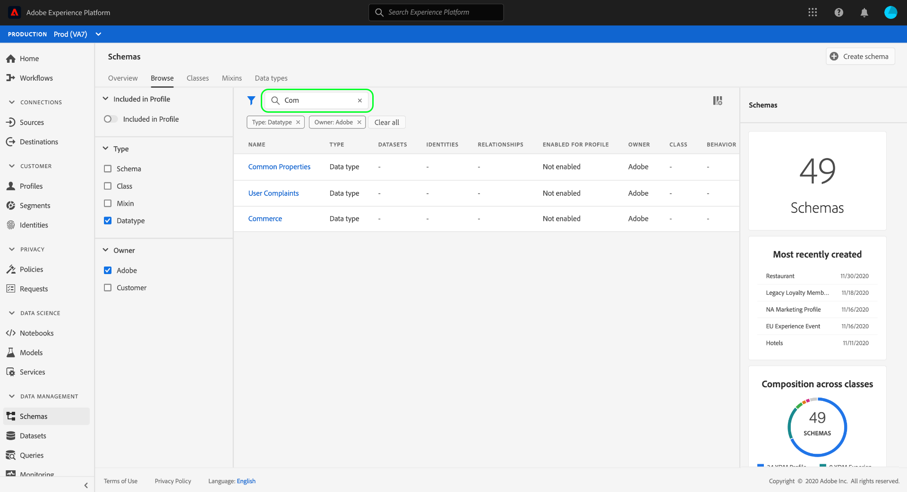

# Explore os recursos XDM na interface do usuário

No Adobe Experience Platform, todos os recursos do Modelo de dados de experiência (XDM) são armazenados no, [!DNL Schema Library]incluindo recursos padrão fornecidos pelo Adobe e recursos personalizados definidos pela sua organização. Na interface do usuário do Experience Platform, é possível visualização a estrutura e os campos de qualquer schema, classe, combinação ou tipo de dados existente na [!DNL Schema Library]. Isso é especialmente útil ao planejar e se preparar para a ingestão de dados, já que a interface do usuário fornece informações sobre os tipos de dados esperados e casos de uso de cada campo fornecidos por esses recursos XDM.

Este tutorial aborda as etapas para explorar schemas, classes, combinações e tipos de dados existentes na interface do usuário do Experience Platform.

## Pesquisar um recurso XDM {#lookup}

Na interface do usuário da plataforma, selecione **[!UICONTROL Schemas]** no painel de navegação esquerdo. A área de trabalho de [!UICONTROL Schemas] fornece uma guia **[!UICONTROL Procurar]** para explorar todos os recursos XDM existentes em sua organização, juntamente com guias dedicadas adicionais para explorar especificamente **[!UICONTROL classes]**, **[!UICONTROL misturas]** e tipos **[!UICONTROL de]** dados.

Na guia [!UICONTROL Procurar] , é possível usar o ícone de filtro (ImagemFiltrar) para revelar os controles no painel esquerdo para restringir os resultados listados.

Por exemplo, para filtrar a lista para mostrar apenas os tipos de dados padrão fornecidos pelo Adobe, selecione **[!UICONTROL Tipo]** de dados e **[!UICONTROL Adobe]** nas seções **[!UICONTROL Tipo]** e **[!UICONTROL Proprietário]** , respectivamente.

A alternância **[!UICONTROL Incluído no Perfil]** permite filtrar os resultados para mostrar somente os recursos usados em schemas que foram habilitados para uso no Perfil [do cliente em tempo](../../profile/home.md)real.

Você também pode usar a barra de pesquisa para restringir os resultados aos recursos cujos nomes correspondem ao query de pesquisa.

Quando encontrar o recurso que deseja explorar, selecione seu nome na lista para visualização de sua estrutura na tela.

## Explore um recurso XDM na tela {#explore}

Após selecionar um recurso, sua estrutura é aberta na tela.

Todos os campos do tipo de objeto que contêm subpropriedades são recolhidos por padrão quando aparecem pela primeira vez na tela. Para mostrar as subpropriedades de qualquer campo, selecione o ícone ao lado de seu nome.

### Campos gerados pelo sistema {#system-fields}

Alguns campos de schema são prefixados com um sublinhado, como `_repo` e `_id`. Eles representam espaços reservados para campos que o sistema gerará e atribuirá automaticamente quando os dados forem assimilados.

Dessa forma, a maioria desses campos deve ser excluída da estrutura de seus dados ao ingressar na Plataforma, com a exceção principal sendo o `_{TENANT_ID}` campo, no qual todos os campos XDM criados em sua organização devem ser nomeados.

### Tipos de dados {#data-types}

Para cada campo mostrado na tela, seu tipo de dados correspondente é mostrado ao lado do nome, indicando rapidamente o tipo de dados que o campo espera para ingestão.

Qualquer tipo de dados anexado com colchetes (`[]`) representa uma matriz desse tipo de dados específico. Por exemplo, um tipo de dados de **[!UICONTROL String]\[]** indica que o campo espera uma matriz de valores de string. Um tipo de dados de Item **[!UICONTROL de]Pagamento\[]** indica uma matriz de objetos que estão em conformidade com o tipo de dados de Item [!UICONTROL de] Pagamento.

Se um campo de matriz for baseado em um tipo de objeto, você poderá selecionar seu ícone na tela para mostrar os atributos esperados para cada item de matriz.

### [!UICONTROL Propriedades do campo] {#field-properties}

Quando você seleciona o nome de qualquer campo na tela, o painel direito é atualizado para mostrar detalhes sobre esse campo nas propriedades **[!UICONTROL do]** campo. Isso pode incluir uma descrição do caso de uso pretendido do campo, valores padrão, padrões, formatos, se o campo é obrigatório ou não e muito mais.

Se o campo que você está inspecionando for um campo enum, o painel direito também exibirá os valores aceitáveis que o campo espera receber.

### Campos de identidade {#identity}

Ao inspecionar schemas que contêm campos de identidade, esses campos são realçados na tela com um ícone de impressão digital (Imagemde ícone de impressão digital). Se você selecionar o nome do campo de identidade, poderá visualização informações adicionais, como a namespace [de](../../identity-service/namespaces.md) identidade e se o campo é ou não a identidade primária do schema.

### Campos de relacionamento {#relationship}

Os campos de relacionamento também são destacados exclusivamente na tela, mostrando o nome do schema de destino ao qual o campo faz referência. Se você selecionar o nome do campo de relação, poderá visualização a namespace de identidade da identidade principal do schema de destino.

>[!NOTE]
>
>Consulte o tutorial sobre como [criar uma relação na interface do usuário](./create-schema-ui.md) para obter mais informações sobre o uso de relações em schemas XDM.

## Próximas etapas

Este documento abordou como explorar os recursos XDM existentes na interface do usuário do Experience Platform. Para obter mais informações sobre os diferentes recursos da área de trabalho dos [!UICONTROL Schemas] e [!DNL Schema Editor], consulte o tutorial [de criação do](./create-schema-ui.md)schema.