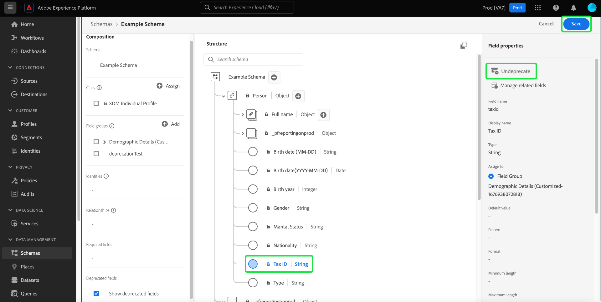

# Substituir um campo XDM na interface do usuário

O Experience Data Model (XDM) oferece a flexibilidade de gerenciar o modelo de dados à medida que as necessidades da sua empresa mudam, substituindo os campos de esquema após a assimilação dos dados. Campos indesejados podem ser descontinuados para removê-los da visualização da interface e também ocultá-los das interfaces downstream. Convenientemente, uma caixa de seleção no Editor de esquemas permite exibir campos obsoletos e, se necessário, você também pode reprová-los.

Como os campos obsoletos estão ocultos da interface do usuário por padrão, isso simplifica o esquema no Editor de esquemas e impede que campos indesejados sejam adicionados a dependências downstream, como o Construtor de segmentos, o Designer de jornadas e assim por diante. A descontinuação de campo também é compatível com versões anteriores. Outros sistemas que usam campos obsoletos, como públicos-alvo e consultas, continuarão a avaliá-los conforme esperado. Se um campo obsoleto for usado em um público-alvo existente, ele será tratado normalmente, o que significa que o campo é exibido conforme esperado na tela do Construtor de segmentos ou avaliado com base em quaisquer dados disponíveis nos campos obsoletos. Essa é uma alteração ininterrupta que não afeta negativamente nenhum fluxo de dados existente.

>[!NOTE]
>
>Antes de os dados serem assimilados em um esquema, você pode remover grupos de campos desnecessários. Consulte a documentação sobre [como remover um grupo de campos de um esquema](../ui/resources/schemas.md#remove-fields) para obter mais informações.

Depois que os dados tiverem sido assimilados em seu esquema, você não poderá mais remover campos do esquema sem fazer alterações irrelevantes. Nesse caso, você pode descontinuar um campo indesejado em um esquema ou recurso personalizado usando o [Editor de esquemas](./create-schema-ui.md) ou a [API do Registro de esquemas](https://developer.adobe.com/experience-platform-apis/references/schema-registry/).

Este documento aborda como descontinuar campos para diferentes recursos XDM usando o Editor de esquemas na interface do usuário do Experience Platform. Para obter etapas sobre como descontinuar um campo XDM usando a API, consulte o tutorial em [como descontinuar um campo XDM usando a API do Registro de Esquema](./field-deprecation-api.md).

## Desativar um campo {#deprecate}

Para descontinuar um campo personalizado, navegue até o Editor de esquemas do esquema que deseja editar. Selecione o campo que você deseja descontinuar da seção [!UICONTROL Estrutura] da tela, seguido por **[!UICONTROL Descontinuar]** das [!UICONTROL Propriedades do Campo].

Uma caixa de diálogo é exibida para confirmar suas escolhas e notificá-lo de que o campo será removido da visualização da interface do esquema de união e ocultado das interfaces downstream. Para concluir a ação, selecione **[!UICONTROL Confirmar]**.

O campo agora é removido da visualização da interface do usuário.

>[!NOTE]
>
>Depois de descontinuadas, as interfaces do usuário downstream, como painéis de segmentação, Customer Journey Analytics e Adobe Journey Optimizer, não exibem mais campos descontinuados como parte do fluxo de trabalho. No entanto, as interfaces do usuário downstream têm a opção de mostrar campos obsoletos se necessário e continuar a tratar o campo obsoleto como normal. Consulte a respectiva documentação para obter mais informações. As consultas e os públicos que usam o campo obsoleto continuarão a ser executados conforme esperado.

## Mostrar campos obsoletos {#show-deprecated}

Para exibir campos obsoletos anteriormente, navegue até o esquema relevante no Editor de esquemas. Marque a caixa de seleção **[!UICONTROL Mostrar campos obsoletos]** na seção [!UICONTROL Composição] da tela.

O campo obsoleto agora aparece na visualização da interface do usuário. Selecione **[!UICONTROL Salvar]** para confirmar suas configurações.

## Reativar campos {#undeprecate-fields}

Para desfazer um campo obsoleto, primeiro [exiba o campo obsoleto](#show-deprecated) conforme descrito acima, e depois selecione o campo obsoleto na seção [!UICONTROL Estrutura] do editor. Em seguida, selecione **[!UICONTROL Descontinuar]** na barra lateral [!UICONTROL Propriedades do campo], seguido de **[!UICONTROL Salvar]**.

A caixa de diálogo [!UICONTROL Reativar campo] é exibida. Para confirmar as alterações, selecione **[!UICONTROL Confirmar]**.

![A caixa de diálogo [!UICONTROL Reativar campo] com Confirmação realçada.](../images/tutorials/field-deprecation/undeprecate-field-dialog.png)

O campo agora é exibido como padrão na visualização da interface do usuário e também nas interfaces downstream. Novamente, agora há a opção de descontinuar o campo.

## Próximas etapas

Este documento abordou como descontinuar campos XDM usando a interface do Editor de esquemas. Para obter mais informações sobre como configurar campos para recursos personalizados, consulte o manual em [definindo campos XDM na API](./custom-fields-api.md). Para obter mais informações sobre o gerenciamento de descritores, consulte o [manual de ponto de extremidade de descritores](../api/descriptors.md).
