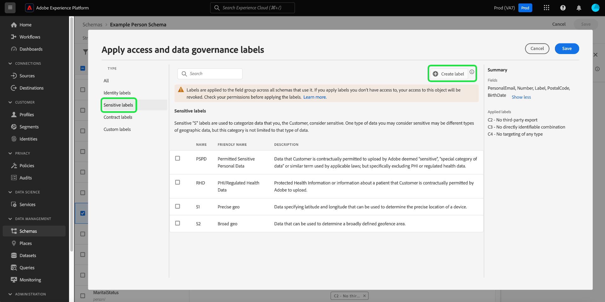

# Gerenciar rótulos de uso de dados para um esquema

>[!IMPORTANT]
>
>A rotulagem baseada em esquemas faz parte do [controle de acesso baseado em atributo](../../access-control/abac/overview.md), que está disponível em uma versão limitada para clientes de saúde com base nos EUA. Esse recurso estará disponível para todos os clientes da Real-time Customer Data Platform assim que for totalmente lançado.

Todos os dados trazidos para o Adobe Experience Platform são restritos pelos esquemas do Experience Data Model (XDM). Esses dados podem estar sujeitos a restrições de uso definidas por sua organização ou por regulamentos legais. Para levar isso em conta, a Plataforma permite que você restrinja o uso de determinados conjuntos de dados e campos por meio do uso de [rótulos de uso de dados](../../data-governance/labels/overview.md).

Um rótulo aplicado a um campo de esquema indica as políticas de uso que se aplicam aos dados contidos nesse campo específico.

Embora os rótulos possam ser aplicados a conjuntos de dados individuais (e campos nesses conjuntos de dados), você também pode aplicar rótulos no nível do esquema. Quando os rótulos são aplicados diretamente a um esquema, eles são propagados para todos os conjuntos de dados existentes e futuros que são baseados nesse esquema.

Este tutorial aborda as etapas para adicionar rótulos a um esquema usando o Editor de esquemas na interface do usuário da plataforma.

## Introdução

Este guia requer uma compreensão funcional dos seguintes componentes do Adobe Experience Platform:

* [[!DNL Experience Data Model (XDM) System]](../home.md): O quadro normalizado pelo qual [!DNL Experience Platform] organiza os dados de experiência do cliente.
   * [Editor de esquema](../ui/overview.md): Saiba como criar e gerenciar esquemas e outros recursos na interface do usuário da plataforma.
* [[!DNL Adobe Experience Platform Data Governance]](../../data-governance/home.md): Fornece a infraestrutura para impor restrições de uso de dados em operações da plataforma, usando políticas que definem quais ações de marketing podem (ou não) ser executadas em dados rotulados.

## Selecione um esquema ou campo para adicionar rótulos a

Rótulos só podem ser aplicados a esquemas e não podem ser adicionados aos componentes que compõem esses esquemas (classes, grupos de campos e tipos de dados). Para começar a adicionar rótulos, primeiro [selecionar um esquema existente para editar](../ui/resources/schemas.md#edit) ou [criar um novo schema](../ui/resources/schemas.md#create) para exibir sua estrutura no Editor de esquemas.

Para editar os rótulos de um campo individual, você pode selecionar o campo na tela e depois selecionar **[!UICONTROL Gerenciar acesso]** no painel direito.

Também é possível selecionar a variável **[!UICONTROL Rótulos]** , escolha o campo desejado na lista e selecione **[!UICONTROL Editar rótulos de governança]** no painel direito.

![Selecione um campo no [!UICONTROL Rótulos] guia](../images/tutorials/labels/select-field-on-labels-tab.png)

Para editar os rótulos de todo o esquema, selecione o ícone de lápis () ao lado do nome do schema no **[!UICONTROL Rótulos]** guia .

![Selecione o nome do esquema na [!UICONTROL Rótulos] guia](../images/tutorials/labels/select-schema-on-labels-tab.png)

>[!NOTE]
>
>Uma mensagem de aviso de isenção de responsabilidade é exibida ao tentar editar os rótulos de um esquema ou campo pela primeira vez, explicando como o uso de rótulos afeta as operações de downstream, dependendo das políticas de sua organização. Selecionar **[!UICONTROL Continue]** para continuar a editar.
>
>

## Editar os rótulos do esquema ou campo

Uma caixa de diálogo é exibida e permite editar os rótulos do campo selecionado. Se um campo de tipo de objeto individual for selecionado, o painel direito listará os subcampos para os quais os rótulos aplicados serão propagados.

>[!NOTE]
>
>Se você estiver editando campos para todo o esquema, o painel direito não listará os campos aplicáveis e exibirá o nome do esquema.

Use a lista exibida para selecionar os rótulos que deseja adicionar ao schema ou campo. Como os rótulos são escolhidos, a variável **[!UICONTROL Rótulos aplicados]** atualizações de seção para mostrar os rótulos que foram selecionados até agora.

Para filtrar os rótulos exibidos por tipo, selecione a categoria desejada no painel esquerdo. Para criar um novo rótulo personalizado, selecione **[!UICONTROL Criar rótulo]**.

Quando estiver satisfeito com os rótulos escolhidos, selecione **[!UICONTROL Salvar]** para aplicá-los ao campo ou schema.

O **[!UICONTROL Rótulos]** será exibida novamente, mostrando os rótulos aplicados para o esquema.

## Próximas etapas

Este guia cobriu como gerenciar rótulos de uso de dados para esquemas e campos. Para obter informações sobre como gerenciar rótulos de uso de dados, incluindo como adicioná-los a conjuntos de dados específicos em vez de no nível do esquema, consulte o [guia da interface do usuário de rótulos de uso de dados](../../data-governance/labels/user-guide.md).
