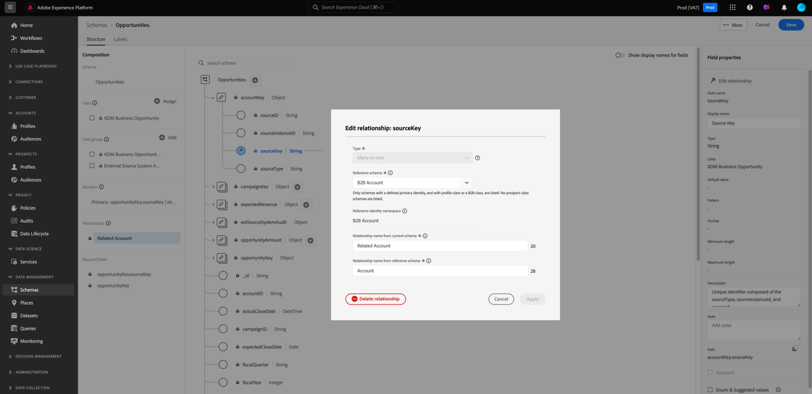

# Definir um relacionamento de “muitos para um” entre dois esquemas na Real-time Customer Data Platform B2B Edition {#relationship-b2b}

>[!CONTEXTUALHELP]
>id="platform_xdm_b2b_reference_schema"
>title="Esquema de referência"
>abstract="Selecione o esquema com o qual deseja estabelecer uma relação. Dependendo da classe do esquema, ele também pode ter relacionamentos existentes com outras entidades no contexto B2B. Consulte a documentação para saber como as classes de esquema B2B se relacionam umas com as outras."

O Adobe Real-time Customer Data Platform B2B Edition fornece várias classes do Experience Data Model (XDM) que capturam entidades fundamentais de dados B2B, incluindo [contas](../classes/b2b/business-account.md), [oportunidades](../classes/b2b/business-opportunity.md), [campanhas](../classes/b2b/business-campaign.md) e muito mais. Ao criar esquemas com base nessas classes e habilitá-los para uso no [Perfil do cliente em tempo real](../../profile/home.md), é possível mesclar dados de fontes diferentes em uma representação unificada chamada de esquema de união.

No entanto, os esquemas de união só podem conter campos capturados por esquemas que compartilham a mesma classe. É aqui que entram as relações de esquema. Ao implementar relacionamentos em seus esquemas B2B, você pode descrever como essas entidades de negócios se relacionam entre si e pode incluir atributos de várias classes em casos de uso de segmentação downstream.

O diagrama a seguir fornece um exemplo de como as diferentes classes B2B podem se relacionar entre si em uma implementação básica:

Este tutorial aborda as etapas para definir uma relação muitos para um entre dois esquemas no Real-Time CDP B2B Edition.

>[!NOTE]
>
>Se você não estiver usando o Real-time Customer Data Platform B2B Edition ou quiser criar uma relação um para um, consulte o manual em [criando uma relação um para um](./relationship-ui.md).
>
>Este tutorial foca em como estabelecer manualmente relações entre esquemas B2B na interface do usuário da plataforma. Se você estiver trazendo dados de uma conexão de origem B2B, poderá usar um utilitário de geração automática para criar os esquemas, identidades e relacionamentos necessários. Consulte a documentação de origens em namespaces e esquemas B2B para obter mais informações sobre [uso do utilitário de geração automática](../../sources/connectors/adobe-applications/marketo/marketo-namespaces.md).

## Introdução

Este tutorial requer entendimento prático do [!DNL XDM System] e do Editor de Esquemas na interface do usuário do [!DNL Experience Platform]. Antes de iniciar este tutorial, reveja a seguinte documentação:

* [Sistema XDM no Experience Platform](../home.md): uma visão geral do XDM e sua implementação em [!DNL Experience Platform].
* [Noções básicas sobre a composição de esquema](../schema/composition.md): uma introdução aos blocos de construção de esquemas XDM.
* [Criar um esquema usando o [!DNL Schema Editor]](create-schema-ui.md): um tutorial que aborda as noções básicas sobre como criar e editar esquemas na interface.

## Definir um esquema de origem e de referência

Espera-se que você já tenha criado os dois schemas que serão definidos no relacionamento. Para fins de demonstração, este tutorial cria uma relação entre oportunidades de negócios (definidas em um esquema &quot;[!DNL Opportunities]&quot;) e sua conta de negócios associada (definida em um esquema &quot;[!DNL Accounts]&quot;).

As relações de esquema são representadas por um campo dedicado dentro de um **esquema de origem** que faz referência ao campo de identidade primário de um **esquema de referência**. Nas etapas a seguir, &quot;[!DNL Opportunities]&quot; serve como esquema de origem, enquanto &quot;[!DNL Accounts]&quot; atua como esquema de referência.

### Noções básicas sobre identidades em relacionamentos B2B

>[!CONTEXTUALHELP]
>id="platform_xdm_b2b_identity_namespace"
>title="Namespace de identidade de referência"
>abstract="O namespace (tipo) do campo de identidade principal do esquema de referência. O esquema de referência deve ter um campo de identidade principal estabelecido para participar de um relacionamento. Consulte a documentação para saber mais sobre identidades em relacionamentos B2B."

Para estabelecer uma relação, o schema de referência deve ter uma identidade primária definida. Ao definir uma identidade primária para uma entidade B2B, lembre-se de que as IDs de entidade baseadas em sequência podem se sobrepor se você as estiver coletando em diferentes sistemas ou locais, o que pode levar a conflitos de dados na Platform.

Para levar em conta isso, todas as classes B2B padrão contêm campos &quot;key&quot; que estão em conformidade com o [[!UICONTROL tipo de dados B2B Source]](../data-types/b2b-source.md). Esse tipo de dados fornece campos para um identificador de sequência para a entidade B2B, juntamente com outras informações contextuais sobre a origem do identificador. Um desses campos, `sourceKey`, concatena os valores dos outros campos no tipo de dados para produzir um identificador totalmente exclusivo para a entidade. Este campo deve ser sempre usado como a identidade principal para esquemas de entidade B2B.

>[!NOTE]
>
>Ao [definir um campo XDM como uma identidade](../ui/fields/identity.md), você deve fornecer um namespace de identidade para definir a identidade em. Pode ser um namespace padrão fornecido pelo Adobe ou um namespace personalizado definido por sua organização. Na prática, o namespace é simplesmente uma sequência contextual e pode ser definido com qualquer valor desejado, desde que seja significativo para sua organização categorizar o tipo de identidade. Consulte a visão geral em [namespaces de identidade](../../identity-service/features/namespaces.md) para obter mais informações.

Para fins de referência, as seções a seguir descrevem a estrutura de cada esquema usado neste tutorial antes que uma relação seja definida. Anote onde as identidades primárias foram definidas na estrutura do esquema e nos namespaces personalizados que elas usam.

### Esquema de oportunidades

O esquema de origem &quot;[!DNL Opportunities]&quot; é baseado na classe [!UICONTROL Oportunidade Comercial XDM]. Um dos campos fornecidos pela classe, `opportunityKey`, serve como o identificador do esquema. Especificamente, o campo `sourceKey` sob o objeto `opportunityKey` é definido como a identidade primária do esquema sob um namespace personalizado chamado [!DNL B2B Opportunity].

Conforme visto em **[!UICONTROL Propriedades do Campo]**, este esquema foi habilitado para uso em [!DNL Real-Time Customer Profile].

### Esquema [!DNL Accounts]

O esquema de referência &quot;[!DNL Accounts]&quot; é baseado na classe [!UICONTROL Conta XDM]. O campo `accountKey` de nível raiz contém o `sourceKey` que atua como sua identidade primária em um namespace personalizado chamado [!DNL B2B Account]. Este esquema também foi ativado para uso no Perfil.

## Definir um campo de relacionamento para o esquema de origem {#relationship-field}

>[!CONTEXTUALHELP]
>id="platform_xdm_b2b_relationship_name_current"
>title="Nome do relacionamento do esquema atual"
>abstract="Um rótulo que descreve a relação do esquema atual com o esquema de referência (por exemplo, “Conta relacionada”). Esse rótulo é usado em Perfil e Segmentação para dar contexto aos dados de entidades B2B relacionadas. Consulte a documentação para saber mais sobre a criação de relações de esquema B2B."

>[!CONTEXTUALHELP]
>id="platform_xdm_b2b_relationship_name_reference"
>title="Nome do relacionamento do esquema de referência"
>abstract="Um rótulo que descreve a relação do esquema de referência com o esquema atual (por exemplo, “Oportunidades relacionadas”). Esse rótulo é usado em Perfil e Segmentação para dar contexto aos dados de entidades B2B relacionadas. Consulte a documentação para saber mais sobre a criação de relações de esquema B2B."

Para definir uma relação entre dois esquemas, o esquema de origem deve ter um campo dedicado que indique a identidade primária do esquema de referência. As classes B2B padrão incluem campos de chave de origem dedicada para entidades de negócios comumente relacionadas. Por exemplo, a classe [!UICONTROL Oportunidade Comercial XDM] contém campos de chave de origem para uma conta relacionada (`accountKey`) e uma campanha relacionada (`campaignKey`). No entanto, você também pode adicionar outros campos [!UICONTROL B2B Source] ao esquema usando grupos de campos personalizados se precisar de mais do que os componentes padrão.

>[!NOTE]
>
>Atualmente, somente as relações muitos para um e um para um podem ser definidas de um esquema de origem para um esquema de referência. Para relações um para muitos, você deve definir o campo de relacionamento no esquema que representa o &quot;muitos&quot;.

Para definir um campo de relação, selecione o campo em questão na tela, seguido por **[!UICONTROL Adicionar relação]** na barra lateral [!UICONTROL Propriedades de esquema]. No caso do esquema [!DNL Opportunities], este é o campo `accountKey.sourceKey`, já que o objetivo é estabelecer uma relação muitos para um com uma conta.

A caixa de diálogo [!UICONTROL Adicionar relação] é exibida. Use esta caixa de diálogo para especificar detalhes do relacionamento. O tipo de relação é definido como **[!UICONTROL Muitos para um]** por padrão.

Em **[!UICONTROL Esquema de Referência]**, use a barra de pesquisa ou o menu suspenso para localizar o nome do esquema de referência. Quando você realça o nome do esquema de referência, o campo **[!UICONTROL Namespace de identidade de referência]** atualiza automaticamente para o namespace da identidade principal do esquema de referência.

>[!NOTE]
>
>A lista de esquemas de referência disponíveis é filtrada para conter apenas esquemas adequados. Os esquemas **devem** ter uma identidade primária atribuída e ser uma classe B2B ou a classe Perfil Individual. Os esquemas de classe de cliente potencial não podem ter relacionamentos.

Em **[!UICONTROL Nome do Relacionamento do Esquema Atual]** e **[!UICONTROL Nome do Relacionamento do Esquema de Referência]**, forneça nomes amigáveis para o relacionamento no contexto dos esquemas de origem e de referência, respectivamente. Quando terminar, selecione **[!UICONTROL Aplicar]** para confirmar as alterações e salvar a relação.

>[!NOTE]
>
>Os nomes dos relacionamentos devem ter 35 caracteres ou menos.

A tela será exibida novamente, com o campo de relacionamento agora marcado com o nome amigável fornecido anteriormente. O nome do relacionamento também está listado no painel esquerdo para facilitar a referência.

Se você visualizar a estrutura do esquema de referência, o marcador de relacionamento aparecerá ao lado do campo de identidade principal do esquema e no painel esquerdo.

## Editar uma relação de esquema B2B {#edit-schema-relationship}

Depois que uma relação de esquema for estabelecida, selecione o campo de relação no esquema de origem seguido por **[!UICONTROL Editar relação]**.

>[!NOTE]
>
>Para exibir todas as relações associadas, selecione o campo de identidade principal no esquema de referência seguido por [!UICONTROL Exibir relações].
>{width="100" zoomable="yes"}

A caixa de diálogo [!UICONTROL Editar relação] é exibida. Nessa caixa de diálogo, é possível alterar o esquema de referência e os nomes dos relacionamentos ou excluir os relacionamentos. O tipo de relação muitos para um não pode ser alterado.

Para manter a integridade dos dados e evitar interrupções na segmentação e em outros processos, considere as seguintes diretrizes ao gerenciar relações de esquema com conjuntos de dados vinculados:

* Evite excluir diretamente as relações se um esquema estiver associado a um conjunto de dados, pois isso pode afetar negativamente a segmentação. Em vez disso, exclua o conjunto de dados associado antes de remover a relação.
* Não é possível alterar o esquema de referência sem primeiro excluir a relação existente. No entanto, isso deve ser feito com cuidado, pois excluir uma relação com um conjunto de dados associado pode causar consequências não intencionais.
* A adição de novas relações a um esquema com conjuntos de dados vinculados existentes pode não funcionar conforme o esperado e pode levar a possíveis conflitos.

## Filtrar e pesquisar relacionamentos {#filter-and-search}

Você pode filtrar e pesquisar relações específicas em seus esquemas na guia [!UICONTROL Relações] do espaço de trabalho [!UICONTROL Esquemas]. Você pode usar essa visualização para localizar e gerenciar rapidamente seus relacionamentos. Leia o documento em [explorando recursos de esquema](../ui/explore.md#lookup) para obter instruções detalhadas sobre as opções de filtragem.

## Próximas etapas

Seguindo este tutorial, você criou com êxito uma relação muitos para um entre dois esquemas usando o [!DNL Schema Editor]. Depois que os dados forem assimilados usando conjuntos de dados com base nesses esquemas e esses dados forem ativados no armazenamento de dados do Perfil, você poderá usar atributos de ambos os esquemas para [casos de uso de segmentação de várias classes](../../rtcdp/segmentation/b2b.md).
