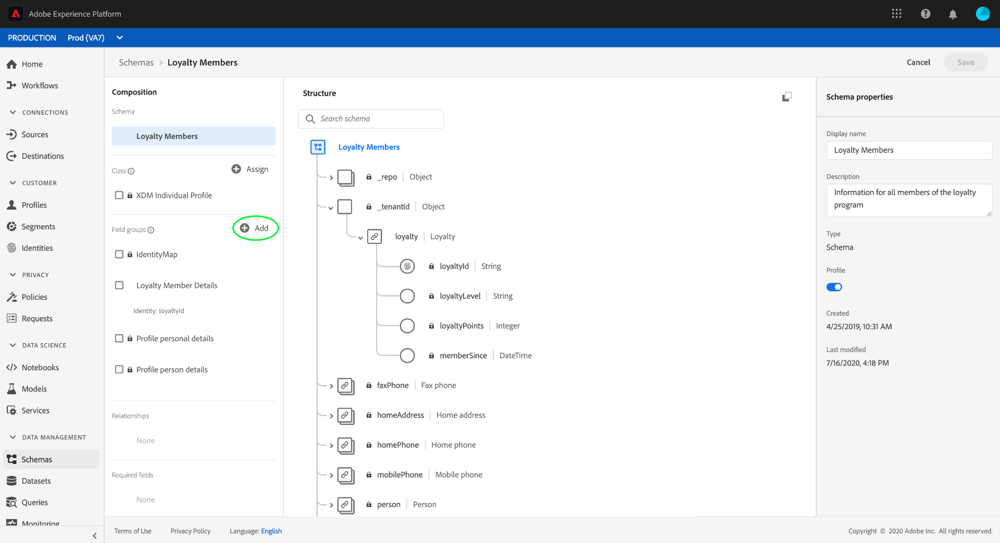

# Definir uma relação entre dois schemas usando o [!DNL Schema Editor]

>[!CONTEXTUALHELP]
>id="platform_schemas_relationships"
>title="Relacionamentos de esquema"
>abstract="Os esquemas pertencentes a classes diferentes podem ser vinculados contextualmente por meio de campos de relação, permitindo a criação de regras de segmentação mais complexas."
>text="See the documentation for more information on schema relationships."

>[!NOTE]
>
>Se estiver usando o Real-time Customer Data Platform B2B Edition, consulte o guia em [criação de relações B2B](./relationship-b2b.md) em vez disso.

A capacidade de entender os relacionamentos entre seus clientes e suas interações com a marca em vários canais é uma parte importante do Adobe Experience Platform. Definir esses relacionamentos dentro da estrutura de [!DNL Experience Data Model] Os esquemas (XDM) permitem que você obtenha insights complexos sobre os dados do cliente.

Embora os relacionamentos de schema possam ser inferidos por meio do uso do schema de união e [!DNL Real-time Customer Profile], isso se aplica somente a esquemas que compartilham a mesma classe. Para estabelecer uma relação entre dois schemas pertencentes a classes diferentes, um campo de relacionamento dedicado deve ser adicionado a um schema de origem, que faz referência à identidade de um schema de destino.

Este documento fornece um tutorial para definir uma relação entre dois esquemas usando o Editor de esquemas na [!DNL Experience Platform] interface do usuário. Para obter etapas sobre como definir relações de esquema usando a API, consulte o tutorial em [definição de um relacionamento usando a API do Registro de Esquema](relationship-api.md).

## Introdução

Este tutorial requer uma compreensão funcional do [!DNL XDM System] e o Editor de esquemas na [!DNL Experience Platform] IU. Antes de iniciar este tutorial, reveja a seguinte documentação:

* [Sistema XDM no Experience Platform](../home.md): Uma visão geral do XDM e sua implementação no [!DNL Experience Platform].
* [Noções básicas da composição do schema](../schema/composition.md): Uma introdução dos blocos de construção dos esquemas XDM.
* [Crie um schema usando o [!DNL Schema Editor]](create-schema-ui.md): Um tutorial sobre as noções básicas para trabalhar com a [!DNL Schema Editor].

## Definir um esquema de origem e de destino

Espera-se que você já tenha criado os dois schemas que serão definidos na relação. Para fins de demonstração, este tutorial cria uma relação entre membros do programa de fidelidade de uma organização (definido em um &quot;[!DNL Loyalty Members]&quot; schema) e seu hotel favorito (definido em um &quot;[!DNL Hotels]&quot; schema).

>[!IMPORTANT]
>
>Para estabelecer uma relação, ambos os esquemas devem ter identidades primárias definidas e devem ser habilitados para [!DNL Real-time Customer Profile]. Consulte a seção sobre [ativar um esquema para usar no Perfil](./create-schema-ui.md#profile) no tutorial de criação de esquema se você precisar de orientação sobre como configurar seus esquemas adequadamente.

Os relacionamentos de schema são representados por um campo dedicado em um **esquema de origem** que se refere a outro campo dentro de um **esquema de destino**. Nas etapas a seguir, &quot;[!DNL Loyalty Members]&quot; será o schema de origem, enquanto &quot;[!DNL Hotels]&quot; atuará como o schema de destino.

Para fins de referência, as seções a seguir descrevem a estrutura de cada schema usado neste tutorial antes que um relacionamento seja definido.

### [!DNL Loyalty Members] schema

O schema de origem &quot;[!DNL Loyalty Members]&quot; se baseia no [!DNL XDM Individual Profile] e é o esquema que foi construído no tutorial para [criação de um schema na interface do usuário](create-schema-ui.md). Ele inclui um `loyalty` objeto sob sua `_tenantId` namespace, que inclui vários campos específicos de fidelidade. Um desses campos, `loyaltyId`, serve como a identidade primária do schema no [!UICONTROL Email] namespace. Conforme visto em **[!UICONTROL Propriedades do esquema]**, este esquema foi ativado para uso em [!DNL Real-time Customer Profile].

### [!DNL Hotels] schema

O schema de destino &quot;[!DNL Hotels]&quot; se baseia em um &quot; personalizado[!DNL Hotels]&quot; e contém campos que descrevem um hotel.

Para participar de um relacionamento, o schema de destino deve ter uma identidade primária. Neste exemplo, a variável `hotelId` é usado como a identidade primária, usando um namespace de identidade &quot;ID do hotel&quot; personalizado.

>[!NOTE]
>
>Para saber como criar namespaces de identidade personalizados, consulte [Documentação do Serviço de identidade](../../identity-service/namespaces.md#manage-namespaces).

Depois que a identidade primária é definida, o schema de destino deve ser ativado para [!DNL Real-time Customer Profile].

## Criar um grupo de campos do schema de relacionamento

>[!NOTE]
>
>Essa etapa só será necessária se o schema de origem não tiver um campo do tipo string dedicado a ser usado como referência para o schema de destino. Se esse campo já estiver definido no esquema de origem, pule para a próxima etapa de [definição de um campo de relacionamento](#relationship-field).

Para definir uma relação entre dois schemas, o schema de origem deve ter um campo dedicado para ser usado como referência para o schema de destino. É possível adicionar esse campo ao schema de origem criando um novo grupo de campos de esquema.

Comece selecionando **[!UICONTROL Adicionar]** no **[!UICONTROL Grupos de campos]** seção.

O [!UICONTROL Adicionar grupo de campos] será exibida. Aqui, selecione **[!UICONTROL Criar novo grupo de campos]**. Nos campos de texto exibidos, insira um nome de exibição e uma descrição para o novo grupo de campos. Selecionar **[!UICONTROL Adicionar grupos de campos]** quando terminar.

A tela reaparece com &quot;[!DNL Favorite Hotel]&quot; que aparecem no **[!UICONTROL Grupos de campos]** seção. Selecione o nome do grupo de campos e selecione **[!UICONTROL Adicionar campo]** ao lado do nível da raiz `Loyalty Members` campo.

Um novo campo é exibido na tela abaixo da `_tenantId` namespace. Em **[!UICONTROL Propriedades do campo]**, forneça um nome de campo e nome de exibição para o campo e defina seu tipo como &quot;[!UICONTROL String]&quot;.

Quando terminar, selecione **[!UICONTROL Aplicar]**.

O arquivo `favoriteHotel` é exibido na tela. Selecionar **[!UICONTROL Salvar]** para finalizar as alterações no schema.

## Definir um campo de relacionamento para o schema de origem {#relationship-field}

Depois que o schema de origem tiver um campo de referência dedicado definido, você poderá designá-lo como um campo de relacionamento.

Selecione o `favoriteHotel` na tela, role para baixo **[!UICONTROL Propriedades do campo]** até que o **[!UICONTROL Relação]** será exibida. Marque a caixa de seleção para revelar os parâmetros necessários para configurar um campo de relacionamento.

Selecione a lista suspensa para **[!UICONTROL Esquema de referência]** e selecione o schema de destino para o relacionamento (&quot;[!DNL Hotels]&quot; neste exemplo). Se o esquema de destino estiver ativado para [!DNL Profile], o **[!UICONTROL Namespace da identidade de referência]** é automaticamente definido para o namespace da identidade primária do schema de destino. Se o schema não tiver uma identidade primária definida, você deverá selecionar manualmente o namespace que planeja usar no menu suspenso. Selecionar **[!UICONTROL Aplicar]** quando terminar.

O `favoriteHotel` agora é destacado como uma relação na tela, exibindo o nome e o namespace de identidade de referência do schema de destino. Selecionar **[!UICONTROL Salvar]** para salvar suas alterações e concluir o fluxo de trabalho.

## Próximas etapas

Ao seguir este tutorial, você criou com êxito uma relação um para um entre dois schemas usando o [!DNL Schema Editor]. Para obter etapas sobre como definir relações usando a API, consulte o tutorial em [definição de um relacionamento usando a API do Registro de Esquema](relationship-api.md).
