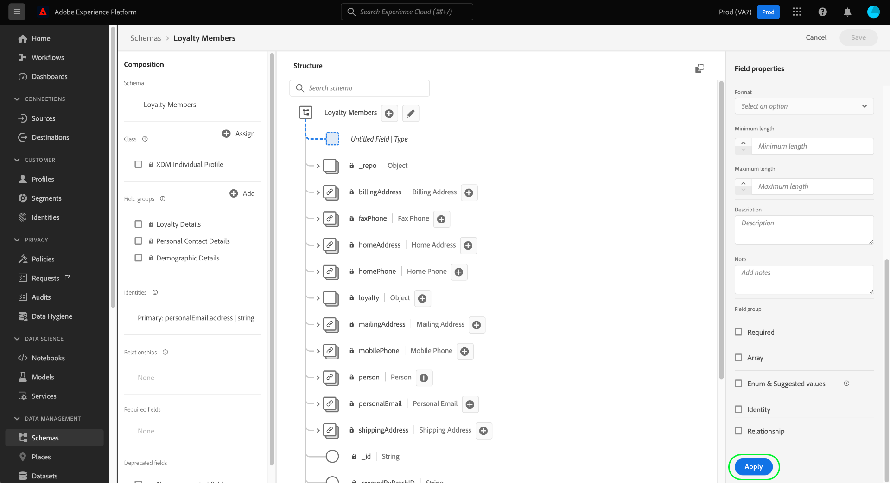

# Definir um relacionamento de “um para um” entre dois esquemas usando o [!DNL Schema Editor] {#relationship-ui}

>[!CONTEXTUALHELP]
>id="platform_schemas_relationships"
>title="Relacionamentos de esquema"
>abstract="Os esquemas pertencentes a classes diferentes podem ser vinculados contextualmente por meio de campos de relação, permitindo a criação de regras de segmentação mais complexas. Consulte a documentação para obter mais informações sobre relações de esquema."

>[!CONTEXTUALHELP]
>id="platform_xdm_1to1_reference_schema"
>title="Esquema de referência"
>abstract="Selecione o esquema com o qual deseja estabelecer uma relação. Esse esquema pode ser uma classe diferente do esquema atual. Consulte a documentação para obter mais informações sobre relações de esquema."

>[!CONTEXTUALHELP]
>id="platform_xdm_1to1_identity_namespace"
>title="Namespace de identidade de referência"
>abstract="O namespace (tipo) do campo de identidade principal do esquema de referência. O esquema de referência deve ter um campo de identidade principal estabelecido para participar de um relacionamento. Consulte a documentação para obter mais informações sobre relações de esquema."

A capacidade de entender os relacionamentos entre seus clientes e as interações deles com sua marca em vários canais é uma parte importante do Adobe Experience Platform. A definição dessas relações na estrutura dos esquemas do [!DNL Experience Data Model] (XDM) permite que você obtenha insights complexos sobre os dados do cliente.

Embora as relações de esquema possam ser inferidas por meio do uso do esquema de união e [!DNL Real-Time Customer Profile], isso se aplica somente a esquemas que compartilham a mesma classe. Para estabelecer uma relação entre dois esquemas pertencentes a classes diferentes, um campo de relação dedicado deve ser adicionado a um esquema de origem, que faz referência à identidade do outro esquema relacionado.

>[!NOTE]
>
>Se os esquemas de origem e destino pertencerem à mesma classe, um campo de relação dedicado deve **não** ser usado. Nesse caso, use a interface do esquema de união para ver o relacionamento. As instruções sobre como fazer isso podem ser encontradas na seção [exibir relações](../../profile/ui/union-schema.md#view-relationships) do guia de interface do esquema de união.

Este documento fornece um tutorial para definir uma relação entre dois esquemas usando o Editor de esquemas na interface do usuário [!DNL Experience Platform]. Para obter etapas sobre como definir relações de esquema usando a API, consulte o tutorial em [como definir uma relação usando a API do Registro de Esquema](relationship-api.md).

>[!NOTE]
>
>Para obter etapas sobre como criar uma relação muitos para um no Adobe Real-Time Customer Data Platform B2B edition, consulte o manual sobre [criação de relações B2B](./relationship-b2b.md).

## Introdução

Este tutorial requer entendimento prático do [!DNL XDM System] e do Editor de Esquemas na interface do usuário do [!DNL Experience Platform]. Antes de iniciar este tutorial, reveja a seguinte documentação:

* [Sistema XDM no Experience Platform](../home.md): uma visão geral do XDM e sua implementação em [!DNL Experience Platform].
* [Noções básicas sobre a composição de esquema](../schema/composition.md): uma introdução aos blocos de construção de esquemas XDM.
* [Criar um esquema usando o [!DNL Schema Editor]](create-schema-ui.md): um tutorial que aborda as noções básicas do trabalho com o [!DNL Schema Editor].

## Definir um esquema de origem e de referência

Espera-se que você já tenha criado os dois schemas que serão definidos no relacionamento. Para fins de demonstração, este tutorial cria uma relação entre os membros de um programa de fidelidade de uma organização (definido em um esquema &quot;[!DNL Loyalty Members]&quot;) e seu hotel favorito (definido em um esquema &quot;[!DNL Hotels]&quot;).

>[!IMPORTANT]
>
>Para estabelecer uma relação, ambos os esquemas devem ter identidades primárias definidas e estar habilitados para [!DNL Real-Time Customer Profile]. Consulte a seção sobre [habilitação de um esquema para uso no Perfil](./create-schema-ui.md#profile) no tutorial de criação de esquema se precisar de orientação sobre como configurar seus esquemas adequadamente.

As relações de esquema são representadas por um campo dedicado em um **esquema de origem** que aponta para outro campo em um **esquema de referência**. Nas etapas a seguir, &quot;[!DNL Loyalty Members]&quot; será o esquema de origem, enquanto &quot;[!DNL Hotels]&quot; atuará como o esquema de referência.

As seções a seguir descrevem a estrutura de cada esquema usado neste tutorial antes que uma relação seja definida.

### Esquema [!DNL Loyalty Members]

O esquema de origem &quot;[!DNL Loyalty Members]&quot; é baseado na classe [!DNL XDM Individual Profile], contendo o campo que descreve os membros de um programa de fidelidade. Um desses campos, `personalEmail.addess`, serve como a identidade principal do esquema no namespace [!UICONTROL Email]. Como visto em **[!UICONTROL Schema Properties]**, este esquema foi habilitado para uso em [!DNL Real-Time Customer Profile].

### Esquema [!DNL Hotels]

O esquema de referência &quot;[!DNL Hotels]&quot; é baseado em uma classe &quot;[!DNL Hotels]&quot; personalizada e contém campos que descrevem um hotel. Para participar de uma relação, o esquema de referência também deve ter uma identidade primária definida e estar habilitado para [!UICONTROL Profile]. Nesse caso, `_tenantId.hotelId` atua como a identidade principal do esquema, usando um namespace de identidade personalizado &quot;[!DNL Hotel ID]&quot;.

>[!NOTE]
>
>Para saber como criar namespaces de identidade personalizados, consulte a [documentação do Serviço de Identidade](../../identity-service/features/namespaces.md#manage-namespaces).

## Criar um grupo de campos de relacionamento

>[!NOTE]
>
>Essa etapa só será necessária se o esquema de origem não tiver um campo do tipo string dedicado para ser usado como ponteiro para a identidade principal do esquema de referência. Se este campo já estiver definido no esquema de origem, pule para a próxima etapa de [definindo um campo de relação](#relationship-field).

Para definir uma relação entre dois esquemas, o esquema de origem deve ter um campo dedicado que indicará a identidade principal do esquema de referência. Você pode adicionar este campo ao esquema de origem criando um novo grupo de campos de esquema ou estendendo um existente.

No caso do esquema [!DNL Loyalty Members], um novo campo `preferredHotel` será adicionado para indicar o hotel preferido do membro de fidelidade para visitas da empresa. Comece selecionando o ícone de adição (**+**) ao lado do nome do esquema de origem.

Um novo espaço reservado de campo é exibido na tela. Em **[!UICONTROL Field properties]**, forneça um nome de campo e um nome para exibição para o campo e defina seu tipo como &quot;[!UICONTROL String]&quot;. Em **[!UICONTROL Assign to]**, selecione um grupo de campos existente a ser estendido ou digite um nome exclusivo para criar um novo grupo de campos. Nesse caso, um novo grupo de campos &quot;[!DNL Preferred Hotel]&quot; é criado.

Quando terminar, selecione **[!UICONTROL Apply]**.

O campo `preferredHotel` atualizado aparece na tela, localizada sob um objeto `_tenantId`, já que é um campo personalizado. Selecione **[!UICONTROL Save]** para finalizar suas alterações no esquema.

## Definir um campo de relacionamento para o esquema de origem {#relationship-field}

Depois que o esquema de origem tiver um campo de referência dedicado definido, você poderá designá-lo como um campo de relacionamento.

>[!NOTE]
>
>Só há suporte para relações em campos de sequência ou matriz de sequência.

Selecione o campo `preferredHotel` na tela e, em seguida, selecione **[!UICONTROL Add relationship]** na barra lateral **[!UICONTROL Field properties]**.

A caixa de diálogo [!UICONTROL Add relationship] é exibida. Nessa caixa de diálogo, é possível definir os parâmetros necessários para configurar um campo de relacionamento. Para usuários B2C do Real-Time CDP, você pode **somente** definir uma relação um para um entre o esquema de origem e de referência.

>[!NOTE]
>
>Se você tiver acesso ao Real-Time CDP B2B edition, poderá usar os controles do painel direito para definir um campo de relação, bem como criar uma relação muitos para um usando a [mesma caixa de diálogo](./relationship-b2b.md#relationship-field).

Use a lista suspensa para **[!UICONTROL Reference schema]** e selecione o esquema de referência para a relação (&quot;[!DNL Hotels]&quot; neste exemplo).

>[!NOTE]
>
>Somente os esquemas que contêm uma identidade primária são incluídos no menu suspenso Esquema de referência. Essa proteção impede que você crie acidentalmente uma relação com um esquema que ainda não está configurado corretamente.

O namespace de identidade do esquema de referência (neste caso, &quot;[!DNL Hotel ID]&quot;) é preenchido automaticamente em **[!UICONTROL Reference identity namespace]**. Selecione **[!UICONTROL Apply]** quando terminar.

O campo `preferredHotel` agora está realçado como uma relação na tela, exibindo o nome do esquema de referência. Selecione **[!UICONTROL Save]** para salvar suas alterações e concluir o fluxo de trabalho.

### Editar um campo de relacionamento existente {#edit-relationship}

Para alterar o esquema de referência, selecione um campo com uma relação existente e selecione **[!UICONTROL Edit relationship]** na barra lateral **[!UICONTROL Field properties]**.

A caixa de diálogo [!UICONTROL Edit relationship] é exibida. Aqui, você pode seguir o processo descrito em [definindo um campo de relação](#relationship-field) ou excluir a relação. Selecione **[!UICONTROL Delete relationship]** para remover a relação com o esquema de referência.

## Filtrar e pesquisar relacionamentos {#filter-and-search}

Você pode filtrar e pesquisar relações específicas nos esquemas na guia [!UICONTROL Relationships] do espaço de trabalho [!UICONTROL Schemas]. Você pode usar essa visualização para localizar e gerenciar rapidamente seus relacionamentos. Leia o documento em [explorando recursos de esquema](../ui/explore.md#lookup) para obter instruções detalhadas sobre as opções de filtragem.

## Próximas etapas

Seguindo este tutorial, você criou com êxito uma relação um para um entre dois esquemas usando o [!DNL Schema Editor]. Para obter etapas sobre como definir relações usando a API, consulte o tutorial em [definição de uma relação usando a API do Registro de Esquema](relationship-api.md).
