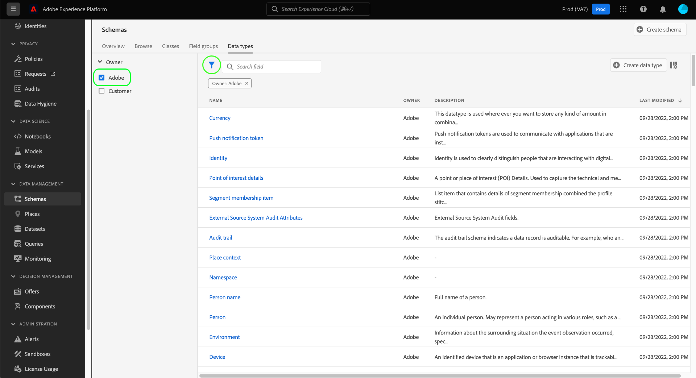

# Explorar recursos de esquema na interface do

No Adobe Experience Platform, todos os recursos de esquema do Experience Data Model (XDM) são armazenados no [!DNL Schema Library], incluindo os recursos padrão fornecidos pelo Adobe e os recursos personalizados definidos pela sua organização. Na interface do usuário do Experience Platform, é possível exibir a estrutura e os campos de qualquer esquema, classe, grupo de campos ou tipo de dados existente no [!DNL Schema Library]. Isso é especialmente útil ao planejar e se preparar para a assimilação de dados, pois a interface do usuário fornece informações sobre os tipos de dados e casos de uso esperados de cada campo fornecido por esses recursos XDM.

Este tutorial aborda as etapas para explorar esquemas, classes, grupos de campos e tipos de dados existentes na interface do usuário do Experience Platform.

## Pesquisar um recurso de esquema {#lookup}

Na interface da Platform, selecione **[!UICONTROL Esquemas]** na navegação à esquerda. O espaço de trabalho [!UICONTROL Esquemas] fornece uma guia **[!UICONTROL Procurar]** para explorar todos os esquemas em sua organização, juntamente com guias dedicadas adicionais para explorar **[!UICONTROL Classes]**, **[!UICONTROL Grupos de campos]** e **[!UICONTROL Tipos de dados]**, respectivamente.

O ícone de filtro () revela controles no painel esquerdo para restringir os resultados listados. Os controles exibidos diferem dependendo do tipo de recurso que está sendo listado.

Por exemplo, para filtrar a lista para mostrar apenas os tipos de dados padrão fornecidos pelo Adobe, selecione **[!UICONTROL Datatype]** e **[!UICONTROL Adobe]** nas seções **[!UICONTROL Type]** e **[!UICONTROL Owner]**, respectivamente.

A opção **[!UICONTROL Incluído no Perfil]** permite que você filtre os resultados para mostrar apenas os recursos usados em esquemas que foram habilitados para uso no [Perfil de Cliente em Tempo Real](../../profile/home.md). A opção **[!UICONTROL Mostrar esquemas adhoc]** filtra a lista de esquemas criados com campos com namespace para serem usados apenas por um único conjunto de dados.

![A guia [!UICONTROL Procurar] do espaço de trabalho [!UICONTROL Esquemas] com o painel de filtros realçado.](../images/ui/explore/filter.png)

Ao listar recursos nas guias **[!UICONTROL Classes]**, **[!UICONTROL Grupos de campos]** ou **[!UICONTROL Tipos de dados]**, você pode selecionar **[!UICONTROL Adobe]** para mostrar apenas os recursos padrão ou **[!UICONTROL Cliente]** para mostrar apenas os recursos criados pela sua organização.

Você também pode usar a barra de pesquisa para restringir ainda mais os resultados.

Os recursos exibidos nos resultados da pesquisa são ordenados primeiro por correspondências de título e, em seguida, por correspondências de descrição. Por sua vez, quanto mais palavras corresponderem em uma dessas categorias, maior será o recurso exibido na lista.

Depois de encontrar o recurso que deseja explorar, selecione o nome dele na lista para exibir sua estrutura na tela.

## Explorar um recurso XDM na tela {#explore}

Depois de selecionar um recurso, sua estrutura é aberta na tela.

Todos os campos do tipo de objeto que contêm subpropriedades são recolhidos por padrão quando aparecem pela primeira vez na tela. Para mostrar as subpropriedades de qualquer campo, selecione o ícone ao lado do nome.

### Indicador padrão de classe e grupo de campos {#standard-class-and-field-group-indicator}

No Editor de esquemas, classes e grupos de campos padrão (gerados por Adobe) são indicados com o ícone de cadeado (. O cadeado é exibido no painel à esquerda, ao lado do nome da classe ou do grupo de campos, e também ao lado de qualquer campo no diagrama de esquema que faça parte de um recurso gerado pelo sistema.

Consulte a documentação [Adicionar campos personalizados a grupos de campos padrão](./resources/schemas.md) para obter orientação. Não é possível editar uma classe padrão.

### Campos gerados pelo sistema {#system-fields}

Alguns nomes de campos recebem um sublinhado como prefixo, por exemplo, `_repo` e `_id`. Eles representam espaços reservados para campos que o sistema gerará e atribuirá automaticamente à medida que os dados forem assimilados.

Dessa forma, a maioria desses campos deve ser excluída da estrutura dos dados ao assimilar na Platform. A principal exceção para essa regra é o campo [`_{TENANT_ID}` ](../api/getting-started.md#know-your-tenant_id), no qual todos os campos XDM criados em sua organização devem ter o namespace.

### Tipos de dados {#data-types}

Para cada campo mostrado na tela, seu tipo de dados correspondente é mostrado ao lado do nome, indicando rapidamente o tipo de dados que o campo espera para assimilação.

Qualquer tipo de dados com colchetes (`[]`) anexados representa uma matriz desse tipo de dados específico. Por exemplo, um tipo de dados de **[!UICONTROL Cadeia de caracteres]\[]** indica que o campo espera uma matriz de valores de cadeia de caracteres. Um tipo de dados de **[!UICONTROL Item de Pagamento]\[]** indica uma matriz de objetos que estão em conformidade com o tipo de dados [!UICONTROL Item de Pagamento].

Se um campo de matriz é baseado em um tipo de objeto, você pode selecionar seu ícone na tela para mostrar os atributos esperados para cada item de matriz.

### [!UICONTROL Propriedades do campo] {#field-properties}

Ao selecionar o nome de qualquer campo na tela, o painel direito é atualizado para mostrar detalhes sobre esse campo em **[!UICONTROL Propriedades do campo]**. Isso pode incluir uma descrição do caso de uso pretendido do campo, valores padrão, padrões, formatos, se o campo é obrigatório ou não e muito mais.

Se o campo que você está inspecionando for um campo de enumeração, o painel direito também exibirá os valores aceitáveis que o campo espera receber.

### Campos de identidade {#identity}

Ao inspecionar esquemas que contêm campos de identidade, esses campos são listados no painel à esquerda na classe ou no grupo de campos que os fornece ao esquema. Selecione o nome do campo de identidade no painel à esquerda para revelar o campo na tela, independentemente da profundidade em que ele está aninhado.

Os campos de identidade são realçados na tela com um ícone de impressão digital (). Se você selecionar o nome do campo de identidade, poderá exibir informações adicionais, como o [namespace de identidade](../../identity-service/features/namespaces.md) e se o campo é ou não a identidade principal do esquema.

>[!NOTE]
>
>Consulte o manual sobre [definição de campos de identidade](./fields/identity.md) para obter mais informações sobre campos de identidade e suas relações com os serviços downstream da Platform.

### Campos de relacionamento {#relationship}

Se você estiver inspecionando um esquema que contém um campo de relação, o campo será listado no painel esquerdo em **[!UICONTROL Relações]**. Selecione o nome do campo de relacionamento no painel à esquerda para revelar o campo na tela, independentemente da profundidade em que ele está aninhado.

Os campos de relacionamento também são destacados exclusivamente na tela, mostrando o nome do esquema de referência ao qual o campo é vinculado. Se você selecionar o nome do campo de relacionamento, poderá exibir o namespace de identidade da identidade principal do esquema de referência no painel direito.

>[!NOTE]
>
>Consulte o tutorial sobre [criação de uma relação na interface](../tutorials/relationship-ui.md) para obter mais informações sobre o uso de relações em esquemas XDM.

## Próximas etapas

Este documento abordou como explorar os recursos XDM existentes na interface do usuário do Experience Platform. Para obter mais informações sobre os diferentes recursos do espaço de trabalho [!UICONTROL Esquemas] e [!DNL Schema Editor], consulte a [[!UICONTROL visão geral dos esquemas] do espaço de trabalho](./overview.md).
