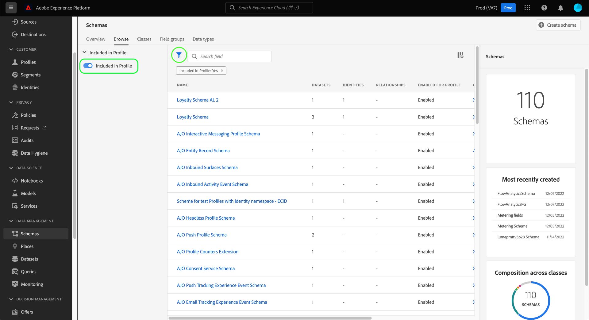

# Explore os recursos XDM na interface do usuário

No Adobe Experience Platform, todos os recursos do Experience Data Model (XDM) são armazenados em [!DNL Schema Library], incluindo os recursos padrão fornecidos pelo Adobe e os recursos personalizados definidos pela sua organização. Na interface do usuário do Experience Platform, é possível visualização a estrutura e os campos de qualquer schema, classe, combinação ou tipo de dados existente no [!DNL Schema Library]. Isso é especialmente útil ao planejar e se preparar para a ingestão de dados, já que a interface do usuário fornece informações sobre os tipos de dados esperados e casos de uso de cada campo fornecidos por esses recursos XDM.

Este tutorial aborda as etapas para explorar schemas, classes, combinações e tipos de dados existentes na interface do usuário do Experience Platform.

## Procure um recurso XDM {#lookup}

Na interface do usuário da plataforma, selecione **[!UICONTROL Schemas]** no painel de navegação esquerdo. A área de trabalho [!UICONTROL Schemas] fornece uma guia **[!UICONTROL Procurar]** para explorar todos os recursos XDM existentes em sua organização, juntamente com guias dedicadas adicionais para explorar **[!UICONTROL Classes]**, **[!UICONTROL Mixins]** e **[!UICONTROL Tipos de dados]** especificamente.

Na guia [!UICONTROL Procurar], você pode usar o ícone de filtro () para revelar controles no painel esquerdo para restringir os resultados listados.

Por exemplo, para filtrar a lista para mostrar apenas os tipos de dados padrão fornecidos pelo Adobe, selecione as seções **[!UICONTROL Datatype]** e **[!UICONTROL Adobe]** nas seções **[!UICONTROL Type]** e **[!UICONTROL Owner]**, respectivamente.

A alternância **[!UICONTROL Incluída no Perfil]** permite filtrar os resultados para mostrar apenas os recursos que são usados em schemas que foram habilitados para uso em [Perfil do cliente em tempo real](../../profile/home.md).

Você também pode usar a barra de pesquisa para restringir ainda mais os resultados. Quando você pesquisa um termo, os itens principais representam recursos cujos nomes correspondem ao query de pesquisa. Abaixo desses itens, em **[!UICONTROL Campos padrão]**, todos os recursos que contenham campos que correspondam ao query serão listados. Isso permite que você pesquise por recursos XDM com base no tipo de dados que eles contêm, sem precisar saber o nome do recurso antecipadamente.

Quando encontrar o recurso que deseja explorar, selecione seu nome na lista para visualização de sua estrutura na tela.

## Explore um recurso XDM na tela {#explore}

Após selecionar um recurso, sua estrutura é aberta na tela.

Todos os campos do tipo de objeto que contêm subpropriedades são recolhidos por padrão quando aparecem pela primeira vez na tela. Para mostrar as subpropriedades de qualquer campo, selecione o ícone ao lado de seu nome.

### Campos gerados pelo sistema {#system-fields}

Alguns nomes de campo recebem um sublinhado, como `_repo` e `_id`. Eles representam espaços reservados para campos que o sistema gerará e atribuirá automaticamente quando os dados forem assimilados.

Dessa forma, a maioria desses campos deve ser excluída da estrutura de seus dados ao ingressar na Plataforma. A principal exceção para essa regra é o campo [`_{TENANT_ID}`](../api/getting-started.md#know-your-tenant_id), no qual todos os campos XDM criados em sua organização devem ser nomeados.

### Tipos de dados {#data-types}

Para cada campo mostrado na tela, seu tipo de dados correspondente é mostrado ao lado do nome, indicando rapidamente o tipo de dados que o campo espera para ingestão.

Qualquer tipo de dados anexado com colchetes (`[]`) representa uma matriz desse tipo de dados específico. Por exemplo, um tipo de dados de **[!UICONTROL String]\[]** indica que o campo espera uma matriz de valores de string. Um tipo de dados **[!UICONTROL Item de Pagamento]\[]** indica uma matriz de objetos que estão em conformidade com o tipo de dados [!UICONTROL Item de Pagamento].

Se um campo de matriz for baseado em um tipo de objeto, você poderá selecionar seu ícone na tela para mostrar os atributos esperados para cada item de matriz.

### [!UICONTROL Propriedades do campo] {#field-properties}

Quando você seleciona o nome de qualquer campo na tela, o painel direito é atualizado para mostrar detalhes sobre esse campo em **[!UICONTROL Propriedades do campo]**. Isso pode incluir uma descrição do caso de uso pretendido do campo, valores padrão, padrões, formatos, se o campo é obrigatório ou não e muito mais.

Se o campo que você está inspecionando for um campo enum, o painel direito também exibirá os valores aceitáveis que o campo espera receber.

### Campos de identidade {#identity}

Ao inspecionar schemas que contêm campos de identidade, esses campos são listados no painel esquerdo sob a classe ou combinação que os fornece ao schema. Selecione o nome do campo de identidade no painel esquerdo para revelar o campo na tela, independentemente da profundidade de aninhamento.

Os campos de identidade são realçados na tela com um ícone de impressão digital (). Se você selecionar o nome do campo de identidade, poderá visualização informações adicionais, como [namespace de identidade](../../identity-service/namespaces.md) e se o campo é ou não a identidade primária do schema.

>[!NOTE]
>
>Consulte o guia em [definindo campos de identidade](./fields/identity.md) para obter mais informações sobre campos de identidade e sua relação com serviços de plataforma downstream.

### Campos de relacionamento {#relationship}

Se você estiver inspecionando um schema que contém um campo de relacionamento, o campo será listado no painel esquerdo em **[!UICONTROL Relacionamentos]**. Selecione o nome do campo de relação no painel esquerdo para revelar o campo na tela, independentemente da profundidade de aninhamento.

Os campos de relacionamento também são destacados exclusivamente na tela, mostrando o nome do schema de destino ao qual o campo faz referência. Se você selecionar o nome do campo de relação, poderá visualização a namespace de identidade da identidade principal do schema de destino no painel direito.

>[!NOTE]
>
>Consulte o tutorial em [criar uma relação na interface do usuário](../tutorials/create-schema-ui.md) para obter mais informações sobre o uso de relações em schemas XDM.

## Próximas etapas

Este documento abordou como explorar os recursos XDM existentes na interface do usuário do Experience Platform. Para obter mais informações sobre os diferentes recursos da área de trabalho [!UICONTROL Schemas] e [!DNL Schema Editor], consulte [[!UICONTROL Schemas] visão geral da área de trabalho](./overview.md).