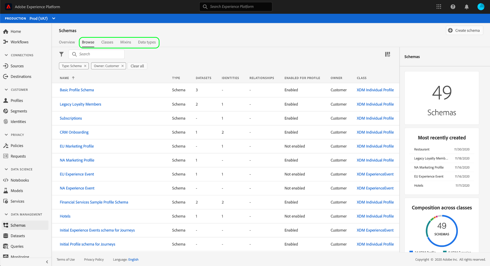
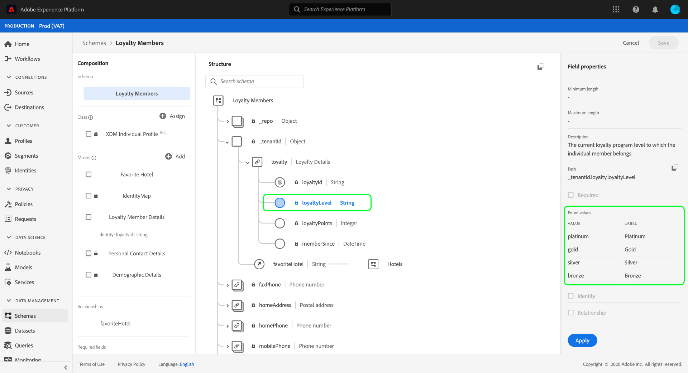

# Explorar recursos de esquema na interface do

No Adobe Experience Platform, todos os recursos de esquema do Experience Data Model (XDM) são armazenados no [!DNL Schema Library], incluindo os recursos padrão fornecidos pelo Adobe e os recursos personalizados definidos pela sua organização. Na interface do usuário do Experience Platform, você pode exibir a estrutura e os campos de qualquer esquema, classe, grupo de campos ou tipo de dados existente no [!DNL Schema Library]. Isso é especialmente útil ao planejar e se preparar para a assimilação de dados, pois a interface do usuário fornece informações sobre os tipos de dados e casos de uso esperados de cada campo fornecido por esses recursos XDM.

Este tutorial aborda as etapas para explorar esquemas, classes, grupos de campos e tipos de dados existentes na interface do Experience Platform.

## Pesquisar um recurso de esquema {#lookup}

Na interface do usuário do Experience Platform, selecione **[!UICONTROL Schemas]** na navegação à esquerda. O espaço de trabalho [!UICONTROL Schemas] fornece uma guia **[!UICONTROL Browse]** para explorar todos os esquemas da organização, juntamente com guias dedicadas adicionais para explorar **[!UICONTROL Classes]**, **[!UICONTROL Field groups]**, **[!UICONTROL Data types]** e **[!UICONTROL Relationships]** respectivamente.

O ícone de filtro () revela controles no painel esquerdo para restringir os resultados listados. Os filtros de recursos estão disponíveis para esquemas e relações nas guias **[!UICONTROL Browse]** e **[!UICONTROL Relationships]**, respectivamente.

Na guia [!UICONTROL Browse] do espaço de trabalho [!UICONTROL Schemas], você pode filtrar o inventário de esquemas. Use a opção **[!UICONTROL Included in Profile]** para mostrar apenas esquemas que foram habilitados para uso no [Perfil de Cliente em Tempo Real](../../profile/home.md). Use o botão **[!UICONTROL Show adhoc schemas]** para filtrar a lista de esquemas criados com campos com namespace para uso somente por um único conjunto de dados.

![A guia [!UICONTROL Schemas] do espaço de trabalho [!UICONTROL Browse] com o painel de filtros realçado.](../images/ui/explore/filters.png)

Na guia [!UICONTROL Relationship] do espaço de trabalho [!UICONTROL Schemas], você pode filtrar a lista de relações com base em quatro critérios. Os filtros incluem [!UICONTROL Source schema], [!UICONTROL Destination schema], [!UICONTROL Source class] e [!UICONTROL Destination class]. A tabela abaixo fornece uma descrição dos filtros.

| Filtro | Descrição |
|-----------------------------------|------------|
| [!UICONTROL Source schema] | Para ver todas as relações nas quais o esquema selecionado é o ponto de partida ou &quot;origem&quot;, selecione um esquema no menu suspenso [!UICONTROL Source schema]. |
| [!UICONTROL Destination schema] | Para exibir todas as relações nas quais o esquema selecionado é o destino ou &quot;destino&quot;, selecione um esquema no menu suspenso [!UICONTROL Destination schema]. |
| [!UICONTROL Source class] | Para filtrar relações com base na classe do esquema inicial, selecione uma classe no menu suspenso [!UICONTROL Source class]. |
| [!UICONTROL Destination class] | Para exibir relações que terminam com esquemas de uma classe específica, selecione uma classe no menu suspenso [!UICONTROL Destination class]. |

{style="table-layout:auto"}

Você também pode usar a barra de pesquisa para restringir ainda mais os resultados.

Os recursos exibidos nos resultados da pesquisa são ordenados primeiro por correspondências de título e, em seguida, por correspondências de descrição. Por sua vez, quanto mais palavras corresponderem em uma dessas categorias, maior será o recurso exibido na lista.

Depois de encontrar o recurso que deseja explorar, selecione o nome dele na lista para exibir sua estrutura na tela.

## Gerenciar esquemas, classes, grupos de campos e tipos de dados: ações e exclusão {#xdm-resource-actions}

Use esta seção quando precisar gerenciar ou excluir recursos XDM, ou quando uma ação (como excluir) não estiver disponível e você precisar entender o porquê.

### Onde encontrar ações (página em linha versus detalhada) {#where-to-find-actions}

Para executar ações como excluir, exportar ou copiar um recurso, use um dos seguintes pontos de entrada:

Nas guias **[!UICONTROL Browse]**, **[!UICONTROL Classes]**, **[!UICONTROL Field groups]** e **[!UICONTROL Data types]**, as ações de gerenciamento estão disponíveis em dois locais:

- **Em linha na tabela**: cada linha de recurso inclui um menu de ações (por exemplo, **[!UICONTROL …]**) que fornece acesso direto às ações disponíveis.

- **Modo de exibição de detalhes do recurso**: para acessar ações completas no modo de exibição de detalhes, selecione um **recurso personalizado (definido pelo locatário)**. Os recursos padrão (fornecidos pela Adobe) têm ações limitadas e não mostram opções como Excluir, Copiar estrutura JSON ou Adicionar ao pacote. Selecione um recurso personalizado no inventário para abrir a exibição detalhada e use o menu **[!UICONTROL More]** no cabeçalho da página para acessar as mesmas ações disponíveis.

Essas ações são consistentes em ambos os pontos de entrada para tipos de recursos compatíveis (esquemas, classes, grupos de campos e tipos de dados).

### Ações disponíveis {#available-actions}

Dependendo do tipo de recurso e suas permissões, as seguintes ações podem estar disponíveis:

- **[!UICONTROL Delete]** — Remover permanentemente um recurso personalizado de sua organização (quando as restrições permitirem). Se a exclusão estiver bloqueada, consulte [Restrições](#delete-constraints).
- **[!UICONTROL Download sample file]** — Gera um arquivo de dados de exemplo com base na estrutura de recursos. Passo a passo: [Gerar dados XDM de amostra](./sample.md).
- **[!UICONTROL Copy JSON structure]** — Copie a definição de recurso no formato JSON para reutilização, exportação ou inspeção. Passo a passo: [Exportar esquemas XDM](./export.md).
- **[!UICONTROL Add to package]** — Inclua o recurso em um pacote de sandbox para exportação ou importação em sandboxes. Passo a passo: [Exportar objetos em um pacote](../../sandboxes/ui/sandbox-tooling.md#export-objects).

O seguinte se aplica a diferentes tipos de recursos:

- Para **esquemas, classes, grupos de campos e tipos de dados personalizados (definidos pelo locatário)**, todas as ações acima podem estar disponíveis.
- Para **classes, grupos de campos e tipos de dados padrão (definidos pela Adobe)**:
   - Somente **[!UICONTROL Download sample file]** está disponível.
   - **Excluir**, **Copiar estrutura JSON** e **Adicionar ao pacote** não estão disponíveis.

### Excluir comportamento {#delete-behavior}

Use a ação **[!UICONTROL Delete]** quando quiser remover um recurso personalizado que não é mais necessário.

>[!IMPORTANT]
>
> A exclusão de um recurso o remove permanentemente de sua organização e não pode ser desfeita. Alguns recursos não podem ser excluídos devido a restrições de uso, permissões ou sistema.

Para excluir um recurso:

1. Localize o recurso na tabela ou abra sua visualização detalhada.
2. Selecione o menu de ações (**[!UICONTROL …]** ou **[!UICONTROL More]**).
3. Selecione **[!UICONTROL Delete]**.
4. Confirme a ação na caixa de diálogo selecionando **[!UICONTROL Delete]** novamente.

O recurso é removido permanentemente da organização após a confirmação.

Se a exclusão não estiver disponível para um recurso, a opção aparecerá desativada com uma dica de ferramenta explicando por que a ação não pode ser executada.

### Restrições (conjunto de dados, perfil, RBAC, locatário versus global) {#delete-constraints}

Se uma ação como **[!UICONTROL Delete]** estiver indisponível ou desabilitada, isso geralmente ocorre devido a uma das seguintes condições:

- **Permissões (RBAC)**: você deve ter as permissões necessárias (como **[!UICONTROL Manage Schemas]**) para executar ações de gerenciamento. Se as permissões estiverem ausentes, as ações aparecerão desativadas com dicas de ferramentas. Para saber como as permissões são configuradas, consulte a [visão geral da interface do usuário do controle de acesso](../../access-control/ui/overview.md).

- **Associação de conjunto de dados**: os recursos usados por um ou mais conjuntos de dados (como esquemas associados a conjuntos de dados) não podem ser excluídos. Para identificar e remover dependências do conjunto de dados, consulte [Excluir um conjunto de dados](../../catalog/datasets/user-guide.md#delete).

- **Habilitação de perfil**: esquemas habilitados para o Perfil de Cliente em Tempo Real não podem ser excluídos. Para obter orientação sobre como a ativação de perfil afeta seu esquema, consulte [Planejamento para ativação do perfil do cliente em tempo real](../schema/profile-enablement-planning.md).

- **Recursos de locatário vs. globais**: recursos (personalizados) definidos pelo locatário podem ser excluídos (sujeitos a restrições), enquanto classes, grupos de campos e tipos de dados padrão (fornecidos pela Adobe) não podem ser excluídos.

Essas restrições são refletidas diretamente na interface do usuário do. Quando uma ação não está disponível, ela aparece desativada e inclui uma dica de ferramenta explicando a limitação específica.

Se não for possível excluir um recurso, revise as condições acima para determinar se é necessário atualizar permissões, remover dependências ou ajustar o modelo de dados.

Para obter fluxos de trabalho adicionais de edição de esquemas na tela, consulte [Criar e editar esquemas na interface](./resources/schemas.md).

## Explorar um recurso XDM na tela {#explore}

Depois de selecionar um recurso, sua estrutura é aberta na tela.

Todos os campos do tipo de objeto que contêm subpropriedades são recolhidos por padrão quando aparecem pela primeira vez na tela. Para mostrar as subpropriedades de qualquer campo, selecione o ícone ao lado do nome.

### Indicador padrão de classe e grupo de campos {#standard-class-and-field-group-indicator}

No Editor de esquemas, classes e grupos de campos padrão (gerados pela Adobe) são indicados com o ícone de cadeado (. O cadeado é exibido no painel à esquerda, ao lado do nome da classe ou do grupo de campos, e também ao lado de qualquer campo no diagrama de esquema que faça parte de um recurso gerado pelo sistema.

Consulte a documentação [Adicionar campos personalizados a grupos de campos padrão](./resources/schemas.md) para obter orientação. Não é possível editar uma classe padrão.

### Campos gerados pelo sistema {#system-fields}

Alguns nomes de campos recebem um sublinhado como prefixo, por exemplo, `_repo` e `_id`. Eles representam espaços reservados para campos que o sistema gerará e atribuirá automaticamente à medida que os dados forem assimilados.

Dessa forma, a maioria desses campos deve ser excluída da estrutura dos dados ao assimilar na Experience Platform. A principal exceção para essa regra é o campo [`_{TENANT_ID}` ](../api/getting-started.md#know-your-tenant_id), no qual todos os campos XDM criados em sua organização devem ter o namespace.

### Tipos de dados {#data-types}

Para cada campo mostrado na tela, seu tipo de dados correspondente é mostrado ao lado do nome, indicando rapidamente o tipo de dados que o campo espera para assimilação.

Qualquer tipo de dados com colchetes (`[]`) anexados representa uma matriz desse tipo de dados específico. Por exemplo, um tipo de dados de **[!UICONTROL String]\[]** indica que o campo espera uma matriz de valores de cadeia de caracteres. Um tipo de dados de **[!UICONTROL Payment Item]\[]** indica uma matriz de objetos que estão em conformidade com o tipo de dados [!UICONTROL Payment Item].

Se um campo de matriz é baseado em um tipo de objeto, você pode selecionar seu ícone na tela para mostrar os atributos esperados para cada item de matriz.

### [!UICONTROL Field properties] {#field-properties}

Quando você seleciona o nome de qualquer campo na tela, o painel direito é atualizado para mostrar detalhes sobre esse campo em **[!UICONTROL Field properties]**. Isso pode incluir uma descrição do caso de uso pretendido do campo, valores padrão, padrões, formatos, se o campo é obrigatório ou não e muito mais.

Se o campo que você está inspecionando for um campo de enumeração, o painel direito também exibirá os valores aceitáveis que o campo espera receber.

### Campos de identidade {#identity}

Ao inspecionar esquemas que contêm campos de identidade, esses campos são listados no painel à esquerda na classe ou no grupo de campos que os fornece ao esquema. Selecione o nome do campo de identidade no painel à esquerda para revelar o campo na tela, independentemente da profundidade em que ele está aninhado.

Os campos de identidade são realçados na tela com um ícone de impressão digital (). Se você selecionar o nome do campo de identidade, poderá exibir informações adicionais, como o [namespace de identidade](../../identity-service/features/namespaces.md) e se o campo é ou não a identidade principal do esquema.

>[!NOTE]
>
>Consulte o manual sobre [definição de campos de identidade](./fields/identity.md) para obter mais informações sobre campos de identidade e suas relações com os serviços downstream do Experience Platform.

### Campos de relacionamento {#relationship}

Se você estiver inspecionando um esquema que contém um campo de relação, o campo será listado no painel esquerdo em **[!UICONTROL Relationships]**. Selecione o nome do campo de relacionamento no painel à esquerda para revelar o campo na tela, independentemente da profundidade em que ele está aninhado. Os campos de relacionamento também são destacados exclusivamente na tela, mostrando o nome do esquema de referência ao qual o campo é vinculado. Para organizações com recursos B2B, os nomes de relacionamentos personalizados podem ser escritos e serão exibidos na tela nesses casos.

Para exibir o namespace de identidade da identidade primária do esquema de referência, selecione o campo de relação e, em seguida, **[!UICONTROL Edit relationship]** na barra lateral [!UICONTROL Field properties]. Os parâmetros da relação são exibidos na caixa de diálogo [!UICONTROL Edit relationship] exibida.

Consulte o tutorial sobre [criação de uma relação na interface](../tutorials/relationship-ui.md) para obter mais informações sobre o uso de relações em esquemas XDM.

## Próximas etapas

Este documento abordou como explorar os recursos XDM existentes na interface do usuário do Experience Platform. Para obter mais informações sobre os diferentes recursos do espaço de trabalho [!UICONTROL Schemas] e [!DNL Schema Editor], consulte a [[!UICONTROL Schemas] visão geral do espaço de trabalho](./overview.md).
