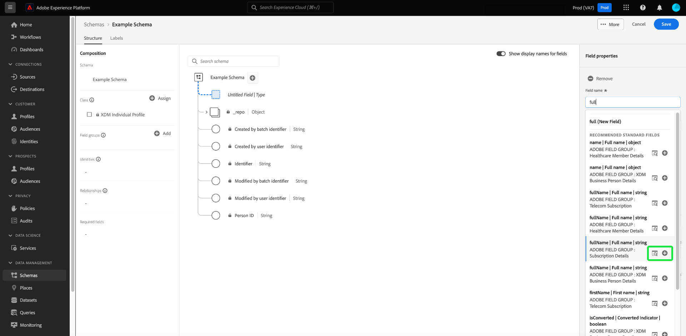

# Fluxos de trabalho baseados em campo no Editor de esquema (Beta)

>[!IMPORTANT]
>
>Os workflows descritos neste documento estão atualmente em beta. A funcionalidade e a documentação estão sujeitas a alterações.

O Adobe Experience Platform fornece um conjunto robusto de [grupos de campo](../schema/composition.md#field-group) padronizados para uso em esquemas do Experience Data Model (XDM). A estrutura e a semântica por trás desses grupos de campo são cuidadosamente personalizadas para atender a uma grande variedade de casos de uso de segmentação e outros aplicativos downstream na Platform. Você também pode definir seus próprios grupos de campos personalizados para atender às necessidades comerciais exclusivas.

Quando você adiciona um grupo de campos a um schema, esse schema herda todos os campos contidos nesse grupo. No entanto, agora é possível adicionar campos individuais ao esquema sem precisar incluir outros campos do grupo de campos associado que talvez você não use necessariamente.

Este guia aborda os diferentes métodos para adicionar campos individuais a um esquema na interface do usuário da plataforma.

## Pré-requisitos

Este tutorial presume que você esteja familiarizado com a [composição de esquemas XDM](../schema/composition.md) e como usar o Editor de esquemas na interface do usuário da plataforma. Para continuar, você deve iniciar o processo de [criar um novo schema](./resources/schemas.md) e atribuí-lo a uma classe padrão antes de continuar com este guia.

## Remover campos adicionados de grupos de campos padrão

Após adicionar um grupo de campos padrão a um esquema, é possível remover os campos padrão que não são necessários.

>[!NOTE]
>
>A remoção de campos de um grupo de campos padrão afeta apenas o schema que está sendo trabalhado e não afeta o próprio grupo de campos. Se você remover campos padrão de um schema, esses campos ainda estarão disponíveis em todos os outros esquemas que empregam o mesmo grupo de campos.

No exemplo a seguir, o grupo de campos padrão **[!UICONTROL Detalhes demográficos]** foi adicionado a um schema. Para remover um único campo, como `taxId`, selecione o campo na tela e selecione **[!UICONTROL Remove]** no painel direito.

Se houver vários campos que você deseja remover, será possível gerenciar o grupo de campos como um todo. Selecione um campo pertencente ao grupo na tela e selecione **[!UICONTROL Gerenciar campos relacionados]** no painel direito.

Uma caixa de diálogo é exibida mostrando a estrutura do grupo de campos em questão. Aqui, você pode usar as caixas de seleção fornecidas para selecionar ou desmarcar os campos necessários. Quando estiver satisfeito, selecione **[!UICONTROL Adicionar campos]**.

A tela reaparece somente com os campos selecionados presentes na estrutura do schema.

## Adicionar campos padrão diretamente a um schema

Você pode adicionar campos de grupos de campos padrão diretamente a um schema sem precisar conhecer previamente o grupo de campos correspondente. Para adicionar um campo padrão a um schema, selecione o ícone de adição (**+**) ao lado do nome do schema na tela. Um espaço reservado **[!UICONTROL Campo sem título]** aparece na estrutura do esquema e o painel direito é atualizado para revelar controles para configurar o campo.

Em **[!UICONTROL Field name]**, comece a digitar o nome do campo que deseja adicionar. O sistema pesquisa automaticamente campos padrão que correspondem à consulta e os lista em **[!UICONTROL Campos padrão recomendados]**, incluindo os grupos de campos aos quais pertencem.

Embora alguns campos padrão compartilhem o mesmo nome, sua estrutura pode variar dependendo do grupo de campos de onde vêm. Se um campo padrão estiver aninhado em um objeto pai na estrutura do grupo de campos, o campo pai também será incluído no esquema se o campo filho for adicionado.

Selecione o ícone de visualização () ao lado de um campo padrão para visualizar a estrutura de seu grupo de campos e entender melhor como ele pode ser aninhado. Para adicionar o campo padrão ao schema, selecione o ícone de adição ().

A tela é atualizada para mostrar o campo padrão adicionado ao esquema, incluindo quaisquer campos pai nos quais ele está aninhado dentro da estrutura do grupo de campos. O nome do grupo de campos também é listado em **[!UICONTROL Field groups]** no painel esquerdo. Para adicionar mais campos do mesmo grupo de campos, selecione **[!UICONTROL Gerenciar campos relacionados]** no painel direito.

## Adicionar campos personalizados diretamente a um esquema

Se você tiver criado anteriormente [grupos de campos personalizados](./resources/field-groups.md#create), poderá adicionar campos personalizados diretamente ao esquema sem precisar adicioná-los separadamente a um grupo de campos personalizado antecipadamente.

>[!WARNING]
>
>Ao adicionar um campo personalizado a um esquema, ainda é necessário selecionar um grupo de campos personalizados existente para que ele seja associado. Isso significa que para adicionar campos personalizados diretamente a um esquema, é necessário ter pelo menos um grupo de campos personalizado definido anteriormente na sandbox em que você está trabalhando. Além disso, quaisquer outros esquemas que empregam esse grupo de campos personalizado também herdarão o campo recém-adicionado depois que você salvar as alterações.

Para adicionar campos ao nível raiz de um schema, selecione o ícone de adição (**+**) ao lado do nome do schema na tela. Um espaço reservado **[!UICONTROL Campo sem título]** aparece na estrutura do esquema e o painel direito é atualizado para revelar controles para configurar o campo.

Comece digitando o nome do campo personalizado que deseja adicionar e o sistema inicia automaticamente a pesquisa por campos padrão correspondentes. Para criar um novo campo personalizado, selecione a opção superior anexada com **([!UICONTROL Novo campo])**.

A partir daqui, forneça um nome de exibição e um tipo de dados para o campo. Em **[!UICONTROL Atribuir grupo de campos]**, selecione o grupo de campos personalizados ao qual deseja que o novo campo seja associado.

Quando terminar, selecione **[!UICONTROL Aplicar]**.

O novo campo é adicionado à tela e é namespacado em seu [ID do locatário](../api/getting-started.md#know-your-tenant_id) para evitar conflitos com campos XDM padrão. O grupo de campos ao qual você associou o novo campo também aparece em **[!UICONTROL Field groups]** no painel esquerdo.

>[!NOTE]
>
>O restante dos campos fornecidos pelo grupo de campos personalizado selecionado são removidos do schema por padrão. Para adicionar alguns desses campos ao schema, selecione um campo pertencente ao grupo e selecione **[!UICONTROL Gerenciar campos relacionados]** no painel direito.

### Adicionar campos personalizados à estrutura de grupos de campos padrão

Se o esquema em que você está trabalhando tiver um campo tipo objeto fornecido por um grupo de campos padrão, você poderá adicionar seus próprios campos personalizados a esse objeto padrão. Selecione o ícone de adição (**+**) ao lado da raiz do objeto e forneça os detalhes do campo personalizado no painel direito.

Depois de aplicar as alterações, o novo campo aparece sob o namespace da ID do locatário no objeto padrão. Esse namespace aninhado impede conflitos de nome de campo no próprio grupo de campos para evitar a quebra de alterações em outros esquemas que usam o mesmo grupo de campos.

## Próximas etapas

Este guia cobriu os novos fluxos de trabalho em campo para o Editor de esquemas na interface do usuário da plataforma. Para obter mais informações sobre como gerenciar schemas na interface do usuário, consulte a [visão geral da interface do usuário](./overview.md).
