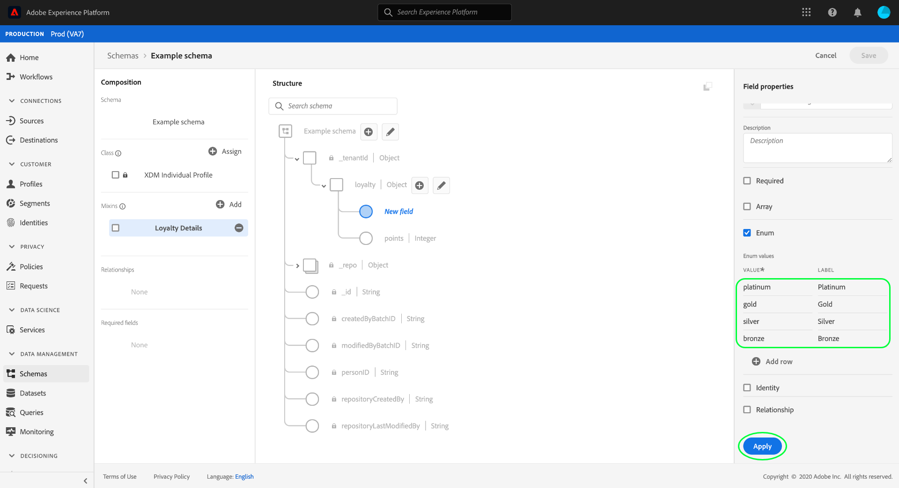

# Definir campos de enumeração na interface do usuário

No Experience Data Model (XDM), um campo enum representa um campo restrito a uma lista predefinida de valores aceitáveis.

Ao [definir um novo campo](./overview.md#define) na interface do usuário do Adobe Experience Platform, você pode defini-lo como um campo de enumeração selecionando a caixa de seleção **[!UICONTROL Enum]** no painel direito.

Controles adicionais são exibidos depois de marcar a caixa de seleção, permitindo especificar as restrições de valor para o enum. Na coluna **[!UICONTROL Value]**, é necessário fornecer o valor exato ao qual deseja restringir o campo. Esse valor deve estar em conformidade com [!UICONTROL Type] selecionado para o campo enum . Opcionalmente, também é possível fornecer um **[!UICONTROL Label]** amigável para a restrição.

Para adicionar restrições adicionais ao enum, selecione **[!UICONTROL Add row]**.

Continue a adicionar as restrições desejadas e os rótulos opcionais ao enum. Quando terminar, selecione **[!UICONTROL Apply]** para aplicar as alterações ao schema.

A tela é atualizada para refletir as alterações. Ao explorar esse schema no futuro, você poderá visualizar e editar as restrições do campo enum no painel direito.

## Próximas etapas

Este guia abordou como definir um campo enum na interface do usuário do . Consulte a visão geral em [definindo campos na interface do usuário](./overview.md#special) para saber como definir outros tipos de campos XDM no [!DNL Schema Editor].
