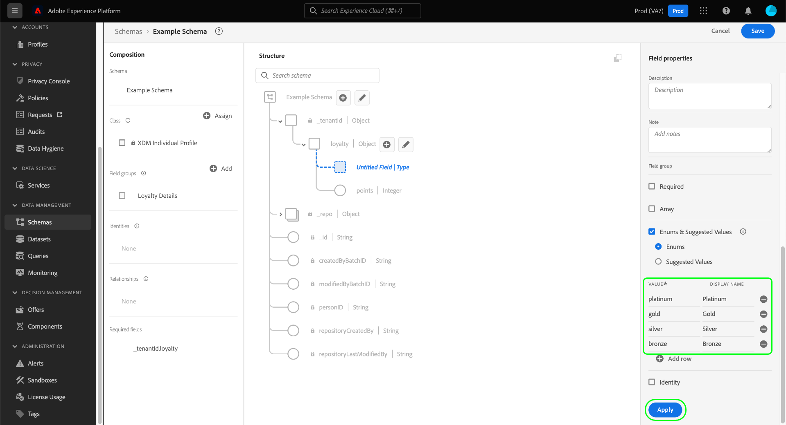
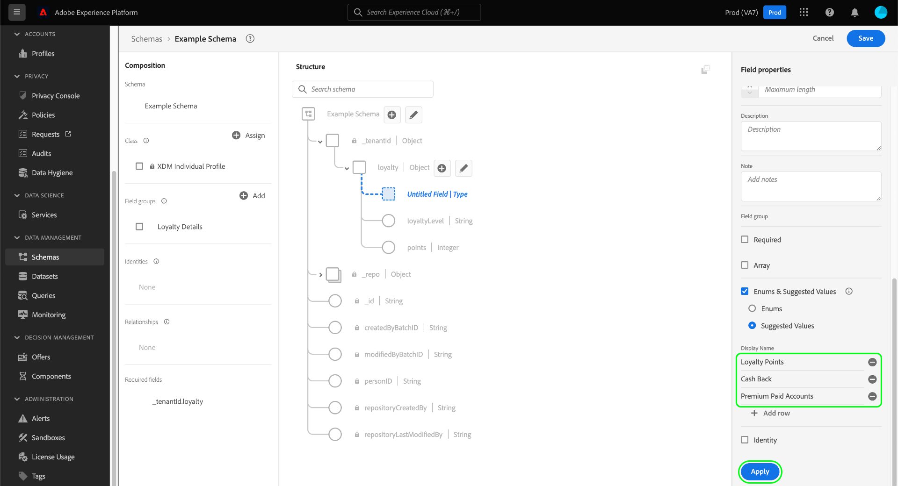

# Definir enumerações e valores sugeridos na interface {#enums-and-suggested-values}

>[!CONTEXTUALHELP]
>id="platform_xdm_enum_suggestedvalue"
>title="Enumerações e valores sugeridos"
>abstract="Uma **Enumeração** restringe um campo de string para permitir somente dados que correspondam a um conjunto predefinido de valores a serem assimilados. Cada restrição de enumeração pode receber um **Nome de exibição** que preenche detalhamentos de atributos na interface de segmentação. **Valores sugeridos** para um campo não restringem a ingestão e determinam apenas os nomes de exibição mostrados na Segmentação. Se você tiver vários esquemas que compartilham um campo pertencente a uma classe ou grupo de campos comum e definir diferentes enumerações ou valores sugeridos para esse campo entre cada esquema, esses valores serão mesclados e anexados no esquema de união."

No Experience Data Model (XDM), um campo de sequência pode receber um conjunto predefinido de valores aceitos ou sugeridos para controlar melhor quais valores são assimilados nesse campo ou como ele se comportará na segmentação.

**[!UICONTROL Enums]** restringir os valores que podem ser assimilados de um campo de cadeia de caracteres para um conjunto predefinido. Se você tentar assimilar dados em um campo enum e o valor não corresponder a nenhum dos definidos em sua configuração, a assimilação será negada.

Ao contrário de enums, a opção **[!UICONTROL Suggested values]** permite denotar um conjunto de valores recomendados para um campo de cadeia de caracteres que não restringe os valores que ele pode assimilar. Em vez disso, os valores sugeridos afetam quais valores predefinidos estão disponíveis na [Interface de segmentação](../../../segmentation/ui/overview.md) ao incluir o campo de sequência como um atributo.

Ao [definir um novo campo](./overview.md#define) na interface do usuário do Adobe Experience Platform e definir o tipo como [!UICONTROL String], você terá a opção de definir um [enum](#enum) ou [valores sugeridos](#suggested-values) para esse campo.

Este documento aborda como definir enumerações e valores sugeridos no espaço de trabalho da interface do usuário [!UICONTROL Schemas]. Para obter uma visão geral rápida sobre enumerações e valores sugeridos, incluindo como configurá-los na interface do usuário e seus efeitos downstream, assista ao seguinte vídeo:

>[!VIDEO](https://video.tv.adobe.com/v/3417877/?captions=por_br&quality=12&learn=on)

## Definir um enum {#enum}

Selecione **[!UICONTROL Enums and Suggested Values]** e depois **[!UICONTROL Enums]**. Controles adicionais são exibidos, permitindo especificar as restrições de valor para o enum. Para adicionar uma restrição, selecione **[!UICONTROL Add row]**.

Na coluna **[!UICONTROL Value]**, você deve fornecer o valor exato ao qual deseja restringir o campo. Opcionalmente, você também pode fornecer um **[!UICONTROL Display Name]** para a restrição, que afeta como o valor será representado na segmentação.

Continue a usar **[!UICONTROL Add row]** para adicionar as restrições desejadas e os rótulos opcionais à enumeração, ou selecione o ícone de exclusão () ao lado de uma linha adicionada anteriormente para removê-lo. Quando terminar, selecione **[!UICONTROL Apply]** para aplicar as alterações ao esquema.

A tela é atualizada para refletir as alterações. Ao explorar esse esquema no futuro, você pode visualizar e editar as restrições para o campo de enumeração no painel direito.

## Definir valores sugeridos {#suggested-values}

Selecione **[!UICONTROL Enums and Suggested Values]** e depois **[!UICONTROL Suggested Values]** para fazer com que controles adicionais apareçam. Aqui, selecione **[!UICONTROL Add row]** para começar a adicionar os valores sugeridos.

Na coluna **[!UICONTROL Display Name]**, forneça um nome amigável para o valor conforme você quer que ele seja exibido na interface do usuário de segmentação. Para adicionar mais valores sugeridos, selecione **[!UICONTROL Add row]** novamente e repita o processo conforme necessário. Para remover uma linha adicionada anteriormente, selecione  ao lado da linha em questão.

Quando terminar, selecione **[!UICONTROL Apply]** para aplicar as alterações ao esquema.

>[!NOTE]
>
>Há um atraso de aproximadamente cinco minutos para que os valores sugeridos atualizados de um campo sejam refletidos na interface do usuário de segmentação.

### Gerenciar valores sugeridos para campos padrão

Alguns campos de componentes XDM padrão contêm seus próprios valores sugeridos, como `eventType` da [[!UICONTROL XDM ExperienceEvent] classe](../../classes/experienceevent.md). Embora seja possível criar valores sugeridos adicionais para um campo padrão, não é possível modificar ou remover valores sugeridos que não estejam definidos pela organização. Ao visualizar um campo padrão na interface do usuário do, os valores sugeridos são exibidos, mas são somente leitura.

Para adicionar novos valores sugeridos para um campo padrão, selecione **[!UICONTROL Add row]**. Para remover um valor sugerido que foi adicionado anteriormente por sua organização, selecione  ao lado da linha em questão.

<!-- ### Removing suggested values for standard fields

Only suggested values that you define can be removed from a standard field. Existing suggested values can be disabled so that they no longer appear in the segmentation dropdown, but they cannot be removed outright.

For example, consider a profile schema where the a suggested value for the standard `person.gender` field is disabled:

In this example, the display name "[!UICONTROL Non-specific]" is now disabled from being shown in the segmentation dropdown list. However, the value `non_specific` is still part of the list of enumerated fields and is therefore still allowed on ingestion. In other words, you cannot disable the actual enum value for the standard field as it would go against the principle of only allowing changes that make a field less restrictive.

See the [section below](#evolution) for more information on the rules for updating enums and suggested values for existing schema fields. -->

## Regras de evolução para enumerações e valores sugeridos {#evolution}

Depois que um esquema com um campo de enumeração é usado para assimilar dados na Experience Platform, qualquer alteração adicional feita na definição do esquema deve estar em conformidade com os dados já existentes no sistema. Em geral, as alterações feitas em um campo existente só podem tornar esse campo **menos** restritivo. Um campo não pode se tornar mais restritivo do que já é.

Quando se trata de enumerações e valores sugeridos, as seguintes regras se aplicam após a assimilação:

* Você **PODE** adicionar valores sugeridos para campos padrão e personalizados com valores sugeridos existentes.
* Você **PODE** remover valores sugeridos de campos personalizados com valores sugeridos existentes.
* Você **PODE** adicionar novos valores de enumeração para um campo de enumeração personalizado existente.
* Você **PODE** alternar os valores de enumeração de um campo personalizado somente para os valores sugeridos ou convertê-los em uma cadeia de caracteres sem enumeração ou valores sugeridos. **Esta opção não pode ser desfeita depois de aplicada.**
* Você **NÃO PODE** remover enumerações ou valores sugeridos de campos padrão.
* Você **NÃO PODE** adicionar valores de enumeração a um campo sem enumeração existente.
* Você **NÃO PODE** remover menos do que todos os valores de enumeração existentes para um campo personalizado.
* Você **NÃO PODE** alternar dos valores sugeridos para uma enumeração.

## Mesclar regras para enumerações e valores sugeridos {#merging}

Se vários esquemas usarem o mesmo campo de enumeração com configurações diferentes e esses esquemas forem incluídos em uma união, determinadas regras se aplicam quando se trata de como as diferenças de enumeração são reconciliadas. As regras exatas dependem se os esquemas fazem referência ao mesmo campo padrão (como `eventType`) ou se estão fazendo referência ao mesmo caminho de campo personalizado em diferentes grupos de campos.

Se fizer referência ao mesmo campo padrão:

* Quaisquer valores adicionais sugeridos são **APPENDED** na união.
* As atualizações feitas nos valores sugeridos para a mesma chave enum são **ATUALIZADAS** na união.

Se estiver fazendo referência ao mesmo caminho de campo personalizado em grupos de campos diferentes:

* Quaisquer valores adicionais sugeridos são **APPENDED** na união.
* Se o mesmo valor adicional sugerido for definido em mais de um esquema, esses valores serão **MESCLADOS** na união. Em outras palavras, o mesmo valor sugerido não aparecerá duas vezes após a mesclagem.

## Limitações da validação

Devido às limitações atuais do sistema, há dois casos em que um enum não é validado pelo sistema durante a assimilação:

1. A enumeração está definida em um [campo de matriz](./array.md).
1. A enumeração está definida em mais de um nível profundo na hierarquia de esquema.

## Próximas etapas

Este guia abordou como definir enumerações e valores sugeridos para campos de sequência na interface do usuário. Para obter informações sobre como gerenciar enumerações e valores sugeridos usando a API do Registro de Esquema, consulte o seguinte [tutorial](../../tutorials/suggested-values.md).

Para saber como definir outros tipos de campo XDM no [!DNL Schema Editor], consulte a visão geral em [definindo campos na interface](./overview.md#special).
