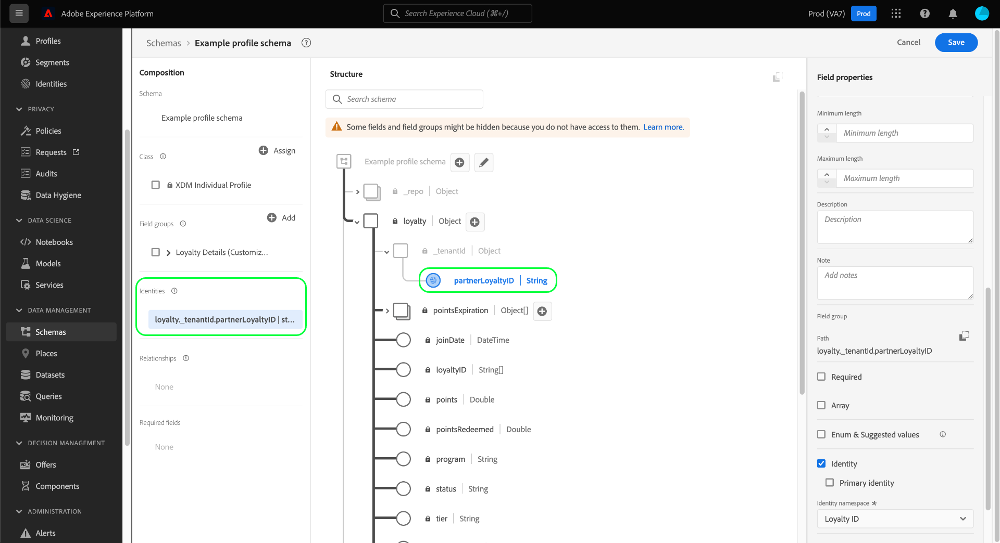

# Definir campos de identidade na interface do usuário

No Experience Data Model (XDM), um campo de identidade representa um campo que pode ser usado para identificar uma pessoa individual relacionada a um registro ou evento de série de tempo. Este documento aborda como definir um campo de identidade na interface do usuário do Adobe Experience Platform.

## Pré-requisitos

Os campos de identidade são um componente essencial na forma como os gráficos de identidade do cliente são construídos na plataforma, o que afeta o modo como o Perfil do cliente em tempo real mescla fragmentos de dados diferentes para obter uma visualização completa do cliente. Antes de definir campos de identidade em seus esquemas, consulte a seguinte documentação para saber mais sobre os principais serviços e conceitos relacionados aos campos de identidade:

* [Serviço](../../../identity-service/home.md) de identidade da Adobe Experience Platform: Corresponde identidades entre dispositivos e sistemas, vinculando conjuntos de dados com base nos campos de identidade definidos pelos esquemas XDM aos quais eles estão em conformidade.
   * [Namespaces](../../../identity-service/namespaces.md) de identidade: Os namespaces de identidade definem os diferentes tipos de informações de identidade que podem estar relacionadas a uma única pessoa e são um componente obrigatório para cada campo de identidade.
* [Perfil](../../../profile/home.md) do cliente em tempo real: Aproveita os gráficos de identidade do cliente para fornecer um perfil unificado do consumidor com base em dados agregados de várias fontes, atualizados em tempo quase real.

## Definir um campo de identidade

Ao [definir um novo campo](./overview.md#define) na interface do usuário, você pode defini-lo como um campo de identidade marcando a caixa de seleção **[!UICONTROL Identity]** no painel direito.

Controles adicionais são exibidos após marcar a caixa de seleção. Se desejar que esse campo seja a identidade primária para o schema, marque a caixa de seleção **[!UICONTROL Primary identity]** .

>[!NOTE]
>
>Um único schema pode ter muitos campos de identidade definidos, mas só pode ter uma identidade primária. Todos os campos de identidade (primários ou não) contribuem para o gráfico de identidade de um cliente individual, mas o Perfil do cliente em tempo real usa somente a identidade primária como fonte de verdade ao mesclar fragmentos de dados. Se quiser ativar um schema para uso no Perfil, o schema deve ter uma identidade primária definida.

Em **[!UICONTROL Identity namespace]**, use o menu suspenso para selecionar o namespace apropriado para o campo de identidade. Os namespaces padrão fornecidos pelo Adobe são listados, juntamente com qualquer namespace personalizado definido pela organização.

Quando terminar, selecione **[!UICONTROL Apply]** para aplicar a alteração ao schema.

A tela é atualizada para refletir as alterações, com o campo selecionado ganhando um símbolo de impressão digital () para designá-lo como uma identidade. No painel à esquerda, o campo de identidade agora é listado sob o nome da classe ou do mixin que fornece o campo para o schema .

Como todos os campos de identidade são obrigatórios por padrão, o campo agora é listado em **[!UICONTROL Required fields]** no painel esquerdo. Se o campo de identidade estiver aninhado dentro da estrutura do schema, todos os campos pai também serão listados conforme necessário.

Se você definiu uma identidade primária para o schema, agora poderá prosseguir para [ativar o schema para uso no Perfil do cliente em tempo real](../resources/schemas.md#profile).

## Próximas etapas

Este guia abordou como definir um campo de identidade na interface do usuário do . À medida que os dados são assimilados usando esse esquema, os gráficos de identidade do cliente serão atualizados para refletir os campos de identidade do esquema. Consulte o guia no [visualizador de gráficos de identidade](../../../identity-service/ui/identity-graph-viewer.md) para saber como explorar o gráfico privado de sua organização na interface do usuário.

Consulte a visão geral em [definindo campos na interface do usuário](./overview.md#special) para saber como definir outros tipos de campos XDM no [!DNL Schema Editor].
