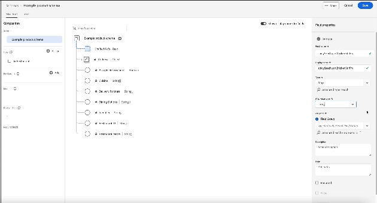

# Definir campos de mapa na interface

O Adobe Experience Platform permite personalizar totalmente a estrutura de suas classes personalizadas do Experience Data Model (XDM), grupos de campos de esquema e tipos de dados.

Você também pode definir campos de mapa no Editor de esquemas para armazenar uma coleção de pares de valores-chave com chaves flexíveis e dinâmicas.

Ao definir um novo campo na interface (UI) do Experience Platform, use a lista suspensa **[!UICONTROL Tipo]** e selecione &quot;**[!UICONTROL Mapa]**&quot; na lista.

Uma propriedade [!UICONTROL Map value type] é exibida. Este valor é necessário para [!UICONTROL Mapear] tipos de dados. Os valores disponíveis para o mapa são [!UICONTROL String] e [!UICONTROL Integer]. Selecione um valor na lista suspensa de opções disponíveis.

![O Editor de Esquemas com a lista suspensa [!UICONTROL Tipo de valor do mapa] foi realçado.](../../images/ui/fields/special/map-value-type.png)

Depois de configurar o subcampo, você deve atribuí-lo a um grupo de campos. Use o menu suspenso **[!UICONTROL Grupo de Campos]** ou o campo de pesquisa e selecione **[!UICONTROL Aplicar]**. Você pode continuar a adicionar campos ao objeto usando o mesmo processo ou selecionar **[!UICONTROL Salvar]** para confirmar as configurações.

## Restrições de uso {#restrictions}

O XDM impõe as seguintes restrições ao uso desse tipo de dados:

* Os tipos de mapa DEVEM ser do tipo `object`.
* Os tipos de mapa NÃO DEVEM ter propriedades definidas (em outras palavras, eles definem objetos &quot;vazios&quot;).
* Os tipos de mapa DEVEM incluir um campo `additionalProperties.type` que descreva os valores que podem ser colocados no mapa, `string` ou `integer`.
* A segmentação de várias entidades só pode ser definida com base nas chaves do mapa, e não nos valores.
* Os mapas não são compatíveis com os públicos-alvo da conta.
* Os mapas definidos em objetos XDM personalizados são limitados a um único nível. Não é possível criar mapas aninhados. Essa restrição não se aplica a mapas definidos em objetos XDM padrão.
* Matrizes de mapas não são compatíveis.

Certifique-se de que você só esteja usando campos do tipo mapa quando for absolutamente necessário, pois eles apresentam as seguintes desvantagens de desempenho:

* O tempo de resposta do [Serviço de Consulta do Adobe Experience Platform](../../../query-service/home.md) degrada de três segundos a dez segundos para 100 milhões de registros.
* Os mapas devem ter menos de 16 chaves, caso contrário, haverá risco de degradação adicional.

>[!NOTE]
>
>A interface do usuário do Experience Platform tem limitações na forma como pode extrair as chaves de campos do tipo mapa. Enquanto os campos do tipo objeto podem ser expandidos, os mapas são exibidos como um único campo. Os campos de mapa criados por meio da API do Registro de Esquema que não são do tipo de dados string ou integer são exibidos como tipos de dados &quot;[!UICONTROL Complexo]&quot;.

## Próximas etapas

Depois de ler este documento, agora é possível definir campos de mapa na interface do usuário do Experience Platform. Lembre-se de que você só pode usar classes e grupos de campos para adicionar campos a esquemas. Para saber mais sobre como gerenciar esses recursos na interface, consulte os guias sobre criação e edição de [classes](../resources/classes.md) e [grupos de campos](../resources/field-groups.md).

Para obter mais informações sobre os recursos do espaço de trabalho [!UICONTROL Esquemas], consulte a [[!UICONTROL visão geral do espaço de trabalho de &#x200B;]](../overview.md).
