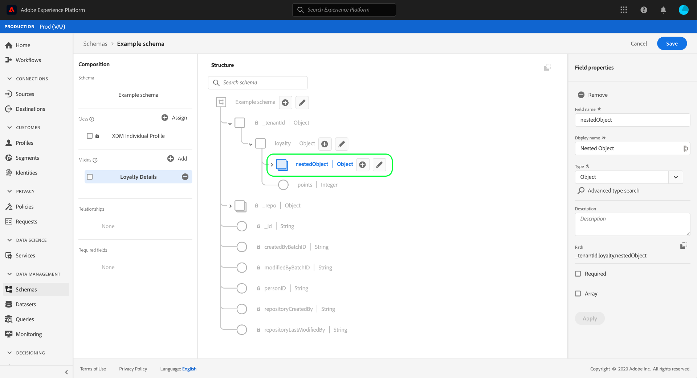

# Definir campos de objeto na interface do usuário

O Adobe Experience Platform permite personalizar totalmente a estrutura de suas classes, combinações e tipos de dados personalizados do Experience Data Model (XDM). Para organizar e aninhar campos relacionados em recursos XDM personalizados, você pode definir campos do tipo objeto que podem conter subcampos adicionais.

Ao [definir um novo campo](./overview.md#define) na interface do usuário do Adobe Experience Platform, use a lista suspensa **[!UICONTROL Type]** e selecione &quot;[!UICONTROL Object]&quot; na lista.

Selecione **[!UICONTROL Apply]** para adicionar o objeto ao esquema. A tela é atualizada para mostrar o novo campo com o tipo de dados [!UICONTROL Object] aplicado, incluindo controles para editar e adicionar subcampos ao objeto.

Para adicionar um subcampo, selecione o ícone de **mais (+)** ao lado do campo de objeto na tela. Um novo campo é exibido abaixo do objeto, com controles para configurar o subcampo no painel direito.

Depois de configurar o subcampo e selecionar **[!UICONTROL Apply]**, você pode continuar a adicionar campos ao objeto usando o mesmo processo. Também é possível adicionar subcampos que são objetos, permitindo aninhar campos da maneira mais profunda que desejar.

Uma vez terminado de construir o objeto, você pode descobrir que deseja reutilizar sua estrutura em diferentes classes e mixins. Nesse caso, é possível optar por converter o objeto em um tipo de dados. Consulte a seção sobre [conversão de objetos em tipos de dados](../resources/data-types.md#convert) no guia da interface do usuário de tipos de dados para obter mais informações.

## Próximas etapas

Este guia cobriu como definir um campo de objeto na interface do usuário do . Consulte a visão geral em [definindo campos na interface do usuário](./overview.md#special) para saber como definir outros tipos de campos XDM no [!DNL Schema Editor].
