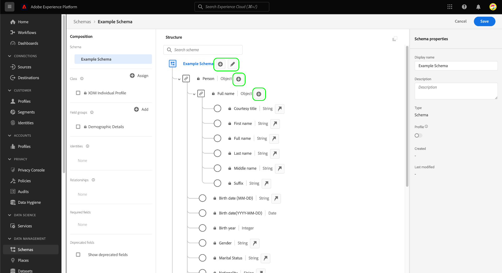

# Definir campos XDM na interface do usuário

O [!DNL Schema Editor] na interface do usuário do Adobe Experience Platform, é possível definir seus próprios campos nas classes personalizadas do Experience Data Model (XDM) e nos grupos de campos do esquema. Este guia aborda as etapas para definir campos XDM na interface do usuário, incluindo as opções de configuração disponíveis para cada tipo de campo.

## Pré-requisitos

Este guia requer uma compreensão funcional do Sistema XDM. Consulte a [Visão geral do XDM](../../home.md) para uma introdução ao papel do XDM no ecossistema do Experience Platform, e [noções básicas da composição do schema](../../schema/composition.md) para saber como classes e grupos de campos contribuem com campos para esquemas XDM.

Embora não seja necessário para este guia, é recomendável seguir também o tutorial em [composição de um esquema na interface do usuário](../../tutorials/create-schema-ui.md) para se familiarizar com os vários recursos do [!DNL Schema Editor].

## Selecionar um recurso para adicionar campos ao {#select-resource}

Para definir novos campos XDM na interface do usuário, primeiro você deve abrir um schema no [!DNL Schema Editor]. Dependendo dos esquemas que estão disponíveis no momento no [!DNL Schema Library], você pode optar por [criar um novo schema](../resources/schemas.md#create) ou [selecionar um esquema existente para editar](../resources/schemas.md#edit).

Assim que tiver o [!DNL Schema Editor] abra o painel à esquerda para selecionar a classe ou grupo de campos para a qual deseja definir campos. Se o recurso for um recurso personalizado definido pela organização, os controles para adicionar ou editar campos serão exibidos na tela. Esses controles são exibidos ao lado do nome do schema, bem como quaisquer campos do tipo de objeto que foram definidos na classe ou grupo de campos selecionado.

>[!NOTE]
>
>Se a classe ou o grupo de campos selecionado for um recurso principal fornecido pelo Adobe, ele não poderá ser editado e, portanto, os controles mostrados acima não aparecerão. Se o esquema ao qual você deseja adicionar campos for baseado em uma classe XDM principal e não contiver grupos de campos personalizados, você poderá [criar um novo grupo de campos](../resources/field-groups.md#create) para adicionar ao schema em vez disso.

Para adicionar um novo campo ao recurso, selecione o **mais (+)** ícone ao lado do nome do esquema na tela ou ao lado do campo do tipo de objeto em que você deseja definir o campo.

## Definir um campo para um recurso {#define}

Depois de selecionar o **mais (+)** ícone, um **[!UICONTROL Novo campo]** aparece na tela, localizada em um objeto de nível raiz que é namespacado para sua ID de locatário exclusiva (mostrado como `_tenantId` no exemplo abaixo). Todos os campos adicionados a um schema por meio de classes personalizadas e grupos de campos são colocados automaticamente dentro desse namespace para evitar conflitos com outros campos a partir de classes fornecidas por Adobe e grupos de campos.

No painel direito em **[!UICONTROL Propriedades do campo]**, é possível configurar os detalhes dos novos campos. As seguintes informações são necessárias para cada campo:

| Propriedade do campo | Descrição |
| --- | --- |
| [!UICONTROL Nome do campo] | Um nome descritivo e exclusivo para o campo. Observe que o nome do campo não pode ser alterado depois que o esquema é salvo.  O nome deve ser escrito em camelCase. Pode conter caracteres alfanuméricos, traço ou sublinhados, mas **podem não** comece com um sublinhado.<ul><li>**Correto**: `fieldName`</li><li>**Aceitável:** `field_name2`, `Field-Name`, `field-name_3`</li><li>**Incorreto**: `_fieldName`</li></ul> |
| [!UICONTROL Nome de exibição] | Um nome amigável para o campo. |
| [!UICONTROL Tipo] | O tipo de dados que o campo conterá. Nesse menu suspenso, é possível selecionar uma das opções [tipos escalares padrão](../../schema/field-constraints.md) suportado pelo XDM ou por um dos vários campos [tipos de dados](../resources/data-types.md) que tenham sido previamente definidas no [!DNL Schema Registry].  Você também pode selecionar **[!UICONTROL Pesquisa de tipo avançada]** para pesquisar e filtrar os tipos de dados existentes e localizar o tipo desejado mais facilmente. |

{style=&quot;table-layout:auto&quot;}

Você também pode fornecer uma opção legível por humanos **[!UICONTROL Descrição]** no campo para fornecer mais contexto sobre o caso de uso pretendido do campo.

>[!NOTE]
>
>Dependendo do **[!UICONTROL Tipo]** Se você selecionou para o campo , controles de configuração adicionais podem aparecer no painel direito. Consulte a seção sobre [propriedades de campos específicos do tipo](#type-specific-properties) para obter mais informações sobre esses controles.
>
>O painel direito também fornece caixas de seleção para designar tipos de campos especiais. Consulte a seção sobre [tipos de campo especiais](#special) para obter mais informações.

Depois de concluir a configuração do campo, selecione **[!UICONTROL Aplicar]**.

A tela é atualizada para mostrar o nome e o tipo do campo, e o painel direito agora lista o caminho do campo, além de suas outras propriedades.

Você pode continuar a seguir as etapas acima para adicionar mais campos ao schema. Depois que o schema é salvo, sua classe base e seus grupos de campos também são salvos se alguma alteração for feita neles.

>[!NOTE]
>
>Quaisquer alterações feitas nos grupos de campos ou na classe de um schema serão refletidas em todos os outros esquemas que os empregam.

## Propriedades de campos específicos do tipo {#type-specific-properties}

Ao definir um novo campo, opções de configuração adicionais podem aparecer no painel direito, dependendo do **[!UICONTROL Tipo]** escolha para o campo . A tabela a seguir descreve essas propriedades de campo adicionais juntamente com seus tipos compatíveis:

| Propriedade do campo | Tipos compatíveis | Descrição |
| --- | --- | --- |
| [!UICONTROL Valor padrão] | [!UICONTROL String], [!UICONTROL Duplo], [!UICONTROL Longo], [!UICONTROL Número inteiro], [!UICONTROL Curto], [!UICONTROL Byte], [!UICONTROL Booleano] | Um valor padrão que será atribuído a esse campo se nenhum outro valor for fornecido durante a assimilação. Esse valor deve estar em conformidade com o tipo selecionado do campo. |
| [!UICONTROL Padrão] | [!UICONTROL String] | A [expressão regular](https://developer.mozilla.org/en-US/docs/Web/JavaScript/Guide/Regular_Expressions) que o valor desse campo deve estar em conformidade para ser aceito durante a assimilação. |
| [!UICONTROL Formato] | [!UICONTROL String] | Selecione de uma lista de formatos predefinidos para cadeias de caracteres que o valor deve estar em conformidade. Os formatos disponíveis incluem: <ul><li>[[!UICONTROL data e hora]](https://tools.ietf.org/html/rfc3339)</li><li>[[!UICONTROL email]](https://tools.ietf.org/html/rfc2822)</li><li>[[!UICONTROL hostname]](https://tools.ietf.org/html/rfc1123#page-13)</li><li>[[!UICONTROL ipv4]](https://tools.ietf.org/html/rfc791)</li><li>[[!UICONTROL ipv6]](https://tools.ietf.org/html/rfc2460)</li><li>[[!UICONTROL uri]](https://tools.ietf.org/html/rfc3986)</li><li>[[!UICONTROL referência de uri]](https://tools.ietf.org/html/rfc3986#section-4.1)</li><li>[[!UICONTROL url-template]](https://tools.ietf.org/html/rfc6570)</li><li>[[!UICONTROL ponteiro json]](https://tools.ietf.org/html/rfc6901)</li></ul> |
| [!UICONTROL Comprimento mínimo] | [!UICONTROL String] | O número mínimo de caracteres que a cadeia de caracteres deve conter para que o valor seja aceito durante a assimilação. |
| [!UICONTROL Tamanho máximo] | [!UICONTROL String] | O número máximo de caracteres que a cadeia de caracteres deve conter para que o valor seja aceito durante a assimilação. |
| [!UICONTROL Valor mínimo] | [!UICONTROL Duplo] | O valor mínimo para Double a ser aceito durante a ingestão. Se o valor assimilado corresponder exatamente ao inserido aqui, o valor será aceito. Ao usar essa restrição, o &quot;[!UICONTROL Valor mínimo exclusivo]&quot; a restrição deve ser deixada em branco. |
| [!UICONTROL Valor máximo] | [!UICONTROL Duplo] | O valor máximo para Double a ser aceito durante a ingestão. Se o valor assimilado corresponder exatamente ao inserido aqui, o valor será aceito. Ao usar essa restrição, o &quot;[!UICONTROL Valor máximo exclusivo]&quot; a restrição deve ser deixada em branco. |
| [!UICONTROL Valor mínimo exclusivo] | [!UICONTROL Duplo] | O valor máximo para Double a ser aceito durante a ingestão. Se o valor assimilado corresponder exatamente ao inserido aqui, o valor será rejeitado. Ao usar essa restrição, o &quot;[!UICONTROL Valor mínimo]&quot; A restrição (não exclusiva) deve ser deixada em branco. |
| [!UICONTROL Valor máximo exclusivo] | [!UICONTROL Duplo] | O valor máximo para Double a ser aceito durante a ingestão. Se o valor assimilado corresponder exatamente ao inserido aqui, o valor será rejeitado. Ao usar essa restrição, o &quot;[!UICONTROL Valor máximo]&quot; A restrição (não exclusiva) deve ser deixada em branco. |

{style=&quot;table-layout:auto&quot;}

## Tipos de campo especiais {#special}

O painel direito fornece várias caixas de seleção para designar funções especiais para o campo selecionado. Os casos de uso para algumas dessas opções envolvem considerações importantes sobre sua estratégia de modelagem de dados e como você pretende usar os serviços downstream da plataforma.

Para saber mais sobre esses tipos especiais, consulte a seguinte documentação:

* [[!UICONTROL Obrigatório]](./required.md)
* [[!UICONTROL Matriz]](./array.md)
* [[!UICONTROL Enum]](./enum.md)
* [[!UICONTROL Identidade]](./identity.md) (Disponível somente para campos de string)
* [[!UICONTROL Relação]](./relationship.md) (Disponível somente para campos de string)

Embora tecnicamente não seja um tipo de campo especial, também é recomendável visitar o guia em [definição de campos do tipo objeto](./object.md) para saber mais sobre como definir subcampos aninhados se suas estruturas de esquema forem estruturadas.

## Próximas etapas

Este guia forneceu uma visão geral de como definir campos XDM na interface do usuário. Lembre-se de que os campos só podem ser adicionados a schemas por meio de classes e grupos de campos. Para saber mais sobre como gerenciar esses recursos na interface do usuário, consulte os guias sobre criação e edição [classes](../resources/classes.md) e [grupos de campos](../resources/field-groups.md).

Para obter mais informações sobre os recursos da [!UICONTROL Esquemas] espaço de trabalho, consulte o [[!UICONTROL Esquemas] visão geral do espaço de trabalho](../overview.md).
