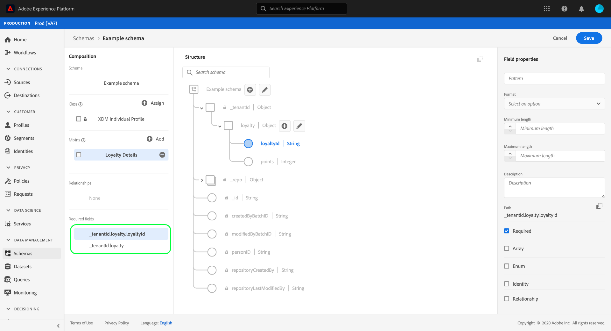

# Definir campos obrigatórios na interface do usuário

No Experience Data Model (XDM), um campo obrigatório indica que ele deve receber um valor válido para que um registro ou evento de série de tempo específico seja aceito durante a assimilação de dados. Casos de uso comuns para campos obrigatórios incluem informações de identidade do usuário e carimbos de data e hora.

Ao [definir um novo campo](./overview.md#define) na interface do usuário do Adobe Experience Platform, você pode defini-lo como um campo obrigatório marcando a caixa de seleção **[!UICONTROL Required]** no painel direito. Selecione **[!UICONTROL Apply]** para aplicar a alteração ao schema.

Depois que o campo é aplicado, seu caminho aparece em **[!UICONTROL Required fields]** no painel esquerdo. Se o campo estiver aninhado, quaisquer campos pai também aparecerão conforme necessário.

## Próximas etapas

Este guia abordou como definir um campo obrigatório na interface do usuário do . Consulte a visão geral em [definindo campos na interface do usuário](./overview.md#special) para saber como definir outros tipos de campos XDM no [!DNL Schema Editor].
