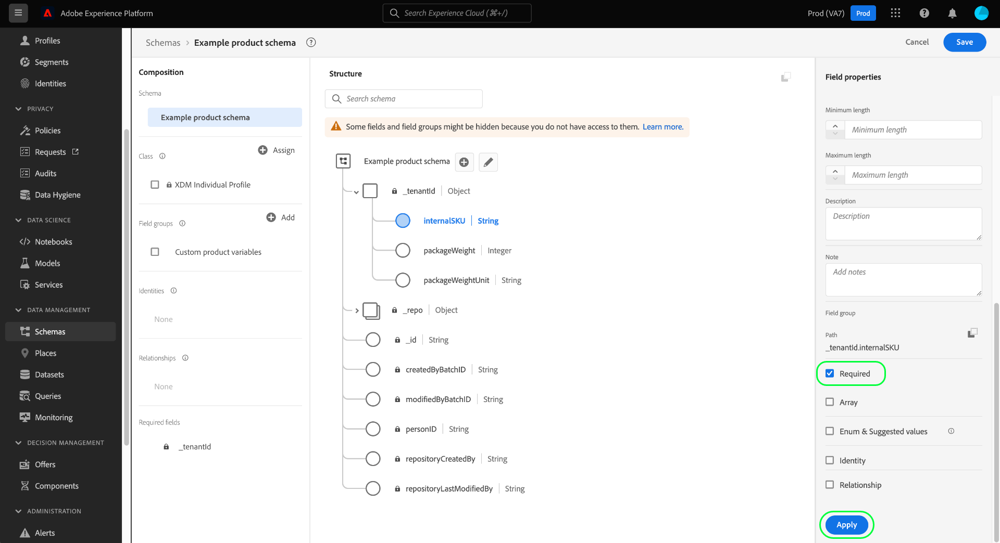
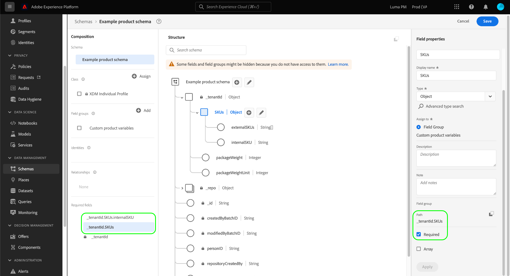

# Definir campos obrigatórios na interface do usuário

No Experience Data Model (XDM), um campo obrigatório indica que ele deve receber um valor válido para que um registro ou evento de série de tempo específico seja aceito durante a assimilação de dados. Casos de uso comuns para campos obrigatórios incluem informações de identidade do usuário e carimbos de data e hora.

>[!IMPORTANT]
>
>Independentemente de um campo de esquema ser obrigatório ou não, a Platform não aceita `null` ou valores vazios para qualquer campo assimilado. Se não houver valor para um campo específico em um registro ou evento, a chave desse campo deverá ser excluída do payload de assimilação.

When [definição de um novo campo](./overview.md#define) na interface do usuário do Adobe Experience Platform, é possível defini-lo como um campo obrigatório selecionando o **[!UICONTROL Obrigatório]** caixa de seleção no painel direito. Selecionar **[!UICONTROL Aplicar]** para aplicar a alteração ao schema.

Se o campo for um atributo de nível raiz sob o objeto de ID do locatário, seu caminho aparecerá imediatamente em **[!UICONTROL Campos obrigatórios]** no painel esquerdo.

Se um campo obrigatório estiver aninhado dentro de um objeto que não esteja marcado como necessário, no entanto, o campo aninhado não aparecerá em **[!UICONTROL Campos obrigatórios]** no painel esquerdo.

No exemplo abaixo, a variável `loyaltyId` for definido conforme necessário, mas seu objeto pai `loyalty` não é. Nesse caso, nenhum erro de validação ocorreria se `loyalty` foi excluído ao assimilar dados, mesmo que o campo filho `loyaltyId` estiver marcada conforme necessário. Em outras palavras, enquanto `loyalty` é opcional, deve conter um `loyaltyId` no caso de inclusão.

Se quiser que um campo aninhado sempre seja obrigatório em um schema, também deverá definir todos os campos pai, conforme necessário (com exceção do objeto de ID do locatário).

## Próximas etapas

Este guia abordou como definir um campo obrigatório na interface do usuário do . Consulte a visão geral em [definição de campos na interface do usuário](./overview.md#special) para saber como definir outros tipos de campo XDM na variável [!DNL Schema Editor].
