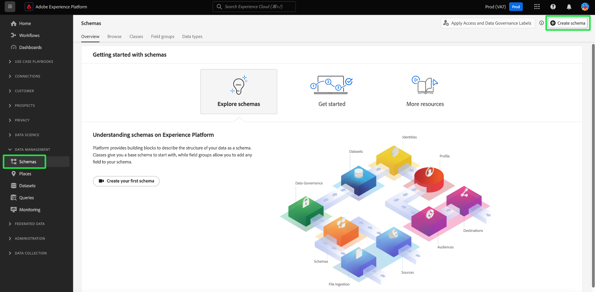
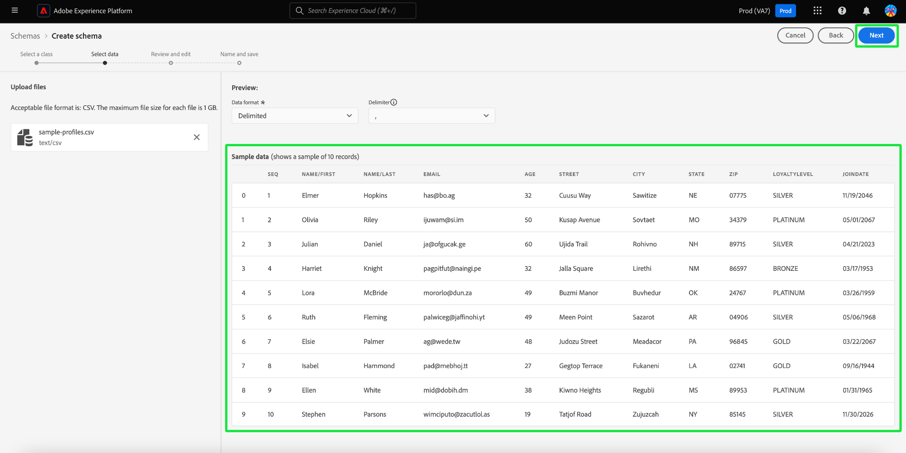

# Criação de esquema assistido por aprendizado de máquina

Use algoritmos de ML para gerar um esquema a partir de dados de amostra. Esse processo economiza tempo e aumenta a precisão ao definir a estrutura, os campos e os tipos de dados para grandes conjuntos de dados complexos.

Com a geração do esquema de ML, você pode integrar rapidamente novas fontes de dados e reduzir os erros da criação manual. Os usuários não técnicos podem usá-lo para gerar esquemas ou gerenciar conjuntos de dados grandes e complexos sem nenhum esforço extra. Essa assistência acelera o processo, desde a obtenção de dados até a obtenção de insights, pois facilita a combinação de novas fontes de dados e a execução da análise de dados.

## Introdução

Este tutorial requer um entendimento prático dos requisitos para a criação de esquema. Antes de continuar com este guia, você deve ler o [guia da interface do usuário para criar e editar esquemas](./resources/schemas.md).

Este guia explica como criar esquemas usando algoritmos de aprendizado de máquina (ML) para gerar um esquema a partir de dados de amostra. Consulte o [manual schema creation workflow guide](https://experienceleague.adobe.com/en/docs/experience-platform/xdm/ui/resources/schemas#add-field-groups) para obter informações sobre como criar esquemas ou o documento sobre [workflows baseados em campo no Editor de esquemas](https://experienceleague.adobe.com/en/docs/experience-platform/xdm/ui/field-based-workflows) para aprimorar sua compreensão do processo de criação de esquema.

>[!NOTE]
>
>Você também pode compor um esquema usando a API [!DNL Schema Registry]. Para criar um esquema manualmente usando a API, primeiro leia o [[!DNL Schema Registry] guia do desenvolvedor](../api/getting-started.md) antes de tentar o tutorial sobre [criação de um esquema usando a API](../tutorials/create-schema-api.md).

## Navegue até Criar fluxo de trabalho de esquema {#navigate-to-schema-creation-workflow}

Na navegação à esquerda da interface do Platform, selecione o espaço de trabalho **[!UICONTROL Esquemas]**. O espaço de trabalho **[!UICONTROL Esquemas]** aparece. Selecione **[!UICONTROL Criar esquema]** para adicionar um novo esquema e iniciar um fluxo de trabalho de criação de esquema.

## Criar um esquema {#create-a-schema}

A caixa de diálogo [!UICONTROL Criar um esquema] é exibida. Selecione a opção de criação de esquema **[Assistido por ML]**, seguida de **[!UICONTROL Selecionar]** para confirmar sua escolha.

![A caixa de diálogo [!UICONTROL Criar um esquema] com [!UICONTROL ML- Assistido] realçada.](../images/ui/ml-schema-creation/use-sample-csv.png)

### Selecionar uma classe base {#select-base-class}

O fluxo de trabalho [!UICONTROL Criar esquema] é exibido. Selecione uma classe base para o esquema seguida de **[!UICONTROL Próximo]**.

### Fazer upload de um arquivo CSV {#upload-csv}

O estágio **[!UICONTROL Selecionar dados]** do fluxo de trabalho de criação é exibido. Na seção **[!UICONTROL Carregar arquivos]**, selecione **[!UICONTROL Escolher arquivos]** ou na seção **[!UICONTROL Arrastar e Soltar arquivos]**. Selecione um arquivo .csv do seu computador para gerar um esquema.

### Visualizar dados {#preview-data}

A seção [!UICONTROL Carregar arquivo] exibe o nome do arquivo CSV importado e a seção **[!UICONTROL Visualizar]** exibe linhas de dados de exemplo do arquivo que você carregou. Selecione **[!UICONTROL Avançar]** para continuar o fluxo de trabalho.

### Revisar e editar esquema {#review-schema}

O estágio **[!UICONTROL Revisar e editar]** do fluxo de trabalho de criação agora é exibido, exibindo a **[!UICONTROL recomendação de esquema]** assistida por aprendizado de máquina em uma exibição tabulada. Nesse estágio, você pode editar, adicionar ou remover campos do esquema recomendado gerado pelo modelo de aprendizado de máquina. A tabela contém os seguintes campos:

| Nome do campo | Descrição |
|------------------|---------------------------------------------------------|
| [!UICONTROL Tabela de dados] | O conjunto de dados ou banco de dados em que o campo se origina. |
| [!UICONTROL Campo do Source] | O nome do campo original do sistema de origem. |
| [!UICONTROL Campo de destino] | O nome do campo no sistema de destino onde os dados serão mapeados. |
| [!UICONTROL Nome de exibição] | O nome usado para exibir o campo na interface. Esse nome deve ser mais amigável ou descritivo. |
| [!UICONTROL Tipo de dados] | O tipo de dados armazenados no campo (por exemplo, `String`, `Date`). |
| [!UICONTROL Grupo de campos] | Uma categorização do campo com base em seu uso ou contexto (por exemplo, [!UICONTROL Detalhes demográficos], [!UICONTROL Detalhes do Commerce]). |

#### Adicionar um campo {#add-field}

Para adicionar um campo ao esquema, selecione **[!UICONTROL Adicionar novo campo]**.

A caixa de diálogo [!UICONTROL Selecionar campo] é exibida. A caixa de diálogo contém um diagrama do schema como ele existe atualmente. Selecione o campo desejado e selecione **[Selecionar]** para adicionar um novo campo ao esquema. Selecione **[Cancelar]** para fechar a caixa de diálogo, se necessário.

Uma nova linha é exibida no esquema recomendado. Agora você pode editar o campo.

#### Editar um campo {#edit-field}

Para editar um campo, selecione o ícone de lápis da linha que deseja editar. Um painel de detalhes é exibido à direita, onde você pode editar o mapeamento do campo personalizado. O painel de detalhes contém o [!UICONTROL Campo de destino], [!UICONTROL Nome para Exibição], [!UICONTROL Tipo de Dados] e [!UICONTROL Grupo de Campos]. Faça as alterações necessárias e selecione **[!UICONTROL Aplicar]** para confirmar. Selecione o ícone de lápis novamente para fechar o painel de detalhes.

#### Remover um campo {#remove-field}

Para remover um campo, selecione o ícone de menos em uma linha que deseja excluir.

>[!CAUTION]
>
>Nenhuma caixa de diálogo de confirmação é exibida ao remover este item.

#### Aprovar o esquema recomendado {#approve}

Para aprovar seu esquema recomendado e continuar o fluxo de trabalho **[!UICONTROL Criar esquema]**, selecione **[Avançar]**.

### Nomear e salvar esquema {#name-and-save}

O estágio **[!UICONTROL Name and save]** do fluxo de trabalho de criação é exibido. Insira um **[Nome para exibição do esquema]** e uma descrição opcional. A seção **[Esquema gerado]** fornece um diagrama do esquema gerado por ML. Selecione **[Concluir]** para concluir o fluxo de trabalho de criação do esquema.

### Visualização no Editor de esquemas {#view-in-editor}

O Editor de esquemas é exibido com o esquema recém-criado exibido na tela. Selecione **[!UICONTROL Salvar]** para retornar ao espaço de trabalho [!UICONTROL Esquemas].

## Próximas etapas

Depois de criar o esquema, você pode usar o Editor de esquemas para fazer mais modificações, se necessário. Seu novo esquema agora está pronto para ser integrado às fontes de dados e usado para análise de dados.

Consulte o [Guia Editar um esquema existente](https://experienceleague.adobe.com/en/docs/experience-platform/xdm/ui/resources/schemas#edit) para obter mais informações sobre o uso do Editor de Esquemas.
