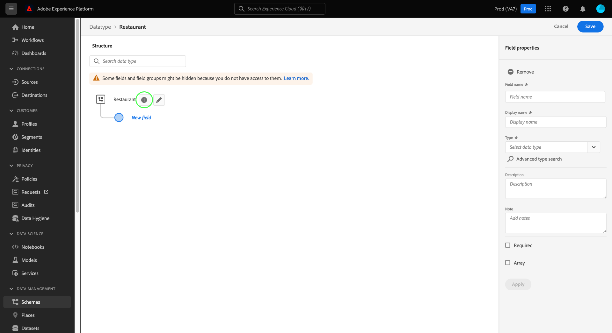
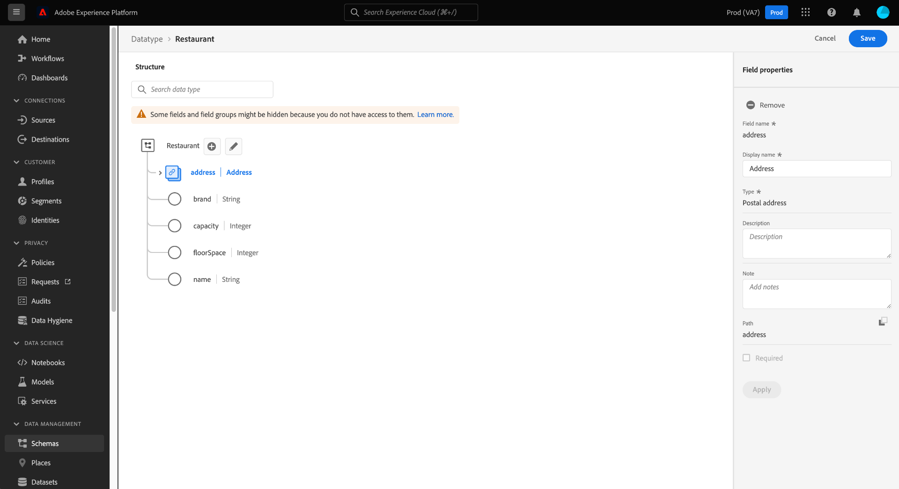

# Criar e editar tipos de dados usando a interface do usuário

No Experience Data Model (XDM), os tipos de dados podem ser reutilizados em campos que contêm vários subcampos. Embora semelhantes aos grupos de campos de esquema, na medida em que permitem o uso consistente de uma estrutura de vários campos, os tipos de dados são mais flexíveis porque podem ser incluídos em qualquer lugar na estrutura do schema, enquanto os grupos de campos só podem ser adicionados no nível raiz.

O Adobe Experience Platform fornece muitos tipos de dados padrão que podem ser usados para abranger uma grande variedade de casos de uso comuns do gerenciamento de experiências. No entanto, você também pode definir seus próprios tipos de dados personalizados para atender às suas necessidades comerciais exclusivas.

Este tutorial aborda as etapas para criar e editar tipos de dados personalizados na interface do usuário da plataforma.

## Pré-requisitos

Este guia requer uma compreensão funcional do Sistema XDM. Consulte a [Visão geral do XDM](../../home.md) para obter uma introdução à função do XDM no ecossistema do Experience Platform e as [noções básicas da composição do schema](../../schema/composition.md) sobre como os tipos de dados contribuem para os esquemas XDM.

Embora não seja necessário para este guia, é recomendável seguir também o tutorial em [composição de um schema na interface do usuário](../../tutorials/create-schema-ui.md) para se familiarizar com os vários recursos do [!DNL Schema Editor].

## Abra o [!DNL Schema Editor] para um tipo de dados

Na interface do usuário da plataforma, selecione **[!UICONTROL Schemas]** na navegação à esquerda para abrir o espaço de trabalho [!UICONTROL Schemas] e selecione a guia **[!UICONTROL Data types]**. Uma lista de tipos de dados disponíveis é exibida, incluindo aqueles definidos pelo Adobe e aqueles criados por sua organização.

Aqui, você tem duas opções:

- [Criar um novo tipo de dados](#create)
- [Selecionar um tipo de dados existente para editar](#edit)

### Criar um novo tipo de dados {#create}

Na guia **[!UICONTROL Data types]**, selecione **[!UICONTROL Create data type]**.

O [!DNL Schema Editor] é exibido, mostrando a estrutura atual do novo tipo de dados na tela. No lado direito do editor, é possível fornecer um nome de exibição e uma descrição opcional para o tipo de dados. Certifique-se de fornecer um nome exclusivo e conciso para o tipo de dados, pois é assim que ele será identificado ao adicioná-lo a um schema.

Este tutorial cria um tipo de dados que descreve uma propriedade de restaurante, de modo que o tipo de dados recebe um nome de exibição de &quot;Restaurante&quot;.

A partir daqui, você pode avançar para a [próxima seção](#add-fields) para começar a adicionar campos ao novo tipo de dados.

### Editar um tipo de dados existente

>[!NOTE]
>
>Depois que um tipo de dados existente é usado em um schema que foi ativado para uso no Perfil do cliente em tempo real, somente alterações não destrutivas podem ser feitas nesse tipo de dados a partir de então. Consulte as [regras de evolução do schema](../../schema/composition.md#evolution) para obter mais informações.

Somente os tipos de dados personalizados definidos pela sua organização podem ser editados. Para restringir a lista exibida, selecione o ícone de filtro () para revelar os controles da filtragem com base em [!UICONTROL Proprietário]. Selecione **[!UICONTROL Cliente]** para mostrar apenas os tipos de dados personalizados pertencentes à sua organização.

Selecione o tipo de dados que deseja editar na lista para abrir o painel direito, mostrando os detalhes do tipo de dados. Selecione o nome do tipo de dados no painel direito para abrir sua estrutura no [!DNL Schema Editor].

## Adicionar campos ao tipo de dados {#add-fields}

Para começar a adicionar campos ao tipo de dados, selecione o ícone de **mais (+)** ao lado do campo de nível raiz na tela. Um novo campo é exibido abaixo e o painel direito é atualizado para exibir controles para o novo campo.

Use os controles no painel direito para configurar os detalhes do novo campo. Consulte o guia em [definindo campos na interface do usuário](../fields/overview.md#define) para obter etapas específicas sobre como configurar e adicionar o campo ao tipo de dados.

O tipo de dados Restaurant requer um campo de string para representar o nome do restaurante. Dessa forma, o [!UICONTROL Field name] é definido como &quot;name&quot; e o [!UICONTROL Type] é definido como &quot;[!UICONTROL String]&quot;. Selecione **[!UICONTROL Aplicar]** para aplicar as alterações ao campo.

Continue adicionando mais campos ao tipo de dados, conforme necessário. O exemplo de tipo de dados Restaurant agora tem campos adicionais para marca, capacidade de assentos e espaço do chão.

Além dos campos básicos, também é possível aninhar outros tipos de dados dentro do tipo de dados personalizado. Por exemplo, o tipo de dados Restaurante requer um campo que representa o endereço físico da propriedade. Nesse cenário, você pode adicionar um novo campo &quot;endereço&quot; ao qual é atribuído o tipo de dados padrão &quot;[!UICONTROL Postal address]&quot;.

Isso demonstra como os tipos de dados podem ser flexíveis em termos de descrição dos dados: os tipos de dados podem empregar campos que também são tipos de dados, que podem conter outros tipos de dados, e assim por diante. Isso permite abstrair e reutilizar padrões de dados comuns em seus esquemas XDM, facilitando a representação de estruturas de dados complexas.

Depois de concluir a adição de campos ao tipo de dados, selecione **[!UICONTROL Save]** para salvar as alterações e adicionar o tipo de dados ao [!DNL Schema Library].

## Adicionar o tipo de dados a uma classe ou grupo de campos

Depois de criar um tipo de dados, você pode começar a usá-lo em seus esquemas. Como os esquemas XDM são compostos de uma classe e zero ou mais grupos de campos, os campos fornecidos por um tipo de dados não podem ser adicionados a um schema diretamente. Em vez disso, eles devem ser incluídos em uma classe ou em um grupo de campos.

Comece seguindo as etapas envolvidas com [adicionar um campo a uma classe](./classes.md#add-fields) ou [adicionar um campo a um grupo de campos](./field-groups.md#add-fields). Ao escolher o **[!UICONTROL Type]** para o novo campo, selecione o nome do seu tipo de dados no menu suspenso.

## Converter um objeto de vários campos em um tipo de dados {#convert}

Ao criar um campo do tipo objeto com vários subcampos no [!DNL Schema Editor], é possível converter esse campo em um tipo de dados para usar a mesma estrutura de campo em uma classe ou grupo de campos diferente.

Para converter um campo do tipo objeto em um tipo de dados, selecione o campo na tela. Antes de converter o campo, verifique se **[!UICONTROL Display name]** é descritivo dos dados que o objeto conterá, pois esse se tornará o nome do tipo de dados. Quando estiver pronto para converter o campo, selecione **[!UICONTROL Convert to new data type]** no painel direito.

A tela atualiza o tipo de dados do campo de &quot;[!UICONTROL Object]&quot; para o novo tipo de dados. Os subcampos também têm pequenos ícones de bloqueio ao lado, indicando que não são mais campos individuais, mas parte de um tipo de dados de vários campos. Essa estrutura agora pode ser reutilizada em outras classes e grupos de campos selecionando esse tipo de dados na lista suspensa **[!UICONTROL Type]** ao definir um novo campo.

## Próximas etapas

Este guia cobriu como criar e editar tipos de dados usando a interface do usuário da plataforma. Para obter mais informações sobre os recursos do espaço de trabalho [!UICONTROL Schemas], consulte a [[!UICONTROL Visão geral do espaço de trabalho Schemas]](../overview.md).

Para saber como gerenciar tipos de dados usando a API [!DNL Schema Registry], consulte o [guia de ponto de extremidade de tipos de dados](../../api/data-types.md).
