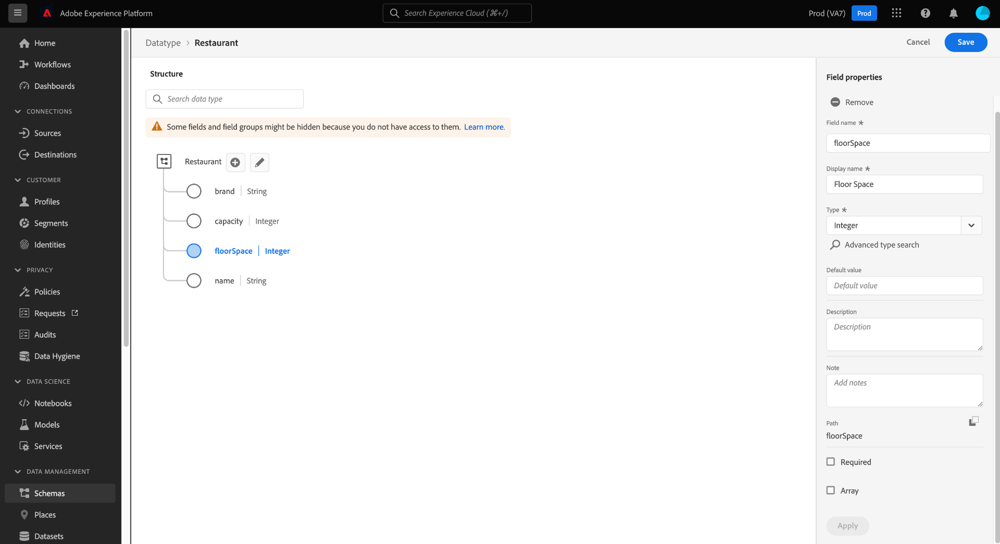

# Criar e editar tipos de dados usando a interface {#ui-create-and-edit}

>[!CONTEXTUALHELP]
>id="platform_schemas_datatype_filter"
>title="Filtro de tipo de dados padrão ou personalizado"
>abstract="A lista de tipos de dados disponíveis é pré-filtrada com base em como foram criados. Selecione o botão de opção para escolher entre as opções Padrão e Personalizado. A opção Padrão mostra entidades criadas pela Adobe e a opção Personalizado exibe entidades criadas na sua organização. Consulte a documentação para saber mais sobre criação e edição de tipos de dados."

No Experience Data Model (XDM), os tipos de dados são campos reutilizáveis que contêm vários subcampos. Embora semelhantes aos grupos de campos de esquema, no sentido de que permitem o uso consistente de uma estrutura de vários campos, os tipos de dados são mais flexíveis, pois podem ser incluídos em qualquer lugar na estrutura do esquema, enquanto os grupos de campos só podem ser adicionados no nível raiz.

O Adobe Experience Platform fornece vários tipos de dados padrão que podem ser usados para abranger uma grande variedade de casos de uso comuns do gerenciamento de experiência. No entanto, você também pode definir seus próprios tipos de dados personalizados para atender às suas necessidades comerciais exclusivas.

>[!NOTE]
>
>Se um campo for definido como um tipo de dados específico, você não poderá criar o mesmo campo com um tipo de dados diferente em outro esquema. Essa restrição se aplica ao locatário da organização.

Este tutorial aborda as etapas para a criação e edição de tipos de dados personalizados na interface do usuário do Experience Platform.

## Pré-requisitos {#prerequisites}

Este guia requer uma compreensão funcional do Sistema XDM. Consulte a [Visão geral do XDM](../../home.md) para obter uma introdução à função do XDM no ecossistema do Experience Platform e as [noções básicas da composição de esquemas](../../schema/composition.md) sobre como os tipos de dados contribuem para esquemas XDM.

Embora não seja necessário para este guia, é recomendável que você também siga o tutorial sobre [composição de um esquema na interface](../../tutorials/create-schema-ui.md) para se familiarizar com os vários recursos do [!DNL Schema Editor].

## Abrir o [!DNL Schema Editor] para um tipo de dados {#data-type}

Na interface do usuário do Experience Platform, selecione **[!UICONTROL Schemas]** na navegação à esquerda para abrir o espaço de trabalho [!UICONTROL Schemas] e selecione a guia **[!UICONTROL Data types]**. Uma lista de tipos de dados disponíveis é exibida. A lista de tipos de dados é automaticamente filtrada com base em como foram criados. A configuração padrão exibe os tipos de dados definidos pelo Adobe. Também é possível filtrar a lista para mostrar os criados por sua organização.

![O espaço de trabalho [!UICONTROL Schemas] com [!UICONTROL Schemas] na navegação à esquerda e [!UICONTROL Data types] realçado.](../../images/ui/resources/data-types/data-types-tab.png)

Aqui, você tem as seguintes opções:

- [Criar um novo tipo de dados](#create)
- [Filtrar tipos de dados](#filter)
- [Selecionar um tipo de dados existente para editar](#edit)

### Criar um novo tipo de dados {#create}

Na guia **[!UICONTROL Data types]**, selecione **[!UICONTROL Create data type]**.

![A guia [!UICONTROL Schemas] do espaço de trabalho [!UICONTROL Data types] com [!UICONTROL Create data type] realçada.](../../images/ui/resources/data-types/create.png)

A [!DNL Schema Editor] é exibida, mostrando a estrutura atual do novo tipo de dados na tela. No lado direito do editor, é possível fornecer um nome de exibição e uma descrição opcional para o tipo de dados. Certifique-se de fornecer um nome exclusivo e conciso para o tipo de dados, pois é assim que ele será identificado ao adicioná-lo a um esquema.

Este tutorial cria um tipo de dados que descreve uma propriedade de restaurante, portanto, o tipo de dados recebe o nome de exibição &quot;Restaurante&quot;.

Daqui, você pode pular para a [próxima seção](#add-fields) para começar a adicionar campos ao novo tipo de dados.

### Filtrar tipos de dados {#filter}

A lista de tipos de dados disponíveis é pré-filtrada com base em como foram criados. Selecione o botão de opção para escolher entre as opções [!UICONTROL Standard] e [!UICONTROL Custom]. A opção [!UICONTROL Standard] mostra entidades criadas pelo Adobe e a opção [!UICONTROL Custom] exibe entidades criadas na organização.

![A guia [!UICONTROL Data types] do espaço de trabalho [!UICONTROL Schemas] com [!UICONTROL Standard] e [!UICONTROL Custom] realçados.](../../images/ui/resources/data-types/standard-and-custom-data-types.png)

### Editar um tipo de dados existente {#edit}

>[!NOTE]
>
>Depois que um tipo de dados existente for usado em um esquema que foi ativado para uso no Perfil do cliente em tempo real, somente alterações não destrutivas poderão ser feitas nesse tipo de dados. Consulte as [regras de evolução do esquema](../../schema/composition.md#evolution) para obter mais informações.

Somente tipos de dados personalizados definidos por sua organização podem ser editados. Selecione **[!UICONTROL Custom]** para mostrar apenas os tipos de dados personalizados de propriedade de sua organização.

Selecione o tipo de dados que deseja editar na lista para abrir o painel direito, mostrando os detalhes do tipo de dados. No painel de detalhes, também é possível baixar um arquivo de amostra, copiar a estrutura JSON ou adicionar o tipo de dados a um pacote.

Selecione o nome do tipo de dados no painel direito para abrir sua estrutura no [!DNL Schema Editor].

![A guia [!UICONTROL Data types] do espaço de trabalho [!UICONTROL Schemas], com um tipo de dados, [!UICONTROL Custom] e o tipo de dados [!UICONTROL Name] realçados.](../../images/ui/resources/data-types/edit.png)

## Adicionar campos ao tipo de dados {#add-fields}

Para começar a adicionar campos ao tipo de dados, selecione o ícone **de adição (+)** ao lado do campo de nível raiz na tela. Um novo campo é exibido abaixo, e o painel direito é atualizado para exibir controles do novo campo.

Use os controles no painel direito para configurar os detalhes do novo campo. Consulte o manual sobre [definição de campos na interface](../fields/overview.md#define) para obter etapas específicas sobre como configurar e adicionar o campo ao tipo de dados.

O tipo de dados Restaurant requer um campo de sequência para representar o nome do restaurante. Dessa forma, o [!UICONTROL Field name] está definido como &quot;nome&quot; e o [!UICONTROL Type] está definido como &quot;[!UICONTROL String]&quot;. Selecione **[!UICONTROL Apply]** para aplicar as alterações ao campo.

Continue adicionando mais campos ao tipo de dados, conforme necessário. O tipo de dados Exemplo de restaurante agora tem campos adicionais para marca, capacidade de assento e espaço.

Além dos campos básicos, você também pode aninhar tipos de dados adicionais com seu tipo de dados personalizado. Por exemplo, o tipo de dados Restaurant requer um campo que representa o endereço físico da propriedade. Nesse cenário, é possível adicionar um novo campo &quot;endereço&quot;, que recebe o tipo de dados padrão &quot;[!UICONTROL Postal address]&quot;.

Isso demonstra como tipos de dados podem ser flexíveis em termos de descrição de seus dados: os tipos de dados podem empregar campos que também são tipos de dados, que podem conter outros tipos de dados e assim por diante. Isso permite abstrair e reutilizar padrões de dados comuns em todos os esquemas XDM, facilitando a representação de estruturas de dados complexas.

Quando terminar de adicionar campos ao tipo de dados, selecione **[!UICONTROL Save]** para salvar suas alterações e adicionar o tipo de dados ao [!DNL Schema Library].

## Adicionar o tipo de dados a um esquema {#add-data-type}

Depois de criar um tipo de dados, você pode começar a usá-lo em seus schemas. Como os esquemas XDM são compostos de uma classe e zero ou mais grupos de campos, os campos fornecidos por um tipo de dados não podem ser adicionados diretamente a um esquema. Em vez disso, eles devem ser incluídos em uma classe ou em um grupo de campos.

Comece seguindo as etapas envolvidas com [adição de um campo a uma classe](./classes.md#add-fields) ou [adição de um campo a um grupo de campos](./field-groups.md#add-fields). Como alternativa, você pode começar a [adicionar um campo diretamente a um esquema](./schemas.md#add-individual-fields) e escolher a classe pai ou o grupo de campos a partir daí. Ao escolher o **[!UICONTROL Type]** para o novo campo, selecione o nome do seu tipo de dados no menu suspenso.

## Converter um objeto de vários campos em um tipo de dados {#convert}

Ao criar um campo do tipo objeto com vários subcampos no [!DNL Schema Editor], você pode converter esse campo em um tipo de dados para que possa usar a mesma estrutura de campo em uma classe ou grupo de campos diferente.

Para converter um campo do tipo objeto em um tipo de dados, selecione o campo na tela. Antes de converter o campo, verifique se **[!UICONTROL Display name]** é descritivo dos dados que o objeto conterá, pois ele se tornará o nome do tipo de dados. Quando estiver pronto para converter o campo, selecione **[!UICONTROL Convert to new data type]** no painel direito.

A tela atualiza o tipo de dados do campo de &quot;[!UICONTROL Object]&quot; para o novo tipo de dados. Essa estrutura agora pode ser reutilizada em outras classes e grupos de campos selecionando esse tipo de dados na lista suspensa **[!UICONTROL Type]** ao definir um novo campo.

## Próximas etapas {#next-steps}

Este guia abordou como criar e editar tipos de dados usando a interface do usuário do Experience Platform. Para obter mais informações sobre os recursos do espaço de trabalho [!UICONTROL Schemas], consulte a [[!UICONTROL Schemas] visão geral do espaço de trabalho](../overview.md).

Para saber como gerenciar tipos de dados usando a API [!DNL Schema Registry], consulte o [manual de ponto de extremidade de tipos de dados](../../api/data-types.md).
