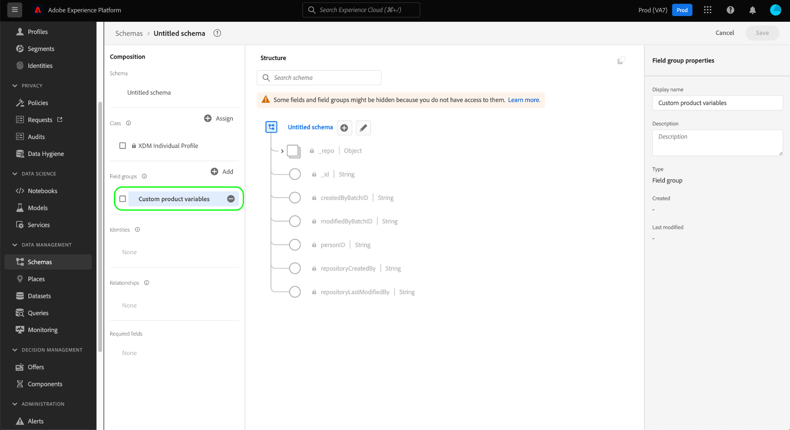

# Criar e editar grupos de campos de esquema na interface {#ui-create-and-edit}

>[!CONTEXTUALHELP]
>id="platform_schemas_fieldgroup_filter"
>title="Filtro de grupo de campos padrão ou personalizado"
>abstract="A lista de grupos de campos disponíveis é pré-filtrada com base em como foram criados. Selecione o botão de opção para escolher entre as opções Padrão e Personalizado. A opção Padrão mostra entidades criadas pela Adobe e a opção Personalizado exibe entidades criadas na sua organização. Consulte a documentação para saber mais sobre criação e edição de grupos de campos."

No Experience Data Model (XDM), os grupos de campos de esquema são componentes reutilizáveis que definem um ou mais campos que implementam determinadas funções, como detalhes pessoais, preferências de hotel ou endereço. Os grupos de campos devem ser incluídos como parte de um esquema que implementa uma classe compatível.

Um grupo de campos define com quais classes é compatível, com base no comportamento dos dados que o grupo de campos representa (registro ou série temporal). Isso significa que nem todos os grupos de campos estão disponíveis para uso com todas as classes.

O Adobe Experience Platform fornece muitos grupos de campo padrão que abrangem uma grande variedade de casos de uso de marketing. No entanto, você também pode criar e editar seus próprios grupos de campos personalizados para definir conceitos adicionais relacionados à sua empresa nos esquemas XDM. Este guia fornece uma visão geral de como criar, editar e gerenciar grupos de campos personalizados para sua organização na interface do usuário do Experience Platform.

## Pré-requisitos {#prerequisites}

Este guia requer uma compreensão funcional do Sistema XDM. Consulte a [Visão geral do XDM](../../home.md) para obter uma introdução à função do XDM no ecossistema do Experience Platform e as [noções básicas da composição de esquemas](../../schema/composition.md) para saber como os grupos de campos contribuem para esquemas XDM.

Embora não seja necessário para este guia, é recomendável que você também siga o tutorial sobre [composição de um esquema na interface](../../tutorials/create-schema-ui.md) para se familiarizar com os vários recursos do [!DNL Schema Editor].

## Criar um novo grupo de campos {#create}

Para criar um novo grupo de campos, primeiro selecione um esquema ao qual o grupo de campos será adicionado. Você pode [criar um novo esquema](./schemas.md#create) ou [selecionar um esquema existente para editar](./schemas.md#edit).

Depois que o esquema for aberto no [!DNL Schema Editor], selecione **[!UICONTROL Add]** ao lado da seção [!UICONTROL Field groups] no painel esquerdo.

Na caixa de diálogo exibida, selecione **[!UICONTROL Create new field group]**. Aqui você pode fornecer um **[!UICONTROL Display name]** e **[!UICONTROL Description]** para o grupo de campos. Quando terminar, selecione **[!UICONTROL Add field groups]**.

O [!DNL Schema Editor] reaparece, com o novo grupo de campos listado no painel esquerdo. Como este é um grupo de campos totalmente novo, no momento ele não fornece campos para o esquema e, portanto, a tela permanece inalterada. Agora você pode começar a [adicionar campos ao grupo de campos](#add-fields).

## Filtrar grupos de campos {#filter}

A lista de grupos de campos disponíveis é pré-filtrada com base em como foram criados. A configuração padrão exibe os grupos de campos definidos pelo Adobe. No entanto, também é possível filtrar a lista para mostrar os criados por sua organização. Selecione o botão de opção para escolher entre as opções [!UICONTROL Standard] e [!UICONTROL Custom]. A opção [!UICONTROL Standard] mostra entidades criadas pelo Adobe e a opção [!UICONTROL Custom] exibe entidades criadas na organização.

![A guia [!UICONTROL Field groups] do espaço de trabalho [!UICONTROL Schemas] com [!UICONTROL Standard] e [!UICONTROL Custom] realçados.](../../images/ui/resources/field-groups/standard-and-custom-field-groups.png)

## Editar um grupo de campos existente {#edit}

>[!NOTE]
>
>Somente grupos de campos personalizados definidos por sua organização podem ser totalmente editados e personalizados. Para grupos de campos principais definidos pelo Adobe, somente os nomes de exibição de seus campos podem ser editados no contexto de esquemas individuais. Elas são indicadas no Editor de Esquemas por um ícone de cadeado (). Consulte a seção sobre [edição de nomes para exibição para campos de esquema](./schemas.md#display-names) para obter detalhes.
>
>Depois que um grupo de campos personalizado é salvo e usado em um esquema para assimilação de dados, somente alterações aditivas podem ser feitas no grupo de campos depois disso. Consulte as [regras de evolução do esquema](../../schema/composition.md#evolution) para obter mais informações.

Para editar um grupo de campos existente, primeiro abra um esquema que empregue o grupo de campos dentro de [!DNL Schema Editor]. Você pode [selecionar um esquema existente para editar](./schemas.md#edit) ou pode [criar um novo esquema](./schemas.md#create) e adicionar o grupo de campos em questão.

Depois que o esquema for aberto no editor, você pode começar a [adicionar campos ao grupo de campos](#add-fields).

## Adicionar campos a um grupo de campos {#add-fields}

>[!NOTE]
>
>Esta seção foca em adicionar campos a grupos de campos personalizados. Para obter informações sobre como adicionar campos personalizados a grupos de campos padrão, consulte o [guia da interface do usuário de esquemas](./schemas.md#custom-fields-for-standard-groups).

Para adicionar campos a um grupo de campos personalizado, comece selecionando o ícone **de adição (+)** ao lado do nome do esquema na tela.

Um espaço reservado **[!UICONTROL Untitled Field]** aparece no na tela e o painel direito é atualizado para mostrar controles para configurar as propriedades do campo. Consulte o manual sobre [definição de campos na interface](../fields/overview.md#define) para obter etapas específicas sobre como configurar tipos de campos diferentes.

Em **[!UICONTROL Assign to]**, selecione a opção **[!UICONTROL Field Group]** e use a lista suspensa para selecionar o grupo de campos desejado na lista. Você pode começar a digitar o nome do grupo de campos para restringir os resultados.

Em **[!UICONTROL Assign to]**, selecione a opção **[!UICONTROL Field Group]** e use a lista suspensa para selecionar o grupo de campos desejado na lista. Você pode começar a digitar o nome do grupo de campos para restringir os resultados.

Depois que o campo é adicionado ao esquema, ele é atribuído ao grupo de campos selecionado. Continue a adicionar quantos campos forem necessários ao grupo de campos. Quando terminar, selecione **[!UICONTROL Save]** para salvar o esquema e o grupo de campos.

Se o mesmo grupo de campos já estiver empregado em outros esquemas, os campos recém-adicionados aparecerão automaticamente nesses esquemas.

## Próximas etapas {#next-steps}

Este guia abordou como criar e editar grupos de campos usando a interface do usuário do Experience Platform. Para obter mais informações sobre os recursos do espaço de trabalho [!UICONTROL Schemas], consulte a [[!UICONTROL Schemas] visão geral do espaço de trabalho](../overview.md).

Para saber como gerenciar grupos de campos usando a API [!DNL Schema Registry], consulte o [manual de ponto de extremidade de grupos de campos](../../api/field-groups.md).
