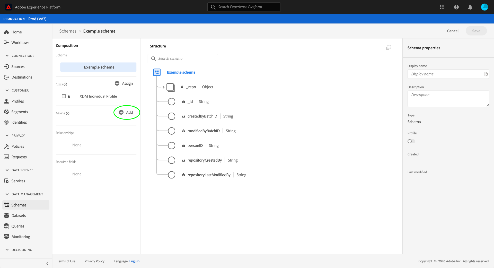

# Criar e editar combinações na interface do usuário

No Experience Data Model (XDM), as combinações são componentes reutilizáveis que definem um ou mais campos que implementam determinadas funções, como detalhes pessoais, preferências de hotel ou endereço. As misturas devem ser incluídas como parte de um schema que implementa uma classe compatível.

Um mixin define a(s) classe(s) com a qual ele é compatível, com base no comportamento dos dados que o mixin representa (registro ou série de tempo). Isso significa que nem todas as combinações estão disponíveis para uso com todas as classes.

O Adobe Experience Platform fornece várias combinações padrão que abrangem uma grande variedade de casos de uso de marketing. No entanto, também é possível criar e editar suas próprias combinações personalizadas para definir conceitos adicionais relacionados à sua empresa nos esquemas XDM. Este guia fornece uma visão geral de como criar, editar e gerenciar combinações personalizadas para sua organização na interface do usuário da plataforma.

## Pré-requisitos

Este guia requer uma compreensão funcional do Sistema XDM. Consulte a [Visão geral do XDM](../../home.md) para obter uma introdução à função do XDM no ecossistema do Experience Platform e as [noções básicas da composição do schema](../../schema/composition.md) sobre como as mixins contribuem para os esquemas do XDM.

Embora não seja necessário para este guia, é recomendável seguir também o tutorial em [composição de um schema na interface do usuário](../../tutorials/create-schema-ui.md) para se familiarizar com os vários recursos do [!DNL Schema Editor].

## Criar um novo mixin {#create}

Para criar um novo mixin, primeiro selecione um schema ao qual o mixin será adicionado. Você pode optar por [criar um novo schema](./schemas.md#create) ou [selecionar um schema existente para editar](./schemas.md#edit).

Depois de abrir o schema no [!DNL Schema Editor], selecione **[!UICONTROL Add]** ao lado da seção [!UICONTROL Mixins] no painel esquerdo.

Uma caixa de diálogo é exibida mostrando uma lista de mixins existentes para sua organização. Próximo à parte superior da caixa de diálogo, selecione **[!UICONTROL Create new mixin]**. Aqui você pode fornecer um **[!UICONTROL Display name]** e **[!UICONTROL Description]** para a mistura. Quando terminar, selecione **[!UICONTROL Add mixin]**.

O [!DNL Schema Editor] reaparece, com a nova mesclagem listada no painel esquerdo. Como essa é uma combinação totalmente nova, atualmente não fornece campos para o esquema e, portanto, a tela permanece inalterada. Agora você pode iniciar [adicionando campos ao mixin](#add-fields).

## Editar um mixin existente {#edit}

>[!NOTE]
>
>Somente mixins personalizados definidos pela sua organização podem ser totalmente editados e personalizados. Para mixins principais definidos pelo Adobe, somente os nomes de exibição de seus campos podem ser editados no contexto de schemas individuais. Consulte a seção sobre [edição de nomes de exibição para campos de esquema](./schemas.md#display-names) para obter detalhes.
>
>Depois que uma mistura personalizada é salva e usada em um esquema para assimilação de dados, somente alterações aditivas podem ser feitas na mistura posteriormente. Consulte as [regras de evolução do schema](../../schema/composition.md#evolution) para obter mais informações.

Para editar um mixin existente, primeiro você deve abrir um schema que empregue o mixin dentro do [!DNL Schema Editor]. Você pode [selecionar um esquema existente para editar](./schemas.md#edit), ou pode [criar um novo esquema](./schemas.md#create) e adicionar o mixin em questão.

Depois de ter o schema aberto no editor, você pode iniciar [adicionando campos ao mixin](#add-fields).

## Adicionar campos a um mixin {#add-fields}

Para adicionar campos a um mixin no [!DNL Schema Editor], comece selecionando o nome do mixin no painel à esquerda e selecione o ícone de **mais (+)** ao lado do nome do schema na tela.

Um **[!UICONTROL New field]** aparece na tela e o painel direito é atualizado para mostrar controles para configurar as propriedades do campo. Consulte o guia em [definindo campos na interface do usuário](../fields/overview.md#define) para obter etapas específicas sobre como configurar e adicionar o campo ao mixin.

Continue a adicionar quantos campos forem necessários ao mixin. Quando terminar, selecione **[!UICONTROL Save]** para salvar o schema e o mixin.

Se o mesmo mixin já estiver empregado em outros schemas, os campos recém-adicionados aparecerão automaticamente nesses schemas.

## Próximas etapas

Este guia cobriu como criar e editar mixins usando a interface do usuário da plataforma. Para obter mais informações sobre os recursos do espaço de trabalho [!UICONTROL Schemas], consulte a [[!UICONTROL Schemas] visão geral do espaço de trabalho](../overview.md).

Para saber como gerenciar mixins usando a API [!DNL Schema Registry], consulte o [guia de ponto de extremidade mixins](../../api/mixins.md).
