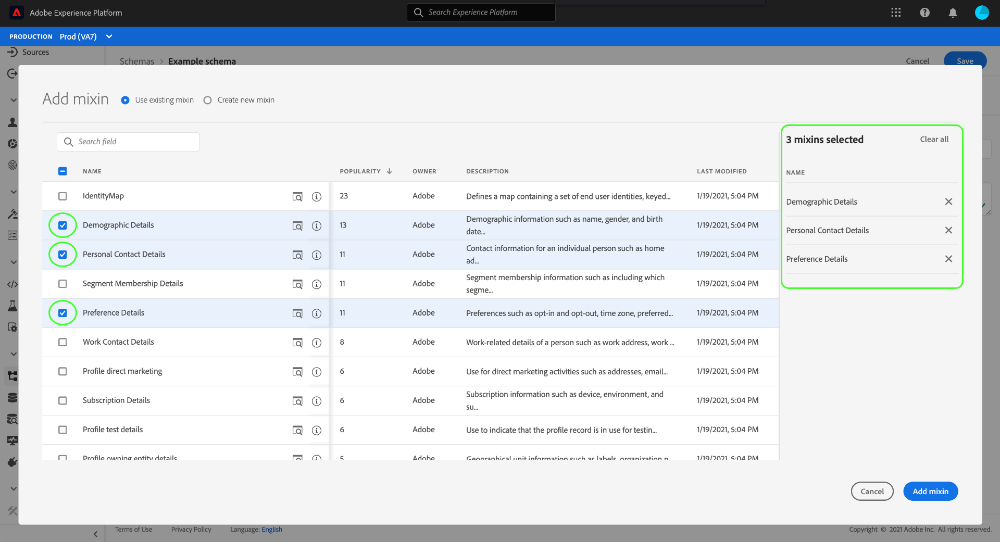
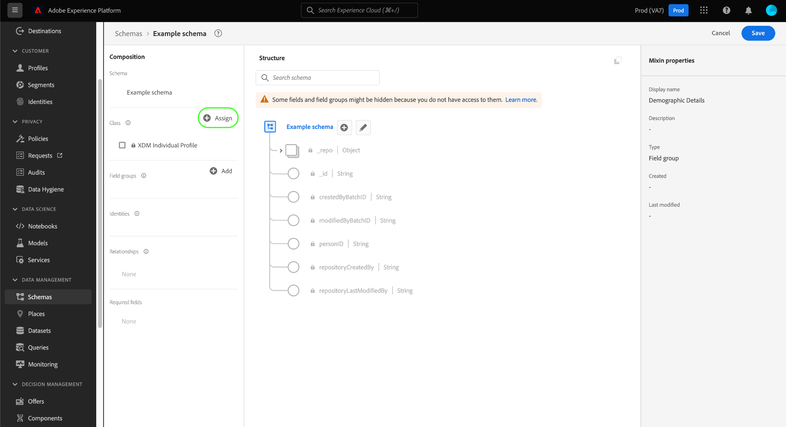

# Criar e editar esquemas na interface do usuário

Este guia fornece uma visão geral de como criar, editar e gerenciar esquemas do Experience Data Model (XDM) para sua organização na interface do usuário do Adobe Experience Platform.

>[!IMPORTANT]
>
>Os esquemas XDM são extremamente personalizáveis e, portanto, as etapas envolvidas na criação de um esquema podem variar dependendo do tipo de dados que você deseja que o esquema capture. Como resultado, este documento cobre apenas as interações básicas que você pode fazer com esquemas na interface do usuário e exclui etapas relacionadas, como personalização de classes, mixins, tipos de dados e campos.
>
>Para um tour completo do processo de criação do schema, siga o [tutorial de criação de schema](../../tutorials/create-schema-ui.md) para criar um schema de exemplo completo e se familiarizar com os muitos recursos do [!DNL Schema Editor].

## Pré-requisitos

Este guia requer uma compreensão funcional do Sistema XDM. Consulte a [Visão geral do XDM](../../home.md) para obter uma introdução à função do XDM no ecossistema do Experience Platform e as [noções básicas da composição do schema](../../schema/composition.md) para obter uma visão geral de como os schemas são construídos.

## Criar um novo schema {#create}

No espaço de trabalho [!UICONTROL Schemas], selecione **[!UICONTROL Create schema]** no canto superior direito. Na lista suspensa que aparece, você pode escolher entre **[!UICONTROL XDM Individual Profile]** e **[!UICONTROL XDM ExperienceEvent]** como a classe base do esquema. Como alternativa, você pode selecionar **[!UICONTROL Browse]** para selecionar na lista completa de classes disponíveis, ou [criar uma nova classe personalizada](./classes.md#create) em vez disso.

Depois de selecionar uma classe, o [!DNL Schema Editor] aparece e a estrutura base do esquema (fornecida pela classe) é mostrada na tela. A partir daqui, você pode usar o painel direito para adicionar um **[!UICONTROL Display name]** e **[!UICONTROL Description]** para o schema.

Agora é possível começar a criar a estrutura do schema adicionando mixins](#add-mixins).[

## Editar um esquema existente {#edit}

>[!NOTE]
>
>Depois que um schema é salvo e usado na assimilação de dados, somente alterações aditivas podem ser feitas nele. Consulte as [regras de evolução do schema](../../schema/composition.md#evolution) para obter mais informações.

Para editar um schema existente, selecione a guia **[!UICONTROL Browse]** e selecione o nome do schema que deseja editar.

>[!TIP]
>
>Você pode usar os recursos de pesquisa e filtragem do espaço de trabalho para ajudar a encontrar o esquema mais fácil. Consulte o guia sobre [exploração de recursos XDM](../explore.md) para obter mais informações.

Depois de selecionar um schema, o [!DNL Schema Editor] aparece com a estrutura do schema mostrada na tela. Agora é possível [adicionar mixins](#add-mixins) ao schema, [editar nomes de exibição de campo](#display-names) ou [editar mixins personalizados existentes](./mixins.md#edit) se o schema empregar algum.

## Adicionar mixins a um schema {#add-mixins}

>[!NOTE]
>
>Esta seção aborda como adicionar mixins existentes a um schema. Se quiser criar um novo mixin personalizado, consulte o guia em [criar e editar mixins](./mixins.md#create).

Depois de abrir um schema dentro do [!DNL Schema Editor], você pode adicionar campos ao schema por meio do uso de mixins. Para iniciar, selecione **[!UICONTROL Add]** ao lado de **[!UICONTROL Mixins]** no painel esquerdo.

Uma caixa de diálogo é exibida mostrando uma lista de mixins que você pode selecionar para o esquema. Como as mixins são compatíveis apenas com uma classe, somente as mixins associadas à classe selecionada do schema serão listadas. Por padrão, as combinações listadas são classificadas com base em sua popularidade de uso na organização.

Se você sabe a atividade geral ou a área comercial dos campos mixin que deseja adicionar, selecione uma ou mais categorias verticais do setor no painel à esquerda para filtrar a lista exibida de mixins.

>[!NOTE]
>
>Para obter mais informações sobre as práticas recomendadas para modelagem de dados específica do setor no XDM, consulte a documentação sobre [modelos de dados do setor](../../schema/industries/overview.md).

Você também pode usar a barra de pesquisa para ajudar a localizar a mixin desejada. Mixins cujo nome corresponde ao query são exibidas na parte superior da lista. Em **[!UICONTROL Standard Fields]**, as combinações que contêm campos que descrevem os atributos de dados desejados são exibidas.

Marque a caixa de seleção ao lado do nome do mixin que você deseja adicionar ao schema. Você pode selecionar várias mixins na lista, com cada mixin selecionado aparecendo no painel direito.

>[!TIP]
>
>Para qualquer mixin listado, você pode passar o mouse ou focar no ícone de informações () para exibir uma breve descrição do tipo de dados que o mixin captura. Você também pode selecionar o ícone de visualização () para visualizar a estrutura dos campos que o mixin fornece antes de decidir adicioná-lo ao schema.

Depois de escolher as mixins, selecione **[!UICONTROL Add mixin]** para adicioná-las ao schema.

O [!DNL Schema Editor] reaparece com os campos fornecidos pela mistura representados na tela.

## Ativar um esquema para o Perfil do cliente em tempo real {#profile}

[Os ](../../../profile/home.md) Perfis do cliente em tempo real emergem dados de fontes diferentes para construir uma visualização completa de cada cliente individual. Se desejar que os dados capturados por um schema participem neste processo, é necessário habilitar o schema para uso em [!DNL Profile].

>[!IMPORTANT]
>
>Para habilitar um schema para [!DNL Profile], ele deve ter um campo de identidade primário definido. Consulte o guia em [definindo campos de identidade](../fields/identity.md) para obter mais informações.

Para ativar o schema, comece selecionando o nome do schema no painel à esquerda e selecione o botão **[!UICONTROL Profile]** no painel à direita.

Um provedor é exibido, avisando que, uma vez que um esquema foi ativado e salvo, ele não poderá ser desativado. Selecione **[!UICONTROL Enable]** para continuar.

A tela reaparece com a alternância [!UICONTROL Profile] ativada.

>[!IMPORTANT]
>
>Como o esquema ainda não foi salvo, esse é o ponto de não retorno se você mudar de ideia sobre permitir que o esquema participe do Perfil do cliente em tempo real: depois de salvar um schema ativado, ele não poderá mais ser desativado. Selecione a opção **[!UICONTROL Profile]** novamente para desativar o esquema.

Para concluir o processo, selecione **[!UICONTROL Save]** para salvar o schema.

O esquema agora está ativado para uso no Perfil do cliente em tempo real. Quando a Platform assimila dados em conjuntos de dados com base nesse esquema, esses dados serão incorporados aos dados do Perfil amalgamado.

## Editar nomes de exibição para campos de esquema {#display-names}

Depois de atribuir uma classe e adicionar mixins a um esquema, você pode editar os nomes de exibição de qualquer um dos campos do esquema, independentemente desses campos terem sido fornecidos por recursos XDM padrão ou personalizados.

>[!NOTE]
>
>Lembre-se de que os nomes de exibição dos campos que pertencem a classes ou mixins padrão só podem ser editados no contexto de um schema específico. Em outras palavras, alterar o nome de exibição de um campo padrão em um schema não afeta outros schemas que usam a mesma classe ou mixin associada.

Para editar o nome de exibição de um campo de esquema, selecione o campo na tela. No painel direito, forneça o novo nome em **[!UICONTROL Display name]**.

Selecione **[!UICONTROL Apply]** no painel direito e a tela será atualizada para mostrar o novo nome de exibição do campo. Selecione **[!UICONTROL Save]** para aplicar as alterações ao schema.

## Alterar a classe de um esquema {#change-class}

Você pode alterar a classe de um schema em qualquer ponto durante o processo de composição inicial antes que o schema tenha sido salvo.

>[!WARNING]
>
>A reatribuição da classe para um schema deve ser feita com extremo cuidado. Mixins são compatíveis apenas com determinadas classes e, portanto, alterar a classe redefinirá a tela e quaisquer campos adicionados.

Para reatribuir uma classe, selecione **[!UICONTROL Assign]** no lado esquerdo da tela.

Uma caixa de diálogo é exibida mostrando uma lista de todas as classes disponíveis, incluindo qualquer classe definida por sua organização (o proprietário sendo &quot;[!UICONTROL Customer]&quot;), bem como classes padrão definidas pelo Adobe.

Selecione uma classe na lista para exibir sua descrição no lado direito da caixa de diálogo. Você também pode selecionar **[!UICONTROL Preview class structure]** para ver os campos e metadados associados à classe. Selecione **[!UICONTROL Assign class]** para continuar.

Uma nova caixa de diálogo é aberta, solicitando que você confirme que deseja atribuir uma nova classe. Selecione **[!UICONTROL Assign]** para confirmar.

Após confirmar a alteração de classe, a tela será redefinida e todo o progresso da composição será perdido.

## Próximas etapas

Este documento abordou as noções básicas para a criação e edição de schemas na interface do usuário da plataforma. É altamente recomendável revisar o [tutorial de criação de esquema](../../tutorials/create-schema-ui.md) para obter um fluxo de trabalho abrangente para criar um schema completo na interface do usuário, incluindo a criação de mixins e tipos de dados personalizados para casos de uso exclusivos.

Para obter mais informações sobre os recursos do espaço de trabalho [!UICONTROL Schemas], consulte a [[!UICONTROL Schemas] visão geral do espaço de trabalho](../overview.md).

Para saber como gerenciar schemas na API [!DNL Schema Registry], consulte o [guia de ponto de extremidade de schemas](../../api/schemas.md).
