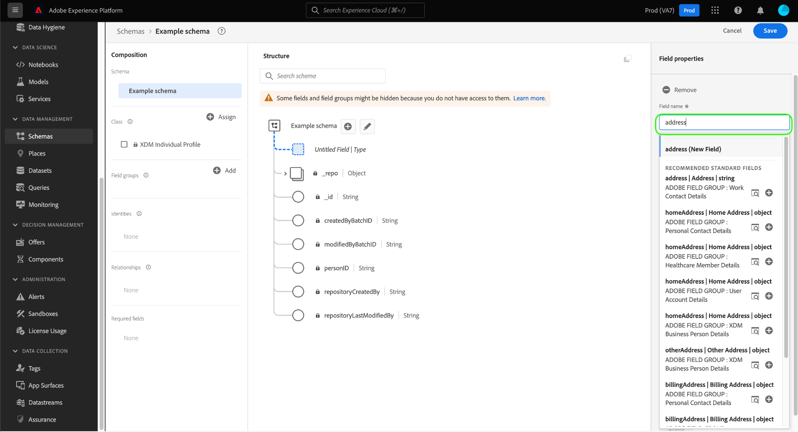

# Criar e editar esquemas na interface {#create-edit-schemas-in-ui}

Este guia fornece uma visão geral de como criar, editar e gerenciar esquemas do Experience Data Model (XDM) para sua organização na interface do usuário do Adobe Experience Platform.

>[!IMPORTANT]
>
>Os esquemas XDM são extremamente personalizáveis e, portanto, as etapas envolvidas na criação de um esquema podem variar dependendo do tipo de dados que você deseja que o esquema capture. Como resultado, este documento abrange apenas as interações básicas que você pode fazer com esquemas na interface e exclui etapas relacionadas, como personalizar classes, grupos de campos de esquema, tipos de dados e campos.
>
>Para um tour completo do processo de criação de esquema, siga juntamente com o [tutorial de criação de esquema](../../tutorials/create-schema-ui.md) para criar um esquema de exemplo completo e familiarizar-se com os vários recursos do [!DNL Schema Editor].

## Pré-requisitos {#prerequisites}

Este guia requer uma compreensão funcional do Sistema XDM. Consulte a [Visão geral do XDM](../../home.md) para obter uma introdução à função do XDM no ecossistema do Experience Platform e as [noções básicas da composição de esquemas](../../schema/composition.md) para obter uma visão geral de como os esquemas são construídos.

## Criar um novo esquema {#create}

No espaço de trabalho [!UICONTROL Schemas], selecione **[!UICONTROL Create schema]** no canto superior direito. O menu suspenso &quot;Selecionar tipo de esquema&quot; é exibido com opções para [!UICONTROL Standard] ou [!UICONTROL Relational] esquemas.

![O espaço de trabalho Esquemas com [!UICONTROL Create Schema] realçado e a lista suspensa &#39;Selecionar tipo de esquema&#39; exibida](../../images/ui/resources/schemas/create-schema.png).

## Criar um esquema relacional {#create-relational-schema}

>[!AVAILABILITY]
>
>O Data Mirror e esquemas relacionais estão disponíveis para os **titulares de licença de campanhas orquestradas** da Adobe Journey Optimizer. Eles também estão disponíveis como uma **versão limitada** para usuários do Customer Journey Analytics, dependendo da sua licença e da ativação de recursos. Entre em contato com o representante da Adobe para obter acesso.

>[!NOTE]
>
>Esquemas relacionais eram anteriormente chamados de esquemas baseados em modelo em versões anteriores da documentação do Adobe Experience Platform.

Selecione **[!UICONTROL Relational]** para definir esquemas estruturados de estilo relacional com controle refinado sobre registros. Os esquemas relacionais oferecem suporte à aplicação da chave primária, ao controle de versão em nível de registro e aos relacionamentos em nível de esquema por meio de chaves primárias e estrangeiras. Eles também são otimizados para assimilação incremental usando captura de dados de alteração e oferecem suporte a vários modelos de dados usados em implementações do Campaign Orchestration, Data Distiller e B2B.

Para saber mais, consulte a visão geral do [Data Mirror](../../data-mirror/overview.md) ou do [Esquema relacional](../../schema/relational.md).

### Criar manualmente {#create-manually}

>[!AVAILABILITY]
>
>O upload do arquivo DDL está disponível somente para titulares de licenças do Adobe Journey Optimizer Orchestrated campaign. Sua interface do usuário pode aparecer de forma diferente.

A caixa de diálogo **[!UICONTROL Create a relational schema]** é exibida. Você pode escolher **[!UICONTROL Create manually]** ou [**[!UICONTROL Upload DDL file]**](#upload-ddl-file) para definir a estrutura do esquema.

Na caixa de diálogo **[!UICONTROL Create a relational schema]**, selecione **[!UICONTROL Create manually]** e, em seguida, **[!UICONTROL Next]**.

A página **[!UICONTROL Relational schema details]** é exibida. Insira um nome para exibição de esquema e uma descrição opcional, e selecione **[!UICONTROL Finish]** para criar o esquema.

![A exibição de detalhes do esquema relacional com [!UICONTROL Schema display name], [!UICONTROL Description] e [!UICONTROL Finish] realçados.](../../images/ui/resources/schemas/relational-details.png)

O Editor de esquemas é aberto com uma tela vazia para definir a estrutura do esquema. Você pode adicionar campos como de costume.

#### Adicionar um campo de identificador de versão {#add-version-identifier}

Para ativar o rastreamento de versão e suportar a captura de dados de alteração, você deve designar um campo de identificador de versão no esquema. No Editor de Esquemas, selecione o ícone de adição () ícone ao lado do nome do esquema para adicionar um novo campo.

Insira um nome de campo como `updateSequence` e escolha um tipo de dados de **[!UICONTROL DateTime]** ou **[!UICONTROL Number]**.

No painel direito, habilite a caixa de seleção **[!UICONTROL Version Identifier]** e selecione **[!UICONTROL Apply]** para confirmar o campo.

>[!IMPORTANT]
>
>Um esquema relacional deve incluir um campo de identificador de versão para oferecer suporte a atualizações no nível do registro e alterar a assimilação da captura de dados.

Para definir relações, selecione **[!UICONTROL Add Relationship]** no Editor de Esquemas para criar relações de chave primária/estrangeira no nível do esquema. Consulte o tutorial em [adicionando relações de nível de esquema](../../tutorials/relationship-ui.md#relationship-field) para obter mais informações.

Em seguida, prossiga para [definir chaves primárias](../fields/identity.md#define-a-identity-field) e [adicionar outros campos](#add-field-groups), conforme necessário. Para obter orientação sobre como habilitar a captura de dados de alteração nas Fontes do Experience Platform, consulte o [guia de assimilação da captura de dados de alteração](../../../sources/tutorials/api/change-data-capture.md).

>[!NOTE]
>
>Depois de salvo, o campo [!UICONTROL Type] na barra lateral [!UICONTROL &#x200B; Schema properties] indica que este é um esquema [!UICONTROL Relational]. Isso também é indicado na barra lateral de detalhes na exibição de inventário de esquema.
>&#x200B;>

### Fazer upload de um arquivo DDL {#upload-ddl-file}

>[!AVAILABILITY]
>
>O upload do arquivo DDL está disponível somente para titulares de licenças do Adobe Journey Optimizer Orchestrated campaign.

Use esse fluxo de trabalho para definir o esquema fazendo upload de um arquivo DDL. Na caixa de diálogo **[!UICONTROL Create a relational schema]**, selecione **[!UICONTROL Upload DDL file]** e, em seguida, arraste um arquivo DDL local do sistema ou selecione **[!UICONTROL Choose files]**. O Experience Platform valida o esquema e exibe uma marca de seleção verde se o upload do arquivo for bem-sucedido. Selecione **[!UICONTROL Next]** para confirmar o carregamento.

![A caixa de diálogo Criar um esquema relacional com [!UICONTROL Upload DDL file] selecionada e [!UICONTROL Next] realçada.](../../images/ui/resources/schemas/upload-ddl-file.png)

A caixa de diálogo [!UICONTROL Select entities and fields to import] é exibida, permitindo que você visualize o esquema. Revise a estrutura do esquema e use os botões de opção e as caixas de seleção para garantir que cada entidade tenha uma chave primária e um identificador de versão especificados.

>[!IMPORTANT]
>
>A estrutura da tabela deve conter uma **chave primária** e um **identificador de versão**, como um campo `updateSequence` do tipo datetime ou number.
>
>Para assimilação de captura de dados de alteração, uma coluna especial chamada `_change_request_type` do tipo Cadeia de caracteres também é necessária para habilitar o processamento incremental. Este campo indica o tipo de alteração de dados (por exemplo, `u` (substituição) ou `d` (exclusão)).

Embora seja necessário durante a assimilação, colunas de controle como `_change_request_type` não são armazenadas no esquema e não aparecem na estrutura final do esquema. Se tudo estiver correto, selecione **[!UICONTROL Done]** para criar o esquema.

>[!NOTE]
>
>O tamanho máximo de arquivo suportado para um upload de DDL é 10 MB.

![A exibição de revisão de esquema Relacional com campos importados mostrados e [!UICONTROL Finish] realçados.](../../images/ui/resources/schemas/entities-and-files-to-inport.png)

O esquema é aberto no Editor de esquemas, onde você pode ajustar a estrutura antes de salvar.

Em seguida, prossiga para [adicionar mais campos](#add-field-groups) e [adicionar mais relações de nível de esquema](../../tutorials/relationship-ui.md#relationship-field), conforme necessário.

Para obter orientação sobre como habilitar a captura de dados de alteração nas Fontes do Experience Platform, consulte o [guia de assimilação da captura de dados de alteração](../../../sources/tutorials/api/change-data-capture.md).

## Criação de esquema padrão {#standard-based-creation}

Se você selecionar &#39;Tipo de esquema padrão&#39; no menu suspenso &#39;Selecionar tipo de esquema&#39;, a caixa de diálogo [!UICONTROL Create a schema] será exibida. Nesta caixa de diálogo, você pode optar por criar manualmente um esquema adicionando campos e grupos de campos ou pode fazer upload de um arquivo CSV e usar algoritmos de ML para gerar um esquema. Selecione um workflow de criação de esquema na caixa de diálogo.

### Beta [!BADGE Criação manual ou com ML]{type=Informative} do esquema {#manual-or-assisted}

Para saber como usar um algoritmo de ML para recomendar uma estrutura de esquema com base em um arquivo csv, consulte o [guia de criação de esquema assistido por aprendizado de máquina](../ml-assisted-schema-creation.md). Este guia de interface do usuário se concentra no fluxo de trabalho de criação manual.

### Criação manual de esquema {#manual-creation}

O fluxo de trabalho [!UICONTROL Create schema] é exibido. Você pode escolher uma classe base para o esquema selecionando **[!UICONTROL Individual Profile]**, **[!UICONTROL Experience Event]** ou **[!UICONTROL Other]**, seguido de **[!UICONTROL Next]** para confirmar sua escolha. Consulte a documentação de [[!UICONTROL XDM individual profile]](../../classes/individual-profile.md) e [[!UICONTROL XDM ExperienceEvent]](../../classes/experienceevent.md) para obter mais informações sobre essas classes.

![O fluxo de trabalho [!UICONTROL Create schema] com as três opções de classe e [!UICONTROL Next] realçado.](../../images/ui/resources/schemas/schema-class-options.png)

Ao escolher **[!UICONTROL Other]**, uma lista de classes disponíveis é exibida. Aqui você pode navegar e filtrar classes pré-existentes.

![O fluxo de trabalho [!UICONTROL Create schema] com [!UICONTROL Other] foi realçado na seção [!UICONTROL Schema details].](../../images/ui/resources/schemas/other-schema-details.png)

Selecione um botão de opção para filtrar as classes com base no fato de serem classes personalizadas ou padrão. Você também pode filtrar os resultados disponíveis com base em seu setor ou pesquisar por uma classe específica usando o campo de pesquisa.

![O fluxo de trabalho [!UICONTROL Create schema] com a barra de pesquisa [!UICONTROL Custom] e [!UICONTROL Industries] realçados.](../../images/ui/resources/schemas/filter-and-search.png)

Para ajudá-lo a decidir a classe apropriada, há ícones de informações e visualização para cada classe. O ícone de informações () abre uma caixa de diálogo que fornece uma descrição da classe e do setor ao qual ela está associada.

O ícone de visualização () abre uma caixa de diálogo de visualização para a classe que contém um diagrama de esquema e suas propriedades.

Selecione qualquer linha para escolher uma classe, em seguida, selecione **[!UICONTROL Next]** para confirmar sua escolha.

![O fluxo de trabalho [!UICONTROL Create schema] com uma classe selecionada na tabela de classes disponíveis e [!UICONTROL Next] realçado.](../../images/ui/resources/schemas/select-class.png)

Após selecionar uma classe, a seção [!UICONTROL Name and review] é exibida. Nesta seção, você fornece um nome e uma descrição para identificar o esquema. &#x200B;A estrutura base do esquema (fornecida pela classe) é mostrada na tela para que você revise e verifique a classe selecionada e a estrutura do esquema.

Insira um [!UICONTROL Schema display name] amigável no campo de texto. Em seguida, insira uma descrição adequada para ajudar a identificar seu esquema. Quando tiver revisado sua estrutura de esquema e estiver satisfeito com suas configurações, selecione **[!UICONTROL Finish]** para criar seu esquema.

![A seção [!UICONTROL Name and review] do fluxo de trabalho [!UICONTROL Create schema] com [!UICONTROL Schema display name], [!UICONTROL Description] e [!UICONTROL Finish] realçados.](../../images/ui/resources/schemas/name-and-review.png)

O Editor de esquemas é exibido com a estrutura do esquema mostrada na tela. Se desejar, agora você pode começar a [adicionar campos à classe](../../ui/resources/classes.md#add-fields).

## Editar um esquema existente {#edit}

>[!NOTE]
>
>Depois que um esquema é salvo e usado na assimilação de dados, somente alterações adicionais podem ser feitas nele. Consulte as [regras de evolução do esquema](../../schema/composition.md#evolution) para obter mais informações.

Para editar um esquema existente, selecione a guia **[!UICONTROL Browse]** e selecione o nome do esquema que deseja editar. Você também pode usar a barra de pesquisa para restringir a lista de opções disponíveis.

>[!TIP]
>
>Você pode usar os recursos de pesquisa e filtragem do espaço de trabalho para facilitar a localização do esquema. Consulte o guia em [explorando recursos XDM](../explore.md) para obter mais informações.

Depois de selecionar um esquema, o [!DNL Schema Editor] aparece com a estrutura do esquema mostrada na tela. Agora você pode [adicionar grupos de campos](#add-field-groups) ao esquema (ou [adicionar campos individuais](#add-individual-fields) a partir desses grupos), [editar nomes de exibição de campos](#display-names) ou [editar grupos de campos personalizados existentes](./field-groups.md#edit) se o esquema empregar algum.

## Mais ações {#more}

No Editor de esquemas, você também pode realizar ações rápidas para copiar a estrutura JSON do esquema ou excluir o esquema se ele não tiver sido ativado para o Perfil do cliente em tempo real ou tiver conjuntos de dados associados. Selecione [!UICONTROL More] na parte superior da exibição para exibir um menu suspenso com ações rápidas.

A funcionalidade Copiar estrutura JSON permite ver como seria uma carga de amostra enquanto você ainda está criando o esquema e seus pipelines de dados. É especialmente útil para situações em que há estruturas complexas de mapa de objetos no esquema, como um mapa de identidade.

## Alternância do nome de exibição {#display-name-toggle}

Para sua conveniência, o Editor de esquemas fornece uma alternância entre os nomes de campo originais e os nomes de exibição mais legíveis. Essa flexibilidade permite uma melhor descoberta de campo e edição de seus esquemas. O botão de alternância é encontrado na parte superior direita da visualização Editor de esquemas.

>[!NOTE]
>
>A alteração de nomes de campo para nomes de exibição é meramente cosmética e não altera nenhum recurso downstream.

![O Editor de Esquemas com [!UICONTROL Show display names for fields] realçado.](../../images/ui/resources/schemas/display-name-toggle.png)

Os nomes de exibição para grupos de campos padrão são gerados pelo sistema, mas podem ser personalizados, conforme descrito na seção [nomes de exibição](#display-names). Os nomes de exibição são refletidos em várias exibições de interface do usuário, incluindo mapeamento e visualizações de conjunto de dados. A configuração padrão está desativada e mostra os nomes dos campos de acordo com os valores originais.

## Adicionar grupos de campos a um esquema {#add-field-groups}

>[!NOTE]
>
>Esta seção aborda como adicionar grupos de campos existentes a um esquema. Se quiser criar um novo grupo de campos personalizado, consulte o manual sobre [criação e edição de grupos de campos](./field-groups.md#create).

Depois de abrir um esquema no [!DNL Schema Editor], você pode adicionar campos ao esquema usando grupos de campos. Para iniciar, selecione **[!UICONTROL Add]** ao lado de **[!UICONTROL Field groups]** no painel esquerdo.

![O Editor de Esquemas com o [!UICONTROL Add] da seção [!UICONTROL Field groups] realçado.](../../images/ui/resources/schemas/add-field-group-button.png)

Uma caixa de diálogo é exibida, mostrando uma lista de grupos de campos que você pode selecionar para o esquema. Como os grupos de campos são compatíveis apenas com uma classe, somente os grupos de campos associados à classe selecionada do esquema serão listados. Por padrão, os grupos de campos listados são classificados com base na popularidade do uso em sua organização.

![A caixa de diálogo [!UICONTROL Add field groups] foi realçada com a coluna [!UICONTROL Popularity].](../../images/ui/resources/schemas/field-group-popularity.png)

Se você souber a atividade geral ou a área comercial dos campos que deseja adicionar, selecione uma ou mais categorias verticais do setor no painel à esquerda para filtrar a lista exibida de grupos de campos.

![A caixa de diálogo [!UICONTROL Add field groups] foi realçada com os filtros [!UICONTROL Industry] e a coluna [!UICONTROL Industry] foi realçada.](../../images/ui/resources/schemas/industry-filter.png)

>[!NOTE]
>
>Para obter mais informações sobre as práticas recomendadas para modelagem de dados específica do setor no XDM, consulte a documentação em [modelos de dados do setor](../../schema/industries/overview.md).

Você também pode usar a barra de pesquisa para ajudar a localizar o grupo de campos desejado. Os grupos de campos cujo nome corresponde à consulta são exibidos na parte superior da lista. Em **[!UICONTROL Standard Fields]**, os grupos de campos que contêm campos que descrevem os atributos de dados desejados são exibidos.

![A caixa de diálogo [!UICONTROL Add field groups] com a função de pesquisa [!UICONTROL Standard fields] foi realçada.](../../images/ui/resources/schemas/field-group-search.png)

Marque a caixa de seleção ao lado do nome do grupo de campos que você deseja adicionar ao esquema. É possível selecionar vários grupos de campos na lista, com cada grupo de campos selecionado aparecendo no painel direito.

![A caixa de diálogo [!UICONTROL Add field groups] com o recurso de seleção de caixa de seleção foi realçada.](../../images/ui/resources/schemas/add-field-group.png)

>[!TIP]
>
>Para qualquer grupo de campos listado, você pode passar o mouse ou focalizar o ícone de informações () para ver uma breve descrição do tipo de dados que o grupo de campos captura. Você também pode selecionar o ícone de visualização () para exibir a estrutura dos campos fornecidos pelo grupo de campos antes de decidir adicioná-lo ao esquema.

Depois de escolher os grupos de campos, selecione **[!UICONTROL Add field groups]** para adicioná-los ao esquema.

![A caixa de diálogo [!UICONTROL Add field groups] com grupos de campos selecionados e [!UICONTROL Add field groups] realçados.](../../images/ui/resources/schemas/add-field-group-finish.png)

O [!DNL Schema Editor] reaparece com os campos fornecidos por grupos de campos representados na tela.

![O [!DNL Schema Editor] com um exemplo de esquema exibido.](../../images/ui/resources/schemas/field-groups-added.png)

>[!NOTE]
>
>No Editor de esquemas, classes e grupos de campos padrão (gerados pela Adobe) são indicados com o ícone de cadeado . O cadeado é exibido no painel à esquerda, ao lado do nome da classe ou do grupo de campos, e também ao lado de qualquer campo no diagrama de esquema que faça parte de um recurso gerado pelo sistema.
>
>

Depois de adicionar um grupo de campos a um esquema, você pode, opcionalmente, [remover campos existentes](#remove-fields) ou [adicionar novos campos personalizados](#add-fields) a esses grupos, dependendo das suas necessidades.

### Remover campos adicionados de grupos de campos {#remove-fields}

Depois de adicionar um grupo de campos a um esquema, você pode remover campos globalmente do grupo de campos ou ocultá-los localmente do esquema atual. Entender a diferença entre essas ações é essencial para evitar alterações não intencionais no esquema.

>[!IMPORTANT]
>
>Selecionar **[!UICONTROL Remove]** exclui o campo do próprio grupo de campos, afetando *todos* esquemas que usam esse grupo de campos.
>&#x200B;>Não use esta opção, a menos que deseje **remover o campo de cada esquema que inclua o grupo de campos**.

Para excluir um campo do grupo de campos, selecione-o na tela e selecione **[!UICONTROL Remove]** no painel direito. Este exemplo mostra o campo `taxId` do grupo **[!UICONTROL Demographic Details]**.

![O [!DNL Schema Editor] com [!UICONTROL Remove] realçado. Esta ação remove um único campo.](../../images/ui/resources/schemas/remove-single-field.png)

Para ocultar vários campos de um esquema sem removê-los do próprio grupo de campos, use a opção **[!UICONTROL Manage related fields]**. Selecione qualquer campo do grupo na tela e, em seguida, selecione **[!UICONTROL Manage related fields]** no painel direito.

![O [!DNL Schema Editor] com [!UICONTROL Manage related fields] realçado.](../../images/ui/resources/schemas/manage-related-fields.png)

Uma caixa de diálogo é exibida mostrando a estrutura do grupo de campos. Use as caixas de seleção para marcar ou desmarcar os campos que deseja incluir.

![A caixa de diálogo [!UICONTROL Manage related fields] com campos selecionados e [!UICONTROL Confirm] realçados.](../../images/ui/resources/schemas/select-fields.png)

Selecione **[!UICONTROL Confirm]** para atualizar a tela e refletir os campos selecionados.

### Comportamento do campo ao remover ou descontinuar campos {#field-removal-deprecation-behavior}

Use a tabela abaixo para entender o escopo de cada ação.

| Ação | Aplica-se somente ao esquema atual | Modifica o grupo de campos | Afeta outros esquemas | Descrição |
|--------------------------|--------------------------------|----------------------|-----------------------|-------------|
| **Remover campo** | Não | Sim | Sim | Exclui o campo do grupo de campos. Isso o remove de todos os esquemas que usam esse grupo. |
| **Gerenciar campos relacionados** | Sim | Não | Não | Oculta campos somente do esquema atual. O grupo de campos permanece inalterado. |
| **Desativar campo** | Não | Sim | Sim | Marca o campo como obsoleto no grupo de campos. Não está mais disponível para uso em nenhum schema. |

>[!NOTE]
>
>Esse comportamento é consistente em esquemas baseados em registros e em eventos.

### Adicionar campos personalizados a grupos de campos {#add-fields}

Depois de ter adicionado um grupo de campos a um esquema, você pode definir campos adicionais para esse grupo. No entanto, todos os campos adicionados a um grupo de campos em um esquema também aparecerão em todos os outros esquemas que empregam esse mesmo grupo de campos.

Além disso, se um campo personalizado for adicionado a um grupo de campos padrão, esse grupo de campos será convertido em um grupo de campos personalizado e o grupo de campos padrão original não estará mais disponível.

Para adicionar um campo personalizado a um grupo de campos padrão, consulte a [seção abaixo](#custom-fields-for-standard-groups) para obter instruções específicas. Se você estiver adicionando campos a um grupo de campos personalizado, consulte a seção sobre [edição de grupos de campos personalizados](./field-groups.md) no guia de interface do usuário de grupos de campos.

Se não quiser alterar nenhum grupo de campos existente, você pode [criar um novo grupo de campos personalizado](./field-groups.md#create) para definir campos adicionais.

## Adicionar campos individuais a um esquema {#add-individual-fields}

O Editor de esquemas permite adicionar campos individuais diretamente a um esquema se você não quiser adicionar um grupo de campos inteiro para um caso de uso específico. Você pode [adicionar campos individuais de grupos de campos padrão](#add-standard-fields) ou [adicionar seus próprios campos personalizados](#add-custom-fields).

>[!IMPORTANT]
>
>Embora o Editor de esquemas funcionalmente permita adicionar campos individuais diretamente a um esquema, isso não altera o fato de que todos os campos em um esquema XDM devem ser fornecidos por sua classe ou por um grupo de campos compatível com essa classe. Conforme explicado nas seções abaixo, todos os campos individuais ainda estão associados a uma classe ou grupo de campos como uma etapa principal quando são adicionados a um esquema.

### Adicionar campos padrão {#add-standard-fields}

Você pode adicionar campos de grupos de campos padrão diretamente a um esquema sem precisar saber seu grupo de campos correspondente antecipadamente. Para adicionar um campo padrão a um esquema, selecione o ícone de adição (**+**) ao lado do nome do esquema na tela. Um espaço reservado **[!UICONTROL Untitled Field]** aparece na estrutura do esquema e o painel direito é atualizado para revelar controles para configurar o campo.

Em **[!UICONTROL Field name]**, comece digitando o nome do campo que deseja adicionar. O sistema procura automaticamente por campos padrão que correspondam à consulta e os lista em **[!UICONTROL Recommended Standard Fields]**, incluindo os grupos de campos aos quais eles pertencem.

Embora alguns campos padrão compartilhem o mesmo nome, sua estrutura pode variar dependendo do grupo de campos de onde vêm. Se um campo padrão estiver aninhado em um objeto principal na estrutura do grupo de campos, o campo principal também será incluído no esquema se o campo secundário for adicionado.

Selecione o ícone de visualização () ao lado de um campo padrão para exibir a estrutura do grupo de campos e entender melhor como ele pode estar aninhado. Para adicionar o campo padrão ao esquema, selecione o ícone de adição ().

A tela é atualizada para mostrar o campo padrão adicionado ao esquema, incluindo todos os campos principais sob os quais ele está aninhado dentro da estrutura do grupo de campos. O nome do grupo de campos também está listado em **[!UICONTROL Field groups]** no painel esquerdo. Se quiser adicionar mais campos do mesmo grupo de campos, selecione **[!UICONTROL Manage related fields]** no painel direito.

### Adicionar campos personalizados {#add-custom-fields}

Semelhante ao fluxo de trabalho para campos padrão, também é possível adicionar seus próprios campos personalizados diretamente a um esquema.

Para adicionar campos ao nível raiz de um esquema, selecione o ícone de adição (**+**) ao lado do nome do esquema na tela. Um espaço reservado **[!UICONTROL Untitled Field]** aparece na estrutura do esquema e o painel direito é atualizado para revelar controles para configurar o campo.

Comece a digitar o nome do campo que deseja adicionar e o sistema inicia automaticamente a pesquisa por campos padrão correspondentes. Para criar um novo campo personalizado, selecione a opção superior anexada com **([!UICONTROL New Field])**.

Depois de fornecer um nome de exibição e um tipo de dados para o campo, a próxima etapa é atribuir o campo a um recurso XDM principal. Se o esquema usar uma classe personalizada, você poderá optar por [adicionar o campo à classe atribuída](#add-to-class) ou a um [grupo de campos](#add-to-field-group). No entanto, se o esquema usar uma classe padrão, você só poderá atribuir o campo personalizado a um grupo de campos.

#### Atribuir o campo a um grupo de campos personalizado {#add-to-field-group}

>[!NOTE]
>
>Esta seção aborda apenas como atribuir o campo a um grupo de campos personalizados. Se, em vez disso, você quiser estender um grupo de campos padrão com o novo campo personalizado, consulte a seção sobre [adição de campos personalizados a grupos de campos padrão](#custom-fields-for-standard-groups).

Em **[!UICONTROL Assign to]**, selecione **[!UICONTROL Field Group]**. Se o esquema usar uma classe padrão, essa será a única opção disponível e será selecionada por padrão.

Em seguida, é necessário selecionar um grupo de campos ao qual o novo campo será associado. Comece a digitar o nome do grupo de campos na entrada de texto fornecida. Se você tiver grupos de campos personalizados que correspondam à entrada, eles serão exibidos na lista suspensa. Como alternativa, você pode digitar um nome exclusivo para criar um novo grupo de campos.

>[!WARNING]
>
>Se você selecionar um grupo de campos personalizado existente, todos os outros esquemas que empregam esse grupo de campos também herdarão o campo recém-adicionado depois que você salvar as alterações. Por esse motivo, somente selecione um grupo de campos existente se desejar esse tipo de propagação. Caso contrário, você deve optar por criar um novo grupo de campos personalizados.

Depois de selecionar o grupo de campos na lista, selecione **[!UICONTROL Apply]**.

O novo campo é adicionado à tela e tem namespace sob sua [ID de locatário](../../api/getting-started.md#know-your-tenant_id) para evitar conflitos com campos XDM padrão. O grupo de campos ao qual você associou o novo campo também aparece em **[!UICONTROL Field groups]** no painel esquerdo.

>[!NOTE]
>
>O restante dos campos fornecidos pelo grupo de campos personalizados selecionado são removidos do esquema por padrão. Se quiser adicionar alguns desses campos ao esquema, selecione um campo pertencente ao grupo e selecione **[!UICONTROL Manage related fields]** no painel direito.

#### Atribuir o campo a uma classe personalizada {#add-to-class}

Em **[!UICONTROL Assign to]**, selecione **[!UICONTROL Class]**. O campo de entrada abaixo é substituído pelo nome da classe personalizada do esquema atual, indicando que o novo campo será atribuído a essa classe.

![A opção [!UICONTROL Class] está sendo selecionada para a nova atribuição de campo.](../../images/ui/resources/schemas/assign-field-to-class.png)

Continue a configurar o campo como desejado e selecione **[!UICONTROL Apply]** quando terminar.

![[!UICONTROL Apply] sendo selecionado para o novo campo.](../../images/ui/resources/schemas/assign-field-to-class-apply.png)

O novo campo é adicionado à tela e tem namespace sob sua [ID de locatário](../../api/getting-started.md#know-your-tenant_id) para evitar conflitos com campos XDM padrão. Selecionar o nome da classe no painel à esquerda revela o novo campo como parte da estrutura da classe.

### Adicionar campos personalizados à estrutura de grupos de campos padrão {#custom-fields-for-standard-groups}

Se o esquema em que você está trabalhando tiver um campo do tipo objeto fornecido por um grupo de campos padrão, será possível adicionar seus próprios campos personalizados a esse objeto padrão.

>[!WARNING]
>
>Quaisquer campos adicionados a um grupo de campos em um esquema também aparecerão em todos os outros esquemas que empregam esse mesmo grupo de campos. Além disso, se um campo personalizado for adicionado a um grupo de campos padrão, esse grupo de campos será convertido em um grupo de campos personalizado e o grupo de campos padrão original não estará mais disponível.
>
>Se você participou da versão beta desse recurso, você receberá uma caixa de diálogo informando sobre os grupos de campos padrão que você personalizou anteriormente. Após selecionar **[!UICONTROL Acknowledge]**, os recursos listados serão convertidos em grupos de campos personalizados.
>
>

Para iniciar, selecione o ícone de adição (**+**) ao lado da raiz do objeto fornecido pelo grupo de campos padrão.

Uma mensagem de aviso é exibida, solicitando que você confirme se deseja converter o grupo de campos padrão. Selecione **[!UICONTROL Continue creating field group]** para continuar.

A tela de desenho reaparece com um espaço reservado sem título para o novo campo. Observe que o nome do grupo de campos padrão foi anexado com &quot;([!UICONTROL Extended])&quot; para indicar que ele foi modificado em relação à versão original. Aqui, use os controles no painel direito para definir as propriedades do campo.

Depois de aplicar as alterações, o novo campo aparece sob o namespace da ID do locatário dentro do objeto padrão. Esse namespace aninhado impede conflitos de nome de campo dentro do próprio grupo de campos para evitar alterações em outros esquemas que usam o mesmo grupo de campos.

## Habilitar um esquema para o perfil do cliente em tempo real {#profile}

>[!CONTEXTUALHELP]
>id="platform_schemas_enableforprofile"
>title="Habilitar um esquema para o perfil"
>abstract="Quando um esquema é habilitado para o perfil, qualquer conjunto de dados criado a partir desse esquema participa do perfil do cliente em tempo real, que mescla dados de fontes diferentes para construir uma visualização completa de cada cliente. Depois que um esquema é usado para assimilar dados no perfil, ele não pode ser desabilitado. Consulte a documentação para obter mais informações."

O [Perfil de Cliente em Tempo Real](../../../profile/home.md) mescla dados de diferentes fontes para criar uma exibição completa de cada cliente individual. Se quiser que os dados capturados por um esquema participem desse processo, habilite o esquema para uso em [!DNL Profile].

>[!IMPORTANT]
>
>Para habilitar um esquema para [!DNL Profile], ele deve ter um campo de identidade primário definido. Consulte o manual sobre [definição de campos de identidade](../fields/identity.md) para obter mais informações.

Para habilitar o esquema, comece selecionando o nome do esquema no painel esquerdo e selecione a opção **[!UICONTROL Profile]** no painel direito.

Um popover é exibido, avisando que, uma vez que um esquema tenha sido ativado e salvo, ele não poderá ser desativado. Selecione **[!UICONTROL Enable]** para continuar.

A tela será exibida novamente com a opção [!UICONTROL Profile] ativada.

>[!IMPORTANT]
>
>Como o esquema ainda não foi salvo, esse é o ponto sem volta se você mudar de ideia sobre como permitir que o esquema participe do Perfil do cliente em tempo real: depois de salvar um esquema ativado, ele não poderá mais ser desativado. Selecione o botão de alternância **[!UICONTROL Profile]** novamente para desabilitar o esquema.

Para concluir o processo, selecione **[!UICONTROL Save]** para salvar o esquema.

O esquema agora está ativado para uso no Perfil do cliente em tempo real. Quando o Experience Platform assimila dados em conjuntos de dados com base nesse esquema, esses dados são incorporados aos dados do perfil combinado.

## Editar nomes de exibição para campos de esquema {#display-names}

Depois de atribuir uma classe e adicionar grupos de campos a um esquema, você pode editar os nomes de exibição de qualquer um dos campos do esquema, independentemente de esses campos terem sido fornecidos por recursos XDM padrão ou personalizados.

>[!NOTE]
>
>Lembre-se de que os nomes de exibição dos campos que pertencem a classes ou grupos de campos padrão só podem ser editados no contexto de um esquema específico. Em outras palavras, alterar o nome de exibição de um campo padrão em um esquema não afeta outros esquemas que empregam a mesma classe ou grupo de campos associado.
>
>Depois de fazer alterações nos nomes de exibição dos campos de um esquema, essas alterações são refletidas imediatamente em qualquer conjunto de dados existente com base nesse esquema.

Altere os nomes de campos para os nomes para exibição alterando para **[!UICONTROL Show display names for fields]**. Para editar o nome de exibição de um campo de esquema, selecione o campo na tela. No painel direito, forneça o novo nome em **[!UICONTROL Display name]**.

Selecione **[!UICONTROL Apply]** no painel direito e a tela será atualizada para mostrar o novo nome de exibição do campo. Selecione **[!UICONTROL Save]** para aplicar as alterações ao esquema.

## Alterar a classe de um esquema {#change-class}

Você pode alterar a classe de um esquema em qualquer momento durante o processo de composição inicial, antes que o esquema tenha sido salvo.

>[!WARNING]
>
>A reatribuição da classe para um schema deve ser feita com extremo cuidado. Os grupos de campos são compatíveis apenas com determinadas classes e, portanto, alterar a classe redefinirá a tela e quaisquer campos adicionados.

Para reatribuir uma classe, selecione **[!UICONTROL Assign]** no lado esquerdo da tela de desenho.

Uma caixa de diálogo é exibida, mostrando uma lista de todas as classes disponíveis, incluindo as definidas pela sua organização (sendo o proprietário &quot;[!UICONTROL Customer]&quot;), bem como as classes padrão definidas pela Adobe.

Selecione uma classe na lista para exibir sua descrição no lado direito da caixa de diálogo. Você também pode selecionar **[!UICONTROL Preview class structure]** para ver os campos e metadados associados à classe. Selecione **[!UICONTROL Assign class]** para continuar.

Uma nova caixa de diálogo é aberta, pedindo que você confirme se deseja atribuir uma nova classe. Selecione **[!UICONTROL Assign]** para confirmar.

Depois de confirmar a alteração de classe, a tela será redefinida e todo o progresso da composição será perdido.

## Próximas etapas {#next-steps}

Este documento abordou as noções básicas para a criação e edição de esquemas na interface do usuário do Experience Platform. É altamente recomendável que você consulte o [tutorial de criação de esquemas](../../tutorials/create-schema-ui.md) para obter um fluxo de trabalho abrangente e criar um esquema completo na interface do usuário, incluindo a criação de grupos de campos personalizados e tipos de dados para casos de uso exclusivos.

Para obter mais informações sobre os recursos do espaço de trabalho [!UICONTROL Schemas], consulte a [[!UICONTROL Schemas] visão geral do espaço de trabalho](../overview.md).

Para saber como gerenciar esquemas na API [!DNL Schema Registry], consulte o [manual de endpoint de esquemas](../../api/schemas.md).
