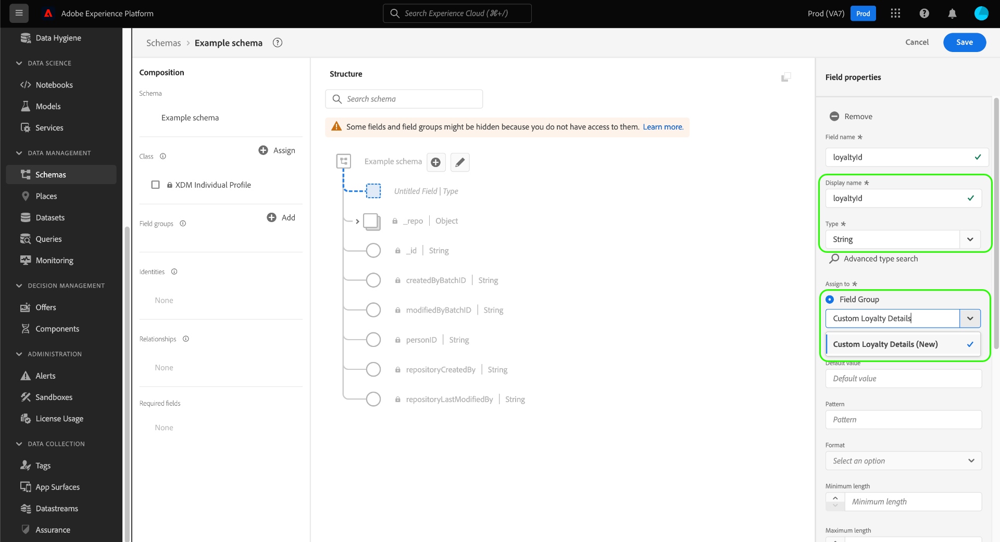
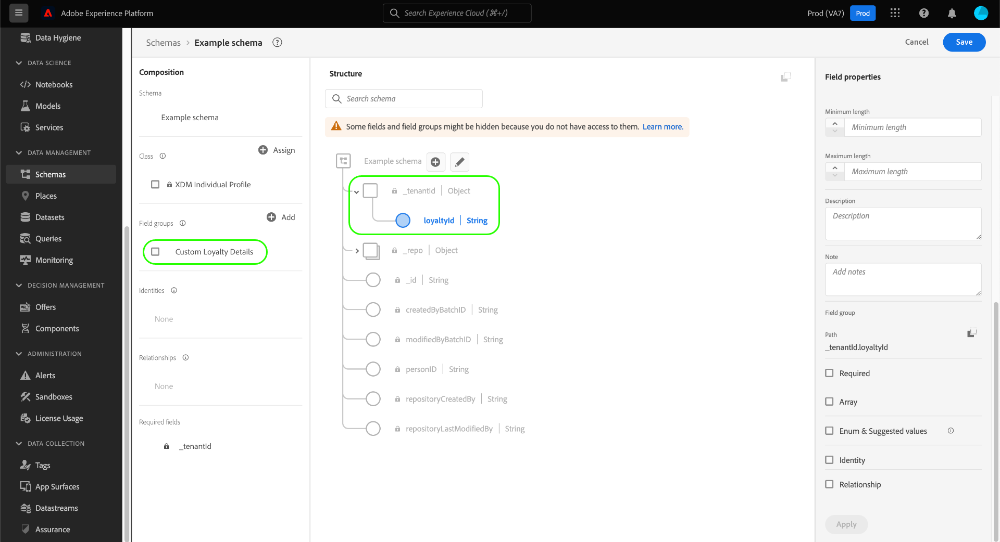

# Criar e editar esquemas na interface do usuário

Este guia fornece uma visão geral de como criar, editar e gerenciar esquemas do Experience Data Model (XDM) para sua organização na interface do usuário do Adobe Experience Platform.

>[!IMPORTANT]
>
>Os esquemas XDM são extremamente personalizáveis e, portanto, as etapas envolvidas na criação de um esquema podem variar dependendo do tipo de dados que você deseja que o esquema capture. Como resultado, este documento cobre apenas as interações básicas que você pode fazer com esquemas na interface do usuário e exclui etapas relacionadas, como personalização de classes, grupos de campos de esquema, tipos de dados e campos.
>
>Para obter um tour completo do processo de criação do schema, siga as etapas [tutorial de criação de schema](../../tutorials/create-schema-ui.md) para criar um schema de exemplo completo e se familiarizar com os vários recursos do [!DNL Schema Editor].

## Pré-requisitos

Este guia requer uma compreensão funcional do Sistema XDM. Consulte a [Visão geral do XDM](../../home.md) para uma introdução ao papel do XDM no ecossistema do Experience Platform, e [noções básicas da composição do schema](../../schema/composition.md) para obter uma visão geral de como os schemas são construídos.

## Criar um novo schema {#create}

No [!UICONTROL Esquemas] espaço de trabalho, selecione **[!UICONTROL Criar esquema]** no canto superior direito. Na lista suspensa exibida, é possível escolher entre **[!UICONTROL Perfil individual XDM]** e **[!UICONTROL ExperiênciaEvento XDM]** como a classe base do esquema. Como alternativa, você pode selecionar **[!UICONTROL Procurar]** para selecionar na lista completa de classes disponíveis, ou [criar uma nova classe personalizada](./classes.md#create) em vez disso.

Depois que você selecionar uma classe, a variável [!DNL Schema Editor] for exibida e a estrutura base do esquema (fornecida pela classe ) for mostrada na tela. A partir daqui, você pode usar o painel direito para adicionar um **[!UICONTROL Nome de exibição]** e **[!UICONTROL Descrição]** para o schema .

Agora é possível começar a criar a estrutura do schema ao [adição de grupos de campos de esquema](#add-field-groups).

## Editar um esquema existente {#edit}

>[!NOTE]
>
>Depois que um schema é salvo e usado na assimilação de dados, somente alterações aditivas podem ser feitas nele. Consulte a [regras de evolução do schema](../../schema/composition.md#evolution) para obter mais informações.

Para editar um esquema existente, selecione o **[!UICONTROL Procurar]** e selecione o nome do schema que deseja editar.

>[!TIP]
>
>Você pode usar os recursos de pesquisa e filtragem do espaço de trabalho para ajudar a encontrar o esquema mais fácil. Consulte o guia sobre [exploração de recursos XDM](../explore.md) para obter mais informações.

Depois de selecionar um schema, a variável [!DNL Schema Editor] é exibido com a estrutura do esquema mostrada na tela. Agora você pode [adicionar grupos de campos](#add-field-groups) ao schema (ou [adicionar campos individuais](#add-individual-fields) desses grupos), [editar nomes de exibição de campo](#display-names)ou [editar grupos de campos personalizados existentes](./field-groups.md#edit) se o schema empregar algum.

## Adicionar grupos de campos a um schema {#add-field-groups}

>[!NOTE]
>
>Esta seção aborda como adicionar grupos de campos existentes a um schema. Para criar um novo grupo de campos personalizado, consulte o guia em [criação e edição de grupos de campos](./field-groups.md#create) em vez disso.

Depois de abrir um schema na [!DNL Schema Editor], é possível adicionar campos ao schema por meio do uso de grupos de campos. Para iniciar, selecione **[!UICONTROL Adicionar]** ao lado de **[!UICONTROL Grupos de campos]** no painel esquerdo.

Uma caixa de diálogo é exibida mostrando uma lista de grupos de campos que você pode selecionar para o esquema. Como os grupos de campos são compatíveis apenas com uma classe, somente os grupos de campos associados à classe selecionada do esquema serão listados. Por padrão, os grupos de campos listados são classificados com base em sua popularidade de uso em sua organização.

Se você conhecer a atividade geral ou a área comercial dos campos que deseja adicionar, selecione uma ou mais categorias verticais do setor no painel à esquerda para filtrar a lista exibida de grupos de campo.

>[!NOTE]
>
>Para obter mais informações sobre as práticas recomendadas para modelagem de dados específica do setor no XDM, consulte a documentação em [modelos de dados do setor](../../schema/industries/overview.md).

Também é possível usar a barra de pesquisa para ajudar a localizar o grupo de campos desejado. Os grupos de campos cujo nome corresponde ao query são exibidos na parte superior da lista. Em **[!UICONTROL Campos padrão]**, grupos de campos que contêm campos que descrevem os atributos de dados desejados são exibidos.

Marque a caixa de seleção ao lado do nome do grupo de campos que deseja adicionar ao schema. É possível selecionar vários grupos de campos na lista, com cada grupo de campos selecionado aparecendo no painel direito.

>[!TIP]
>
>Para qualquer grupo de campos listado, você pode focalizar ou passar o mouse no ícone de informações () para exibir uma breve descrição do tipo de dados que o grupo de campos captura. Também é possível selecionar o ícone de visualização () para exibir a estrutura dos campos que o grupo de campos fornece antes de decidir adicioná-lo ao schema.

Depois de escolher os grupos de campos, selecione **[!UICONTROL Adicionar grupos de campos]** para adicioná-los ao schema.

O [!DNL Schema Editor] reaparece com os campos fornecidos pelo grupo de campos representados na tela.

Após adicionar um grupo de campos a um schema, você pode optar por [remover campos existentes](#remove-fields) ou [adicionar novos campos personalizados](#add-fields) para esses grupos, dependendo de suas necessidades.

### Remover campos adicionados de grupos de campos {#remove-fields}

Após adicionar um grupo de campos a um schema, é possível remover os campos que não são necessários.

>[!NOTE]
>
>A remoção de campos de um grupo de campos afeta apenas o schema que está sendo trabalhado e não afeta o próprio grupo de campos. Se você remover campos em um schema, esses campos ainda estarão disponíveis em todos os outros esquemas que empregam o mesmo grupo de campos.

No exemplo a seguir, o grupo de campos padrão **[!UICONTROL Detalhes demográficos]** foi adicionado a um schema. Para remover um único campo, como `taxId`, selecione o campo na tela e selecione **[!UICONTROL Remover]** no painel direito.

Se houver vários campos que você deseja remover, será possível gerenciar o grupo de campos como um todo. Selecione um campo pertencente ao grupo na tela e selecione **[!UICONTROL Gerenciar campos relacionados]** no painel direito.

Uma caixa de diálogo é exibida mostrando a estrutura do grupo de campos em questão. Aqui, você pode usar as caixas de seleção fornecidas para selecionar ou desmarcar os campos necessários. Quando estiver satisfeito, selecione **[!UICONTROL Confirmar]**.

A tela reaparece somente com os campos selecionados presentes na estrutura do schema.

### Adicionar campos personalizados a grupos de campos {#add-fields}

Após adicionar um grupo de campos a um schema, é possível definir campos adicionais para esse grupo. No entanto, quaisquer campos adicionados a um grupo de campos em um schema também aparecerão em todos os outros esquemas que empregam esse mesmo grupo de campos.

Além disso, se um campo personalizado for adicionado a um grupo de campos padrão, esse grupo de campos será convertido em um grupo de campos personalizado e o grupo de campos padrão original não estará mais disponível.

Se quiser adicionar um campo personalizado a um grupo de campos padrão, consulte [seção abaixo](#custom-fields-for-standard-groups) para obter instruções específicas. Se estiver adicionando campos a um grupo de campos personalizado, consulte a seção em [edição de grupos de campos personalizados](./field-groups.md) no guia da interface do usuário de grupos de campo .

Se você não quiser alterar nenhum grupo de campos existente, poderá [criar um novo grupo de campos personalizado](./field-groups.md#create) para definir campos adicionais.

## Adicionar campos individuais a um schema {#add-individual-fields}

O Editor de esquema permite adicionar campos individuais diretamente a um esquema se você não quiser adicionar um grupo de campos inteiro para um caso de uso específico. Você pode [adicionar campos individuais de grupos de campos padrão](#add-standard-fields) ou [adicionar seus próprios campos personalizados](#add-custom-fields) em vez disso.

>[!IMPORTANT]
>
>Embora o Editor de esquema permita, funcionalmente, adicionar campos individuais diretamente a um esquema, isso não altera o fato de que todos os campos em um esquema XDM devem ser fornecidos por sua classe ou por um grupo de campos compatível com essa classe. Como as seções abaixo explicam, todos os campos individuais ainda são associados a um grupo de campos como uma etapa principal quando são adicionados a um esquema.

### Adicionar campos padrão {#add-standard-fields}

Você pode adicionar campos de grupos de campos padrão diretamente a um schema sem precisar conhecer previamente o grupo de campos correspondente. Para adicionar um campo padrão a um schema, selecione o sinal de mais (**+**) ícone ao lado do nome do esquema na tela. Um **[!UICONTROL Campo sem título]** o espaço reservado aparece na estrutura do schema e o painel direito é atualizado para revelar controles para configurar o campo.

Em **[!UICONTROL Nome do campo]**, comece digitando o nome do campo que deseja adicionar. O sistema pesquisa automaticamente campos padrão que correspondem à consulta e os lista em **[!UICONTROL Campos padrão recomendados]**, incluindo os grupos de campos aos quais eles pertencem.

Embora alguns campos padrão compartilhem o mesmo nome, sua estrutura pode variar dependendo do grupo de campos de onde vêm. Se um campo padrão estiver aninhado em um objeto pai na estrutura do grupo de campos, o campo pai também será incluído no esquema se o campo filho for adicionado.

Selecione o ícone de visualização () ao lado de um campo padrão para visualizar a estrutura de seu grupo de campos e entender melhor como ele pode ser aninhado. Para adicionar o campo padrão ao schema, selecione o ícone de adição ().

A tela é atualizada para mostrar o campo padrão adicionado ao esquema, incluindo quaisquer campos pai nos quais ele está aninhado dentro da estrutura do grupo de campos. O nome do grupo de campos também é listado em **[!UICONTROL Grupos de campos]** no painel esquerdo. Para adicionar mais campos do mesmo grupo de campos, selecione **[!UICONTROL Gerenciar campos relacionados]** no painel direito.

### Adicionar campos personalizados {#add-custom-fields}

Semelhante ao fluxo de trabalho para campos padrão, também é possível adicionar seus próprios campos personalizados diretamente a um esquema.

Para adicionar campos ao nível raiz de um schema, selecione o sinal de mais (**+**) ícone ao lado do nome do esquema na tela. Um **[!UICONTROL Campo sem título]** o espaço reservado aparece na estrutura do schema e o painel direito é atualizado para revelar controles para configurar o campo.

Comece digitando o nome do campo que deseja adicionar e o sistema inicia automaticamente a pesquisa por campos padrão correspondentes. Para criar um novo campo personalizado, selecione a opção superior anexada com **([!UICONTROL Novo campo])**.

A partir daqui, forneça um nome de exibição e um tipo de dados para o campo. Em **[!UICONTROL Atribuir grupo de campos]**, é necessário selecionar um grupo de campos para o novo campo ser associado. Comece a digitar o nome do grupo de campos e, se você tiver digitado anteriormente [grupos de campos personalizados criados](./field-groups.md#create) eles aparecerão na lista suspensa. Como alternativa, você pode digitar um nome exclusivo no campo para criar um novo grupo de campos.

>[!WARNING]
>
>Se você selecionar um grupo de campos personalizado existente, qualquer outro esquema que use esse grupo de campos também herdará o campo recém-adicionado depois de salvar as alterações. Por isso, selecione somente um grupo de campos existente se desejar esse tipo de propagação. Caso contrário, você deve optar por criar um novo grupo de campos personalizado.

Quando terminar, selecione **[!UICONTROL Aplicar]**.

O novo campo é adicionado à tela de desenho e é namespacado sob seu [ID do locatário](../../api/getting-started.md#know-your-tenant_id) para evitar conflitos com campos XDM padrão. O grupo de campos ao qual você associou o novo campo também aparece em **[!UICONTROL Grupos de campos]** no painel esquerdo.

>[!NOTE]
>
>O restante dos campos fornecidos pelo grupo de campos personalizado selecionado são removidos do schema por padrão. Para adicionar alguns desses campos ao schema, selecione um campo pertencente ao grupo e selecione **[!UICONTROL Gerenciar campos relacionados]** no painel direito.

#### Adicionar campos personalizados à estrutura de grupos de campos padrão {#custom-fields-for-standard-groups}

Se o esquema em que você está trabalhando tiver um campo tipo objeto fornecido por um grupo de campos padrão, você poderá adicionar seus próprios campos personalizados a esse objeto padrão.

>[!WARNING]
>
>Todos os campos adicionados a um grupo de campos em um schema também aparecerão em todos os outros esquemas que empregam esse mesmo grupo de campos. Além disso, se um campo personalizado for adicionado a um grupo de campos padrão, esse grupo de campos será convertido em um grupo de campos personalizado e o grupo de campos padrão original não estará mais disponível.
>
>Se tiver participado do beta para esse recurso, você receberá uma caixa de diálogo informando sobre os grupos de campos padrão que você personalizou anteriormente. Depois de selecionar **[!UICONTROL Conhecimento]**, os recursos listados são convertidos em grupos de campos personalizados.
>
>

Para iniciar, selecione o sinal de mais (**+**) ícone ao lado da raiz do objeto fornecido pelo grupo de campos padrão.

Uma mensagem de aviso é exibida, solicitando que você confirme se deseja converter o grupo de campos padrão. Selecionar **[!UICONTROL Continuar criando grupo de campos]** para continuar.

A tela é exibida novamente com um espaço reservado sem título para o novo campo. Observe que o nome do grupo de campos padrão foi anexado com &quot;([!UICONTROL Estendido])&quot; para indicar que foi modificado a partir da versão original. A partir daqui, use os controles no painel direito para definir as propriedades do campo.

Depois de aplicar as alterações, o novo campo aparece sob o namespace da ID do locatário no objeto padrão. Esse namespace aninhado impede conflitos de nome de campo no próprio grupo de campos para evitar a quebra de alterações em outros esquemas que usam o mesmo grupo de campos.

## Ativar um esquema para o Perfil do cliente em tempo real {#profile}

>[!CONTEXTUALHELP]
>id="platform_schemas_enableforprofile"
>title="Ativar um esquema para o Perfil"
>abstract="Quando um esquema é ativado para o Perfil, todos os conjuntos de dados criados a partir desse esquema participam do Perfil do cliente em tempo real, que mescla dados de fontes diferentes para construir uma visualização completa de cada cliente. Depois que um schema é usado para assimilar dados no Perfil, ele não pode ser desativado."
>text="See the documentation for more information on enabling a schema for Profile."

[Perfil do cliente em tempo real](../../../profile/home.md) mescla dados de fontes diferentes para criar uma visualização completa de cada cliente individual. Se desejar que os dados capturados por um schema participem neste processo, é necessário habilitar o schema para uso em [!DNL Profile].

>[!IMPORTANT]
>
>Para habilitar um schema para [!DNL Profile], deve ter um campo de identidade primário definido. Consulte o guia sobre [definição de campos de identidade](../fields/identity.md) para obter mais informações.

Para ativar o schema, comece selecionando o nome do schema no painel esquerdo e selecione o **[!UICONTROL Perfil]** alternar no painel direito.

Um provedor é exibido, avisando que, uma vez que um esquema foi ativado e salvo, ele não poderá ser desativado. Selecionar **[!UICONTROL Habilitar]** para continuar.

A tela reaparece com a [!UICONTROL Perfil] ativar alternância.

>[!IMPORTANT]
>
>Como o esquema ainda não foi salvo, esse é o ponto de não retorno se você mudar de ideia sobre permitir que o esquema participe do Perfil do cliente em tempo real: depois de salvar um schema ativado, ele não poderá mais ser desativado. Selecione o **[!UICONTROL Perfil]** alterne novamente para desativar o esquema.

Para concluir o processo, selecione **[!UICONTROL Salvar]** para salvar o schema .

O esquema agora está ativado para uso no Perfil do cliente em tempo real. Quando a Platform assimila dados em conjuntos de dados com base nesse esquema, esses dados serão incorporados aos dados do Perfil amalgamado.

## Editar nomes de exibição para campos de esquema {#display-names}

Depois de atribuir uma classe e adicionar grupos de campos a um esquema, você pode editar os nomes de exibição de qualquer um dos campos do esquema, independentemente desses campos terem sido fornecidos por recursos XDM padrão ou personalizados.

>[!NOTE]
>
>Lembre-se de que os nomes de exibição dos campos que pertencem a classes ou grupos de campos padrão só podem ser editados no contexto de um schema específico. Em outras palavras, alterar o nome de exibição de um campo padrão em um schema não afeta outros esquemas que empregam a mesma classe ou grupo de campos associado.
>
>Depois de fazer alterações nos nomes de exibição dos campos de um esquema, essas alterações são refletidas imediatamente em qualquer conjunto de dados existente com base nesse esquema.

Para editar o nome de exibição de um campo de esquema, selecione o campo na tela. No painel direito, forneça o novo nome em **[!UICONTROL Nome de exibição]**.

Selecionar **[!UICONTROL Aplicar]** no painel direito, e a tela é atualizada para mostrar o novo nome de exibição do campo. Selecionar **[!UICONTROL Salvar]** para aplicar as alterações ao schema.

## Alterar a classe de um esquema {#change-class}

Você pode alterar a classe de um schema em qualquer ponto durante o processo de composição inicial antes que o schema tenha sido salvo.

>[!WARNING]
>
>A reatribuição da classe para um schema deve ser feita com extremo cuidado. Os grupos de campos são compatíveis apenas com determinadas classes e, portanto, alterar a classe redefinirá a tela e quaisquer campos adicionados.

Para reatribuir uma classe, selecione **[!UICONTROL Atribuir]** no lado esquerdo da tela.

Uma caixa de diálogo é exibida mostrando uma lista de todas as classes disponíveis, incluindo qualquer classe definida por sua organização (o proprietário sendo &quot;[!UICONTROL Cliente]&quot;) bem como as classes padrão definidas pelo Adobe.

Selecione uma classe na lista para exibir sua descrição no lado direito da caixa de diálogo. Você também pode selecionar **[!UICONTROL Visualizar estrutura da classe]** para ver os campos e metadados associados à classe. Selecionar **[!UICONTROL Atribuir classe]** para continuar.

Uma nova caixa de diálogo é aberta, solicitando que você confirme que deseja atribuir uma nova classe. Selecionar **[!UICONTROL Atribuir]** para confirmar.

Após confirmar a alteração de classe, a tela será redefinida e todo o progresso da composição será perdido.

## Próximas etapas

Este documento abordou as noções básicas para a criação e edição de schemas na interface do usuário da plataforma. É altamente recomendável revisar a variável [tutorial de criação de schema](../../tutorials/create-schema-ui.md) para obter um fluxo de trabalho abrangente para criar um esquema completo na interface do usuário, incluindo a criação de grupos de campos personalizados e tipos de dados para casos de uso exclusivos.

Para obter mais informações sobre os recursos da [!UICONTROL Esquemas] espaço de trabalho, consulte o [[!UICONTROL Esquemas] visão geral do espaço de trabalho](../overview.md).

Para saber como gerenciar schemas no [!DNL Schema Registry] API, consulte o [guia do endpoint de schemas](../../api/schemas.md).
