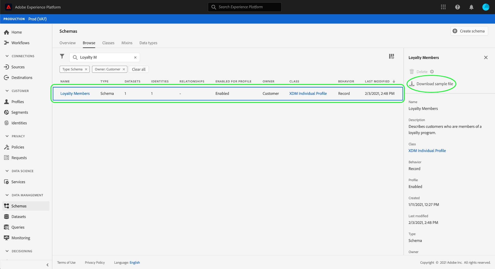

# Gerar dados de amostra para um esquema XDM na interface {#generate-sample-data-for-an-xdm-schema}

>[!CONTEXTUALHELP]
>id="platform_xdm_downloadsamplefile"
>title="Baixar arquivo de amostra"
>abstract="Gere um objeto JSON de amostra que esteja em conformidade com a estrutura do esquema escolhido. Esse objeto pode servir como modelo para garantir que os dados estejam formatados corretamente para ingestão em conjuntos de dados que utilizam esse esquema. O arquivo JSON de amostra será baixado pelo seu navegador."

Para assimilar dados na Adobe Experience Platform, o formato e a estrutura dos dados devem estar em conformidade com um esquema existente do Experience Data Model (XDM). Dependendo da complexidade do esquema para um conjunto de dados específico, pode ser difícil determinar a forma exata dos dados que o conjunto de dados espera após a assimilação.

Para qualquer esquema definido na interface do usuário do Experience Platform, você pode gerar um objeto JSON de amostra que esteja em conformidade com a estrutura do esquema. Esse objeto pode servir como modelo para quaisquer dados assimilados em conjuntos de dados que utilizam o esquema em questão.

>[!NOTE]
>
>Se você não puder encontrar ações como **Excluir** ou **Copiar estrutura JSON**, verifique se está trabalhando com um recurso personalizado (definido pelo locatário) e acessando-o do menu de linhas da tabela ou da exibição detalhada (**[!UICONTROL More]**). A disponibilidade da ação também depende de permissões e restrições de uso. Consulte [Gerenciar esquemas, classes, grupos de campos e tipos de dados: ações e exclusão](./explore.md#xdm-resource-actions).

Na interface do usuário do Experience Platform, selecione **[!UICONTROL Schemas]** na navegação à esquerda. Na guia **[!UICONTROL Browse]**, localize o esquema para o qual você deseja gerar dados de amostra. Selecione-a na lista e o painel direito é atualizado para mostrar detalhes sobre o esquema. Aqui, selecione **[!UICONTROL Download sample file]**.

Um exemplo de arquivo JSON é baixado pelo navegador. Agora você pode usar esse arquivo como uma referência para estruturar seus dados ao assimilar em conjuntos de dados que empregam esse esquema.

## Próximas etapas

Este guia abordou como gerar um arquivo JSON de amostra de um esquema XDM na interface do usuário do Experience Platform. Para saber como gerar dados de amostra usando a API do Registro de Esquema, consulte o [manual de endpoint de dados de amostra](../api/sample-data.md).

Quando estiver pronto para começar a assimilar dados, consulte o tutorial sobre [mapeamento de um arquivo CSV para XDM](../../ingestion/tutorials/map-csv/overview.md) para saber como mapear um arquivo de dados simples (como um CSV) para um esquema XDM e assimilá-lo no Experience Platform. Como alternativa, você pode estabelecer uma [conexão de origem](../../sources/home.md) para trazer seus dados de uma origem externa e mapeá-los para o XDM.

Para obter mais informações sobre os recursos do espaço de trabalho [!UICONTROL Schemas] na interface, consulte a [[!UICONTROL Schemas] visão geral do espaço de trabalho](./overview.md).
